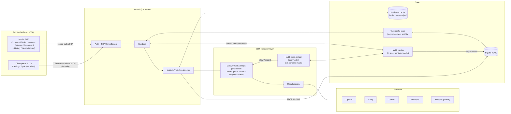
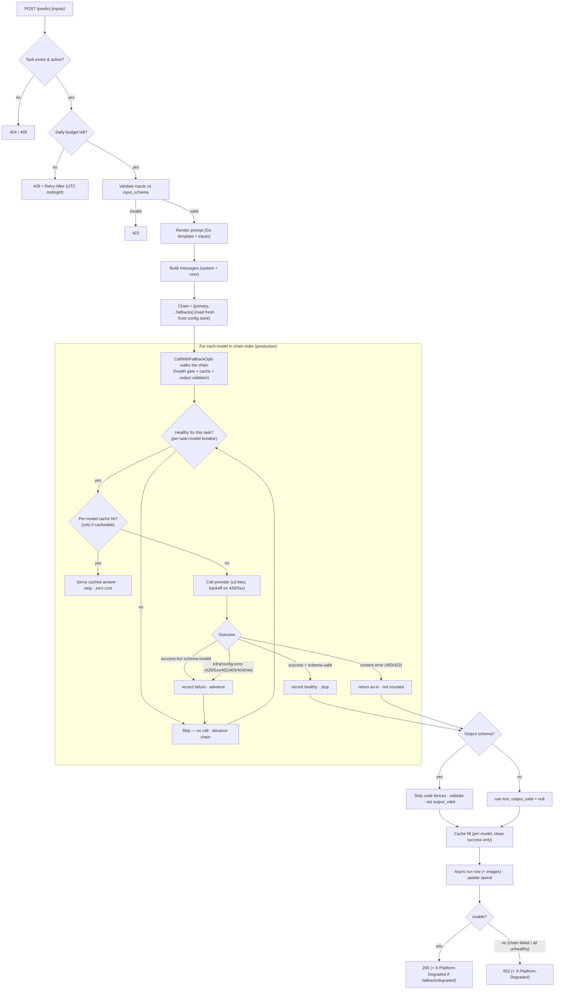
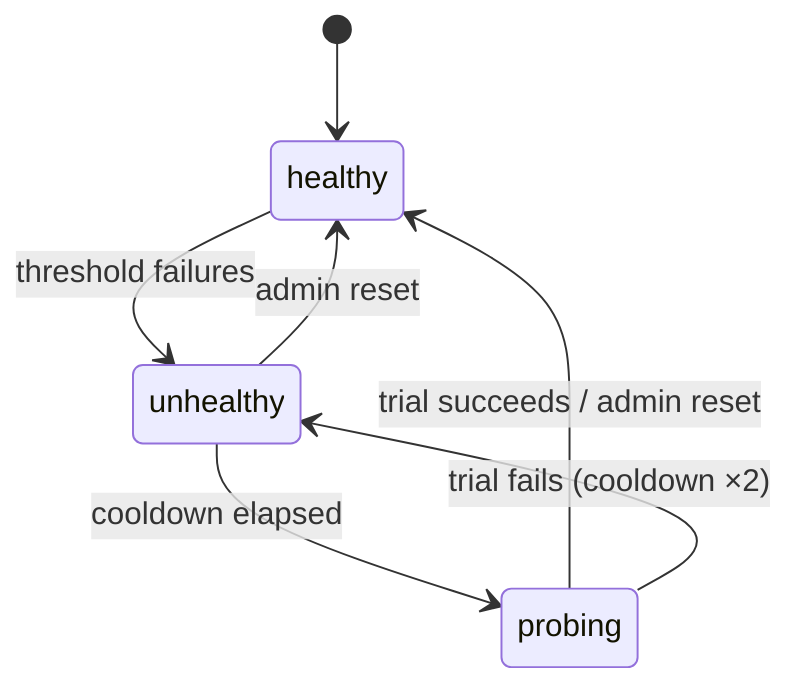
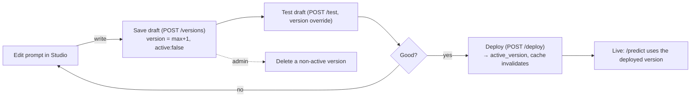

# Repo Work Doc — LLM Platform

> A living reference for **everything the repo does today**: the architecture, every HTTP endpoint (what it accepts and returns), how a prediction flows end to end, the LLM routing/fallback machinery, caching, prompt versioning, auth/RBAC, the data model, configuration, and the frontend. Workflow diagrams are included throughout.

The platform is a **task-keyed LLM prediction service** plus a **Studio** for authoring/versioning prompts and a **playground** for comparing models. A "task" bundles a prompt template, input/output JSON Schemas, a model routing chain (primary + fallbacks), sampling params, a daily budget, and cache settings. Callers invoke a task by id; the platform renders the prompt, attaches any image inputs for vision models, routes to a model (with fallback **and** a per-(task, model) health breaker that routes around a model after repeated failures), validates output, caches, meters cost, and records every run. Admins get a cross-tenant **prompt-history** viewer and a **model-health** console.

There are **three deployables**: the Go backend (single binary), the **Studio** frontend (`llm_platform_frontend`, :5173) for teams that *operate* the platform, and the **client portal** (`llm_platform_client`, :5174) for teams that *call* it (catalog + live Try-it predict against `/v1/tasks/*`, authenticated as a service token — see §11). The superseded Python prototype `llm_platform_v0` is out of scope.

---

## 1. System architecture



**Process boundaries**
- One Go server process. Task config lives in SQLite, fronted by an in-process config cache (5s TTL) coordinated by a read/write lock (`editMu`).
- The prediction cache is a separate store: Redis in production, in-process memory for dev, or off.
- All observability writes (run rows) go through an async writer so they never block the request hot path.

---

## 2. Tech stack

**Backend (`llm_platform_go/`)**
- Go, [chi](https://github.com/go-chi/chi) router + CORS middleware, request-id/logger/recoverer.
- SQLite via `modernc.org/sqlite` (pure-Go, no cgo), WAL mode, single writer connection.
- JWT sessions (HS256), httpOnly cookie.
- Providers: direct HTTP for OpenAI-compatible backends; `anthropic-sdk-go` for the native Messages API.
- Prediction cache: `redis/go-redis/v9` or in-process memory.
- JSON Schema validation: `santhosh-tekuri/jsonschema/v6`. Prompt templating: Go `text/template`.

**Frontend (`llm_platform_frontend/`)**
- React 19 + TypeScript, Vite build/dev server.
- Tailwind CSS 4 + Meesho's Merlin UI design system.
- `js-tiktoken` for client-side token estimation.
- Fetch with `credentials: 'include'` (session cookie); dev proxy forwards API paths to `:8000`.

---

## 3. The prediction pipeline (how a predict request works)

Endpoint: `POST /v1/tasks/{task_id}/predict`. The same core (`executePrediction`) backs `/predict`, `/test`, and shadow comparison — differing only by options (test/shadow bypass the cache and don't count as production traffic in the same way).



**Key facts**
- **Budget gate** uses in-memory spend (refreshed from DB ≤ every 5s), not a per-request `SUM`. `daily_budget_usd: 0` = exempt. At ≥80% it logs a warning; at 100% it returns `429` with `Retry-After` set to seconds until UTC midnight.
- **Routing chain** is `[task.Model, ...task.FallbackModels]`, read fresh from the config store on every request — a routing edit changes which model runs, immediately.
- **Multimodal input**: an `image` (single string) and/or `images` (array) input field — base64 data URLs or image URLs — are collected in order and attached to the user message as OpenAI `image_url` content blocks for vision models. They also key the cache (a different photo is a different prediction) and are persisted on the run row.
- **Per-(task, model) health gate** (production predicts only): before calling a model the walk asks the breaker if it's healthy *for this task*; an unhealthy model is **skipped — no call made**. A provider failure **or a schema-invalid output** is recorded against health and **advances the chain to the next model in the same request**. After the threshold of consecutive failures the model trips unhealthy for a cooldown (exponential backoff); see §6.
- **Per-model cache** is consulted *during* the walk, as the router reaches each model — never as a pre-call shortcut. So a recovered primary is always tried live rather than shadowed by a stale lower-priority cache entry.
- **Output handling**: when a task has an output schema, the raw response is de-fenced (```` ```json ```` wrappers stripped) and validated; `output_valid` is `true`/`false`. If *every* model returns schema-invalid output, the last one is returned with `output_valid:false` (200, not an error). With no schema, `output` is null and `output_valid` is null (raw text only).
- **Cache fill**: only on a *clean* success (schema valid, or no schema). Failures and schema-invalid outputs are never cached. One entry, keyed on the serving model, at the task's TTL (default 24h).
- **Observability**: every call (including cache hits, marked `cache_hit=1` with zero cost) writes a run row asynchronously; the run row also stores the image inputs.
- **Test/shadow** runs (no `useCache`, or a single-model override) bypass health gating and the in-request schema fallback — they call the model exactly as asked and don't feed production health.

---

## 4. Authentication & RBAC

### Login flow
1. `POST /auth/login {user_id}` → looks up a user in the identity store (the demo store is an in-memory SSO stand-in).
2. Issues an HS256 JWT with claims `sub, email, name, role, iss, iat, exp`.
3. Sets an httpOnly cookie (`llm_platform_token` by default), `SameSite=Lax`, `Secure` configurable, `MaxAge = TOKEN_EXPIRY` (default 12h).
4. `RequireAuth` middleware accepts the token via `Authorization: Bearer …` or the cookie, validates signature + expiry, and puts the `auth.User` on the request context. Role is embedded in the token, so the predict hot path needs no identity lookup.

The demo store seeds one user per role:

| id | email | role |
|---|---|---|
| `u-admin` | admin@demo.local | admin |
| `u-creator` | creator@demo.local | creator |
| `u-approver` | approver@demo.local | approver |
| `u-viewer` | viewer@demo.local | viewer |

A token with no role claim defaults to **caller** (least privilege that still allows predict + read).

### Roles × permissions

| Role | task:read | task:predict | task:write | task:deploy | task:delete | task:view_prompt |
|---|:---:|:---:|:---:|:---:|:---:|:---:|
| **admin** | ✓ | ✓ | ✓ | ✓ | ✓ | ✓ |
| **creator** | ✓ | ✓ | ✓ | ✗ | ✗ | ✓ |
| **approver** | ✓ | ✓ | ✗ | ✓ | ✗ | ✓ |
| **caller** (default) | ✓ | ✓ | ✗ | ✗ | ✗ | ✗ |
| **viewer** | ✓ | ✗ | ✗ | ✗ | ✗ | ✓ |

- `RequirePermission(perm)` runs after `RequireAuth` and returns `403` (`role 'X' is not permitted to task:Y`) when the role lacks the capability.
- **Prompt redaction**: callers without `task:view_prompt` get `prompt_template` and `system_prompt` blanked in task/version responses — they see the contract (schemas, metadata), not the prompt internals.

---

## 5. API reference

All errors are `{"detail": "<message>"}` with the HTTP status carrying the meaning. All non-public routes require a valid session.

### 5.1 Auth & meta (public unless noted)

| Method · Path | Accepts | Returns |
|---|---|---|
| `GET /health` | — | `{status:"ok", models_available:[…]}` |
| `GET /auth/demo-users` | — | `{users:[{id,email,name,role}]}` |
| `POST /auth/login` | `{user_id}` | `{user:{…}}` + sets cookie · 401 unknown · 422 missing |
| `POST /auth/logout` | — (auth) | `{status:"logged out"}` (clears cookie) |
| `GET /auth/me` | — (auth) | `{user:{…}}` · 401 if not authed |
| `GET /pricing` | — (auth) | `{pricing:{model:{input_cost_per_1k,output_cost_per_1k}}}` |

### 5.2 Playground / analytics (any authenticated principal)

**`POST /run`** — fan out one prompt across N models in parallel (the Compare playground).
- Accepts: `{prompt (req), models?[], model_conversations?{model:[{role,content}]}, temperature?, max_tokens?, session_id?, system_prompt?}`
- Returns: `{run_id, prompt, system_prompt, results:[{model,response,latency_ms,input_tokens,output_tokens,total_tokens,cost_usd,success,error}], total_wall_clock_ms, models_succeeded, models_failed}`

**`GET /sessions?page&page_size`** — paginated session list (default page_size 8, max 100).
- Returns: `{page,page_size,total_sessions,total_pages,sessions:[{session_id,first_prompt,turn_count,created_at}]}`

**`GET /sessions/{session_id}`** — full conversation: `{session_id, turns:[{run_id,prompt,system_prompt,created_at,results:[…]}]}` · 404 if missing.

**`GET /sessions/{session_id}/leaderboard`** — per-session model leaderboard from manual ratings.
- Returns: `{session_id, entries:[{model, avg_score, rating_count}]}`, ordered by `avg_score` desc.
- Averages the 1–5★ `feedback` rows for the session, scoped to the calling user. Because a fan-out writes one `runs` row per model under a single `run_id`, the query selects the session's `run_id`s in a subquery and groups `feedback` by model — counting each rating exactly once (a naive `run_id` join would multiply each rating by the number of models in the run).

**`DELETE /sessions`** — `{session_ids:[…]}` → `{deleted_count, session_ids}`.

**`POST /feedback`** — `{run_id, model, rating (1–5)}` → echoes back · 422 out of range.

**`GET /dashboard`** — aggregate analytics:
`{total_runs, total_tokens, total_cost_usd, by_task:[{task_id,runs,total_tokens,cost_usd,avg_latency_ms,success_rate}], by_model:[{model,runs,total_tokens,cost_usd,avg_latency_ms,avg_rating,rating_count}], daily:[{date,cost_usd,total_tokens,runs}]}`.

### 5.3 Task product API (RBAC-gated)

The full **Task object** (returned by create/get/update/list):
```
{ id, name, description,
  input_schema|null, output_schema|null,
  prompt_template, system_prompt, prompt_version,
  model, fallback_models[],
  temperature, max_tokens, daily_budget_usd,
  cache_enabled, cache_ttl_seconds, active,
  created_at, updated_at }
```

| Method · Path | Perm | Accepts | Returns / notes |
|---|---|---|---|
| `POST /v1/tasks` | write | full Task body (`id` slug `[a-z0-9-]{2,64}`, `name`, `prompt_template`, `model` required) | `201` Task · `422` validation (bad slug, unknown model, bad schema/template, temp∉[0,2]). **Tasks are authored here** — there is no file/YAML seeding (see §8) |
| `GET /v1/tasks` | read | — | `{tasks:[…]}` (prompts blanked without `view_prompt`) |
| `GET /v1/tasks/{task_id}` | read | — | Task · `404` |
| `PUT /v1/tasks/{task_id}` | write | **partial** patch (only present fields change; `input_schema:null` removes it) | updated Task · routing changes here. Prompt change bumps `prompt_version` |
| `DELETE /v1/tasks/{task_id}` | delete | — | `{task_id,status:"deleted"}` · **admin-only** (`task:delete`). Removes the task + its prompt-version history (run rows kept for audit). `404` unknown · `409` for the built-in `playground` task |
| `POST /v1/tasks/{task_id}/predict` | predict | `{inputs:{…}}` | predict response (below) · `409` inactive · `429` budget · `502` chain failed |
| `GET /v1/tasks/runs/{run_id}` | read | — | `{run_id,task_id,prompt_version,provider,created_at,results:[…]}` |
| `GET /v1/tasks/{task_id}/versions` | read | — | `{task_id,active_version,versions:[{version,prompt_template,system_prompt,note,created_by,created_at,active}]}` |
| `POST /v1/tasks/{task_id}/versions` | write | `{prompt_template (req), system_prompt?, note?}` | `201 {task_id,version,active:false}` (saves a draft; doesn't activate) |
| `DELETE /v1/tasks/{task_id}/versions/{version}` | delete | — | `{task_id,version,status:"deleted"}` · `409` if it's the active version |
| `POST /v1/tasks/{task_id}/deploy` | deploy | `{version (req)}` | `{task_id,active_version,status:"deployed"}` (makes a version live) |
| `POST /v1/tasks/{task_id}/test` | write | `{inputs (req), version?, model?}` | predict response, marked `is_test`; **bypasses cache**, supports version/model overrides |
| `GET /v1/tasks/{task_id}/stats?days=30` | read | — | `{task_id,days,totals:{total_cost_usd,total_tokens,success_count,failure_count,avg_latency_ms}, daily:[{date,cost_usd,tokens,runs}]}` |

**Predict response shape** (`/predict` and `/test`):
```
{ task_run_id, task_id, prompt_version, model, provider,
  output|null,            // parsed JSON when output_schema validates
  output_valid|null,      // null when task has no output schema
  raw_response|null, error|null,
  fallback_used,          // served by a non-primary model
  cached,                 // served from the prediction cache (zero cost)
  usage:{input_tokens,output_tokens,total_tokens,cost_usd},
  latency_ms,             // the winning model's call time only
  gateway_latency_ms }    // end-to-end platform wall-clock: validation +
                          // the whole fallback walk (incl. failed attempts) +
                          // output validation + cache work. Always ≥ latency_ms;
                          // the gap is the gateway's own overhead + losing models
```
Header `X-Platform-Degraded: true` is set when a fallback served it or the chain failed.

**Multimodal inputs**: `inputs` may include an `image` (single string) and/or `images` (array of strings) field — base64 data URLs (`data:image/jpeg;base64,…`) or image URLs — when the task declares them. They are attached to the user message as `image_url` blocks for vision models (not rendered into the prompt text), key the cache, and are persisted on the run row. The backend accepts **both** keys for backward compatibility, but the live `attribute-extraction` task now declares only `images` (one-or-many); the client portal renders a single image picker for it (see §8).

### 5.4 Shadow comparison harness

**`POST /v1/shadow/compare`** (write) — run a labeled dataset through a task and score field-level accuracy.
- Accepts: `{task_id (req), items:[{inputs, expected_output}] (req, ≤200)}`
- Returns: `{id, task_id, items, match_rate (0..1), items_fully_matched, avg_latency_ms, p50_latency_ms, p95_latency_ms, total_cost_usd, mismatches:[{item,field,expected,got}] (≤20), created_at}`

**`GET /v1/shadow/reports?task_id=`** (read) — last 50 reports (newest first), each with summary metrics + a `details` blob (`items_fully_matched`, `p50_latency_ms`, `mismatches`).

### 5.5 Admin observability (admin role only)

Gated by the `RequireAdmin` middleware — the **`admin` role**, not a task capability, because these are privacy-sensitive cross-tenant views. Non-admins get `403`.

| Method · Path | Accepts | Returns |
|---|---|---|
| `GET /v1/admin/runs` | query: `page, page_size (≤100), task_id, model, user_email, q (prompt substring), status (success\|error), type (production\|test)` | Prompt history across **all** users, newest first: `{page, page_size, total_runs, total_pages, runs:[{id, run_id, task_id, user_email, model, provider, prompt_preview, has_image, image_count, success, cache_hit, fallback_used, is_test, latency_ms, total_tokens, cost_usd, created_at}]}`. Rows are lightweight — truncated preview + image **count**, never the bytes |
| `GET /v1/admin/runs/models` | — | `{models:[…]}` — distinct models seen in `runs` (filter dropdown) |
| `GET /v1/admin/runs/{run_id}` | — | Full detail: `{run_id, task_id, user_id, user_email, prompt_version, prompt, system_prompt, images:[…], is_test, created_at, results:[{model, provider, response, success, error, latency_ms, input/output/total_tokens, cost_usd, cache_hit, fallback_used}]}` · `404` |
| `GET /v1/admin/model-health` | — | `{enabled, statuses:[{task_id, model, provider, state (healthy\|unhealthy\|probing), consecutive_failures, total_failures, total_successes, trips, cooldown_ms, open_for_seconds, last_reason, last_error, last_change}]}` |
| `GET /v1/admin/model-health/events` | query: `task_id, model, page, page_size (≤200)` | `{page, page_size, total_count, total_pages, events:[{id, task_id, model, provider, event (failure\|tripped\|recovered\|manual_reset), reason, consecutive_failures, cooldown_ms, state, created_at}]}` |
| `POST /v1/admin/model-health/reset` | `{task_id, model}` | `{status:"ok", task_id, model, state:"healthy"}` · `404` if the pair was never tracked. Records a `manual_reset` event |

---

## 6. LLM execution layer

### Model registry
A single `registry` map is the source of truth for routing. Every model key maps to `{modelID, provider, clientFn, reasoning}`:

| Provider | Model keys (friendly) |
|---|---|
| OpenAI | `gpt-5.1, gpt-5, gpt-5-mini, gpt-5-nano, gpt-4.1, gpt-4.1-mini, gpt-4.1-nano, gpt-4o, gpt-4o-mini` |
| Groq | `llama-groq` (→ llama-3.3-70b-versatile) |
| Gemini | `gemini-3-pro, gemini-2.5-pro, gemini-2.5-flash, gemini-2.5-flash-lite, gemini-flash` |
| Anthropic | `claude-fable-5, claude-opus-4-8, claude-sonnet-4-6, claude-haiku-4-5` |
| Meesho gateway | `meesho-gemini-2.5-flash` (→ vertex/gemini-2.5-flash) |

- **`reasoning` flag** (gpt-5 family): the chat-completions wire rejects `max_tokens`/`temperature`, so `CallModel` sends `max_completion_tokens` and omits temperature.

### Providers
- **`Provider` interface**: `Call(ctx, *chatRequest) (*chatResponse, error)`.
- **OpenAI-compatible provider** covers OpenAI, Groq, Gemini, and the Meesho gateway (POST `{baseURL}/chat/completions`). Auth is `Authorization: Bearer <key>`, except the Meesho gateway which uses the `x-bf-vk` virtual-key header.
- **Anthropic provider** uses the native Messages API (SDK retries disabled — the platform owns retry policy). System prompt → `system`, temperature not forwarded (current models reject it), `thinking` left at model default. A `refusal` stop reason maps to a `400`.
- `BuildClients` wires one provider per backend. Anthropic is left `nil` when its key is absent (so a missing key is a normal "not configured" call error, not a tripped breaker).

### Fallback semantics
`CallWithFallbackOpts` walks `[primary, …fallbacks]` in order, with three optional hooks — a per-model cache `Lookup`, a `HealthGate` (the per-(task, model) breaker), and an `OutputValidator`. For each model it:
- **Skips** the model (no call) if the health gate reports it unhealthy *for this task*.
- Serves a cached answer if the lookup hits.
- Otherwise calls it live and decides:
  - **Stops** on a usable success — a provider success that passes the output validator (or no validator).
  - **Advances** on provider-specific trouble — infra (`429/5xx`, network, timeout) and provider-config errors (`401/403/404`, provider not configured) — **and on a schema-invalid output** (a "schematic" failure), recording the failure against health each time.
  - **Returns immediately** on a `400/422` content error (bad input — retrying elsewhere just burns money; not counted against health).
- Sets `FallbackUsed` (served by a non-primary) and `Degraded` (fallback used, or the whole chain failed) for the `X-Platform-Degraded` contract.

`CallWithFallback`/`CallWithFallbackCached` remain thin wrappers (no gate, no validator) for callers that don't need health gating. The health gate + output validator are wired only for **production** predicts (`useCache`, no model override).

### Per-(task, model) health breaker (`internal/health`)
The single breaker in the platform: keyed on a **specific task's use of a specific model**, so a model that misbehaves for one task is routed around only for that task. The `Tracker` is process-wide and mutex-guarded; the fallback walk feeds it through a task-bound `HealthGate` adapter built in `predict_core.go`. Failures are discovered in-band — there is no separate per-provider circuit breaker or background prober; a model's recovery trial is the next production request after its cooldown elapses.



- **Trip**: after `HEALTH_FAILURE_THRESHOLD` (default **3**) consecutive failures the model goes **unhealthy** and is **skipped — no call** — for `HEALTH_BASE_COOLDOWN` (default **30s**).
- **Backoff**: each re-trip (a failed probe) **doubles** the cooldown, capped at `HEALTH_MAX_COOLDOWN` (default **30m**).
- **Recover**: a successful probe (or an admin reset) returns it to healthy and resets the counters.
- **What counts**: any provider error that advances the chain (network / `401/403` / `429` / `5xx` / timeout) and any **schema-invalid** output. A `400/422` content error does not (bad input, not the model's fault).
- **Scope**: production predicts only. Live state is **in-process** and resets on restart; every transition (`failure` / `tripped` / `recovered` / `manual_reset`) is persisted to `model_health_events` via an async writer. Admins view state and force a reset via `/v1/admin/model-health*` (§5.5).
- **Config**: `HEALTH_BREAKER_ENABLED` (default `true`) turns the whole thing off — every model is then tried every time.

### Retry & cost
- **Retry**: up to 3 attempts per model, backing off 2s/4s/6s, only for retryable statuses (`429/500/503`). Context cancellation/timeout stops retries.
- **Cost**: `CalculateCost(model, in, out)` uses `pricing.json` (`{model:{input_per_1m, output_per_1m}}`), rounded to 6 decimals; unknown models cost `0`. Loaded once at startup from `PRICING_PATH`.

---

## 7. Prediction cache

- **Interface**: `Get(ctx,key)→([]byte,bool)`, `Set(ctx,key,val,ttl)`. Errors are treated as misses — caching never fails a prediction.
- **Backends**: Redis (`NewRedis`, pings at boot), in-process memory (lazy TTL expiry), or off. Selected by config (below).
- **Key**: `"predict:" + SHA-256(JSON{task_id, prompt_version, model, system_prompt, rendered_prompt, temperature, max_tokens, output_schema, images[]})`. The key is **per model** — the routing chain is *not* part of the key. A deploy (version bump), param change, prompt change, model change, or a different image all produce new keys, so invalidation is implicit; stale entries age out by TTL.
- **TTL**: per-task `cache_ttl_seconds`, else 24h default.
- **Consulted during the fallback walk**: only when the router actually reaches a model. Studio test/shadow runs bypass the cache entirely.

---

## 8. Tasks, prompts, schemas

### Task config & validation
Defaults: `temperature 0→0.2`, `max_tokens 0→1000`, `prompt_version 0→1`, `fallback_models nil→[]`. Validation: slug id, known model(s), `name`/`prompt_template`/`model` required, `temperature∈[0,2]`, `max_tokens>0`, `cache_ttl_seconds≥0`, schemas must compile, template must parse.

### Task lifecycle & source of truth
- **The DB is the single source of truth for tasks.** There is no file/YAML seeding layer — tasks are created, edited, and deleted at runtime through the Studio (`POST/PUT/DELETE /v1/tasks`) and persist in the `tasks` table.
- **Authoring** (`POST /v1/tasks`, `task:write` → creator/admin): the Studio's *New task* form supplies every field that used to live in a config file (id, name, description, schemas, prompt, model + fallbacks, sampling, budget, cache). The backend validates the slug, schemas, template, and model, activates the task, and seeds prompt version 1.
- **Deletion** (`DELETE /v1/tasks/{id}`, `task:delete` → admin only): removes the task and its prompt-version history; run rows are kept for audit. The built-in `playground` task is protected (`409`).
- **Startup seeding** is limited to `SeedPlayground`, which idempotently creates the built-in free-form playground task the Compare UI's `/run` attributes to. A fresh database therefore starts with only that task.

### Prompt rendering & validation
- **Render**: Go `text/template` (`{{.field}}`, `{{if .field}}…{{end}}`), compiled templates cached by content hash, `missingkey=error` (referencing an undeclared key fails loudly). Declared input fields are pre-seeded so optional fields work with `{{if}}`.
- **Input validation**: against `input_schema` (JSON Schema) when present; otherwise any input is accepted.
- **Output validation**: strips a wrapping markdown code fence, then validates against `output_schema`; returns the cleaned JSON. No schema → raw text, no validation.
- **Image inputs**: an `image` (string) and/or `images` (array of strings) input field carries base64 data URLs or image URLs. These are **not** rendered into the prompt text (the template only gates on them, e.g. `{{if .images}}…{{end}}`); they're attached to the user message as `image_url` vision blocks. The backend still accepts both keys, but the live `attribute-extraction` task declares only `images` (one-or-many; model `gemini-2.5-flash`, vision; `max_tokens: 2048` so Gemini's hidden "thinking" tokens don't truncate the JSON). The client portal renders one image picker for it — thumbnails with a corner ✕ and a click-to-zoom lightbox that also offers removal.

### Prompt version lifecycle



- Editing a task's prompt via `PUT` also bumps the version (records history). Drafts never auto-activate; `deploy` is the explicit publish gate (`task:deploy`). The active version can't be deleted.
- Edits to task config are serialized by the store's `editMu` write lock; predictions reading config take a shared lock, so a reader during an edit waits and then sees the new config (single-process coordination).

---

## 9. Data model (SQLite, WAL)

| Table | Purpose | Notable columns |
|---|---|---|
| `tasks` | task registry / config | id (PK), name, description, input_schema, output_schema, prompt_template, system_prompt, prompt_version, model, fallback_models (JSON), temperature, max_tokens, daily_budget_usd, active, cache_enabled, cache_ttl_seconds, created_at, updated_at |
| `prompt_versions` | prompt history & drafts | id, task_id, version, prompt_template, system_prompt, note, created_by, created_at · unique (task_id, version) |
| `runs` | every call (predict, /run, test, cache hits) | run_id, session_id, prompt, system_prompt, **image** (JSON array of data URLs/URLs, NULL for text-only), model, response, latency_ms, input/output/total_tokens, cost_usd, success, error, user_id, user_email, task_id, prompt_version, provider, fallback_used, cache_hit, is_test, created_at |
| `feedback` | star ratings | run_id, model, user_id, rating · unique (run_id, model, user_id) |
| `shadow_reports` | accuracy comparisons | id, task_id, created_by, items, match_rate, avg_latency_ms, p95_latency_ms, total_cost_usd, details (JSON), created_at |
| `model_health_events` | per-(task, model) breaker history | id, task_id, model, provider, event (failure\|tripped\|recovered\|manual_reset), reason, consecutive_failures, cooldown_ms, state, created_at · indexed (task_id, model) + created_at |

- **Single writer** (`SetMaxOpenConns(1)`) + `busy_timeout=5000` avoid "database is locked".
- **`RunWriter`**: a 1024-entry buffered channel drained by one goroutine; handlers submit run rows without blocking. If the buffer is full, the row is dropped and counted (a prediction is never blocked by observability). `Close()` flushes on shutdown.
- **`HealthEventWriter`**: the same buffered-channel + drain-goroutine pattern for `model_health_events`, wired as the health tracker's event sink so health-state transitions persist off the request hot path.
- The `image` column is written/read via `imagesToColumn`/`ParseImagesColumn` (JSON array; legacy single-string rows still parse), so one or many images share one column.

---

## 10. Configuration (environment variables)

| Var | Default | Controls |
|---|---|---|
| `PORT` | `8000` | HTTP port |
| `DB_PATH` | `./llm_platform.db` | SQLite file |
| `PRICING_PATH` | `./pricing.json` | cost table |
| `OPENAI_API_KEY` / `_BASE_URL` | — / `api.openai.com/v1` | OpenAI |
| `GROQ_API_KEY` / `_BASE_URL` | — / `api.groq.com/openai/v1` | Groq |
| `GEMINI_API_KEY` / `_BASE_URL` | — / Gemini OpenAI-compat endpoint | Gemini |
| `ANTHROPIC_API_KEY` / `_BASE_URL` | — / SDK default | Anthropic |
| `MEESHO_GATEWAY_VK` / `_BASE_URL` | — / internal gateway URL | Meesho gateway (x-bf-vk) |
| `REDIS_ADDR` / `REDIS_PASSWORD` / `REDIS_DB` | — / — / `0` | Redis cache |
| `CACHE_BACKEND` | `redis` if `REDIS_ADDR` set, else `off` | `redis` \| `memory` \| `off` |
| `HEALTH_BREAKER_ENABLED` | `true` | per-(task, model) health breaker on/off |
| `HEALTH_FAILURE_THRESHOLD` | `3` | consecutive failures (provider error or schema-invalid) before tripping a model for a task |
| `HEALTH_BASE_COOLDOWN` | `30s` | first unhealthy window (doubles per re-trip) |
| `HEALTH_MAX_COOLDOWN` | `30m` | cap for the backed-off cooldown |
| `JWT_SECRET` | `dev-insecure-secret-change-me` | session signing key |
| `AUTH_COOKIE_NAME` | `llm_platform_token` | cookie name |
| `AUTH_ISSUER` | `llm-platform-demo` | JWT `iss` |
| `COOKIE_DOMAIN` / `COOKIE_SECURE` | — / `false` | cookie scope/security |
| `TOKEN_EXPIRY` | `12h` | session lifetime |
| `ALLOWED_ORIGINS` | `http://localhost:5173` | CORS origins |

At least one provider key is required at boot (a warning logs the missing ones; the server still starts — those models fail at call time).

---

## 11. Frontend

Single-page app gated by `/auth/me` (spinner → login → app). Navigation lives in `AppShell`; pricing is fetched once on mount and feeds client-side cost estimates.

| Page | What a user does |
|---|---|
| **Compare** (playground) | Pick 2–N models, enter prompt/system prompt (+ images), tune temperature/max tokens, see side-by-side responses (one scrolling `ModelColumn` per model) with latency/tokens/cost, rate 1–5★, browse/load/delete sessions, open the **🏆 Leaderboard** modal (avg ★ per model for the session, via `GET /sessions/{id}/leaderboard`; disabled until a session exists) |
| **Tasks (Studio)** | **Create a task** (creator/admin — a *New task* form covering id/name/description, model + fallback chain, sampling, budget, cache, prompt, and input/output schemas); browse tasks; view config + 30-day stats; edit system + prompt template; save drafts; edit input/output schemas (visual field editor or raw JSON); configure model routing; **test** against any version/model (client-measured round-trip latency); view/compare/deploy version history; **delete a task** (admin only) |
| **Versions** | Dedicated version browser per task: paginated history, compare two versions, deploy (approver/admin), delete (admin) |
| **Estimate** | Pre-flight token + cost calculator (single or batch) across all models, before spending anything |
| **Dashboard** | Totals (runs/tokens/spend), per-task and per-model breakdowns, daily spend trend, ratings, success rates |
| **History** *(admin)* | Cross-tenant prompt history: filter/search every user's runs (task, model, user, status, prod-vs-test, prompt text), paginated; click a row for a detail drawer with the full prompt, image grid, and per-model responses. Lightweight list (server-truncated previews) so it stays fast on huge prompts/images |
| **Health** *(admin)* | Per-(task, model) circuit-breaker console: live status table (auto-polls every 4s — state, cooldown remaining, failures, trips, last reason) with a **Mark healthy** override, plus a filterable event log (failure/tripped/recovered/manual_reset) |

The **History** and **Health** tabs render only when `user.role === 'admin'` (the backend `RequireAdmin` is the real gate; the nav check just hides them). **API client** (`src/api/client.ts`): one method per endpoint above — including the admin `adminRuns`/`adminRun`/`adminRunModels` and `modelHealth`/`modelHealthEvents`/`resetModelHealth` — all with `credentials:'include'`; an `ApiError` carries the HTTP status so a `401` can trigger re-auth.

**Client RBAC** (`src/auth/permissions.ts`) mirrors the backend table and hides/disables controls by role — create task & save draft (`task:write` → creator/admin), deploy (`task:deploy` → approver/admin), delete task & prune versions (`task:delete` → admin only). The backend remains the source of truth and enforces every check. Callers without `view_prompt` never receive prompt text.

**Notable components/utils**: `SchemaEditor` (dual visual/raw JSON Schema editor), `VersionHistory` (reused by Studio + Versions), `ChatArea`/`ModelColumn`/`MessageBubble` (Compare column layout + response + rating), `LeaderboardModal` (per-session model ranking), `useChat`/`useSessions` hooks, `tokens.ts` (tiktoken counting + cost), `schema.ts` (JSON Schema ↔ field list).

### Client portal (`llm_platform_client/`, :5174)

A **second, consumer-facing** React app for teams that *call* the platform (vs. the Studio above, which is for teams that *operate* it). It talks **only** to the product API — `/v1/tasks/*` — plus `/health` and `/pricing`, and never to the playground/Studio routes.

- **No login.** Every request carries a long-lived **service JWT** in `Authorization: Bearer`, exactly like a machine caller (e.g. CIS). A working demo token for `svc:demo-client` (signed with the dev `JWT_SECRET`, expires 2036) is baked into `src/auth/token.ts`; `VITE_API_TOKEN` overrides it. The token is decoded client-side **for display only** (`decodePrincipal`) — the backend validates the signature on every request. With no role claim it resolves to the `caller` role (read + predict, prompt text redacted).
- **Catalog** (`CatalogPage`) — every registered task as a callable API product; inactive tasks are listed but flagged (predict returns 409). The catalog auto-refreshes on window focus and every 30s (so a Studio deploy shows up).
- **Task detail** (`TaskDetailPage`) — the I/O contract (input/output JSON Schemas), a live **Try it** panel that hits the real `POST /v1/tasks/{id}/predict` (coerces field inputs to the schema type; shows `output_valid`, fallback/degraded/cached badges, model/provider, usage, cost, `task_run_id`; surfaces a 429 budget error with the `Retry-After` window), a 30-day usage chart (all callers), and copy-paste **curl** integration snippets + a copy-token button. The result card shows **two latencies** — `{gateway_latency_ms}ms gateway / {latency_ms}ms model` plus the computed `(+Nms overhead)` (gateway − model). **Image fields** render a single unified picker (`ImagePicker`) for both string (`image`) and array (`images`) fields — a removable thumbnail grid where each tile has a corner ✕ and opens a click-to-zoom lightbox with its own Remove button; files are read into base64 data URLs and sent with the predict request.
- **API client** (`src/api/client.ts`): `listTasks`, `getTask`, `predict` (returns `{result, degraded}` reading the `X-Platform-Degraded` header), `getRun`, `taskStats`, `pricing`. `ApiError` carries the status and parsed `Retry-After`. Built with plain Tailwind (no Merlin dependency); proxies `/v1`, `/health`, `/pricing` to `:8000`. Its `types.ts` is a subset mirror of the Go contracts — keep in sync with the Studio's `types/index.ts`.

---

## 12. Running locally

**All at once** — `./dev.sh` (from the repo root) reads `dev.yaml` and runs all three servers detached (nohup, surviving the shell), each pinned to its port (freed first), with pids + logs under `.dev/`:

- `./dev.sh` — restart everything (default); `./dev.sh start|stop|restart [name]` for one service.
- `./dev.sh status` — show what's listening; `./dev.sh logs <name>` — tail a service's log.
- Backend port is injected as `PORT=<port>` (env); the two Vite apps get `--port <port> --strictPort` (flag).

**By hand:**
- **Backend**: `cd llm_platform_go && go run ./cmd/server` (listens on `:8000`; needs ≥1 provider key in `.env`).
- **Frontend (Studio)**: `cd llm_platform_frontend && npm run dev` (Vite on `:5173`, proxies API to `:8000`).
- **Client portal**: `cd llm_platform_client && npm run dev` (Vite on `:5174`, proxies `/v1`, `/health`, `/pricing` to `:8000`).
- **Service token** (for the portal or a machine caller): `cd llm_platform_go && go run ./cmd/issue-token -sub svc:my-team -email my-team@svc.local -role caller -ttl 8760h`.
- **Tests**: `cd llm_platform_go && go test ./...` (add `-race` for the concurrency paths).

---

*Generated from the codebase as of this revision. When endpoints, the model registry, or RBAC change, update the relevant table here.*
