# LLM Platform Frontend Technical Guide

This is the single technical reading file for `llm_platform_frontend`. It explains what the frontend does, how the code is arranged, why the main decisions were taken, which alternatives were available, and how the UI talks to the Go backend.

The frontend is not just a prompt playground. It is the operating console for the LLM platform:

- Compare model answers side by side.
- Create and edit task configurations.
- Version prompts and deploy a selected version.
- Manage input and output schemas.
- Upload or register evaluation datasets.
- Run production-like task tests and CSV batch tests.
- Inspect usage, costs, prompt history, gateway attempts, and model health.

## 1. Big Picture

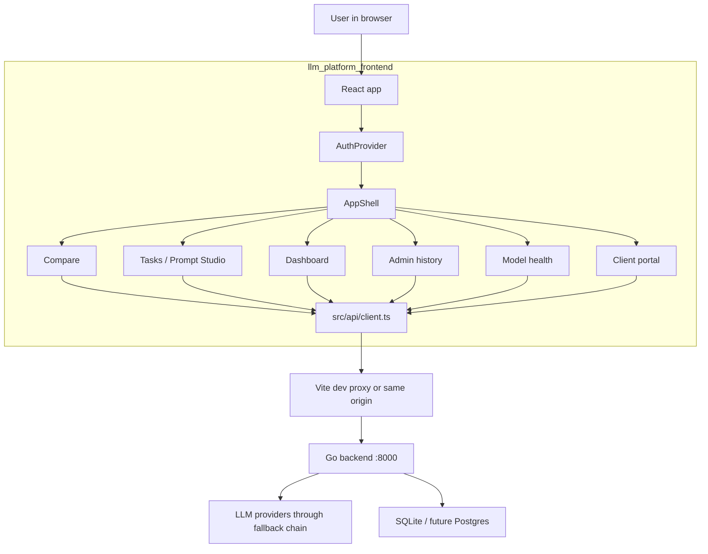

The frontend is intentionally thin on platform correctness. It helps users make good choices and shows useful context, but the backend remains the source of truth for authentication, RBAC, schema validation, task mutation, prompt deployment, budget enforcement, cache behavior, model health, and provider calls.

## 2. Runtime Shape

The app starts in [src/main.tsx](../src/main.tsx):

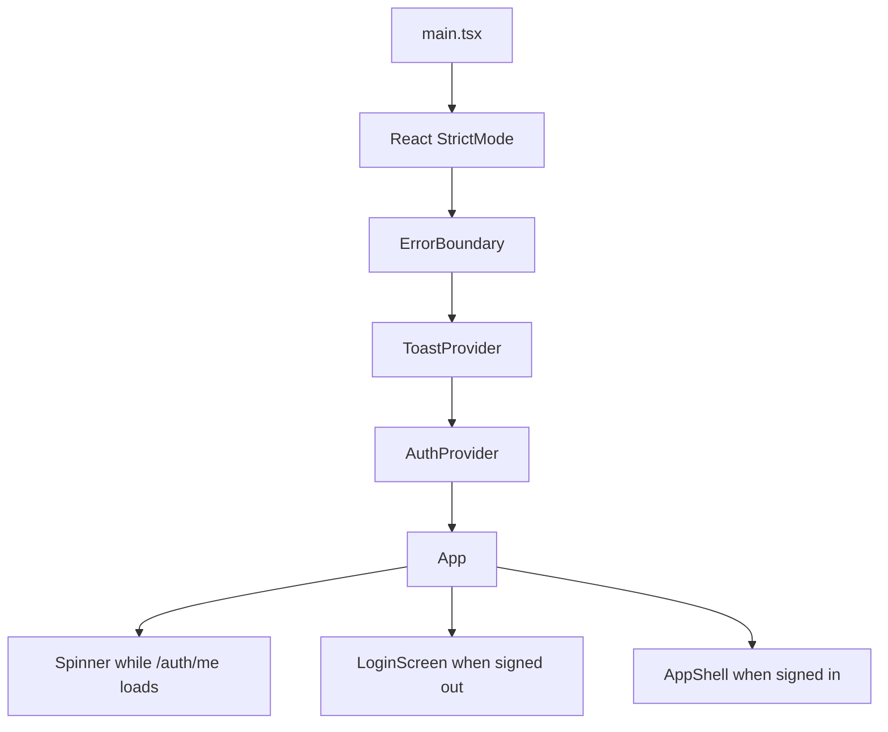

Why this order:

| Layer | Why it exists |
|---|---|
| `ErrorBoundary` | Prevents one React crash from blanking the whole page. |
| `ToastProvider` | Gives every page a shared success/error notification channel. |
| `AuthProvider` | Bootstraps the session from `/auth/me` and owns login/logout state. |
| `App` | Acts as the auth gate: loading, login, or full app shell. |

## 3. Application Navigation

The frontend does not use `react-router`. Navigation is an in-app tab model owned by [src/components/AppShell.tsx](../src/components/AppShell.tsx).

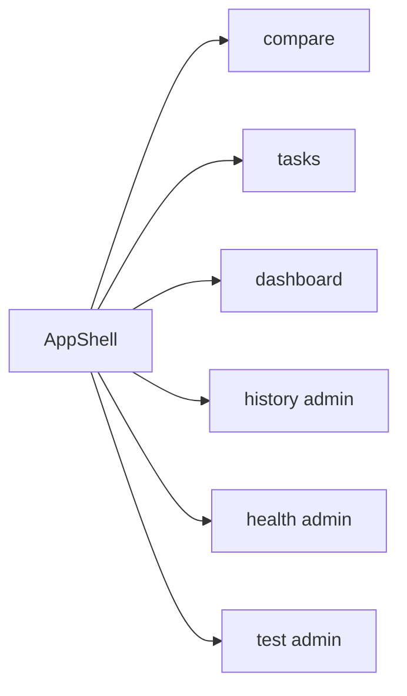

Decision: use a single mounted shell with tab state instead of URL routing.

Why:

- Users do long-running, stateful work: prompt drafts, filters, selected sessions, schema edits, task forms, and in-progress comparison threads.
- Tabs are lazily mounted the first time they are opened, then hidden instead of unmounted.
- This keeps scroll position, filters, and unsaved UI state alive while the user moves around.

Tradeoff:

- Browser URLs do not deep-link to a specific page.
- Access control must be handled in the shell and still enforced by the backend.
- Hidden pages can keep effects alive, so polling pages check visibility before refreshing where needed.

Alternative considered:

- `react-router` would give URL deep links and browser history, but would need extra keep-alive logic to preserve the multi-panel workspace behavior this app wants.

## 4. Source Map

```text
llm_platform_frontend/
  src/
    api/client.ts              HTTP client, error normalization, API contract
    auth/                      Auth context and frontend RBAC helpers
    components/                Reusable UI and feature panels
    hooks/                     Chat/session/eval/localStorage state hooks
    pages/                     Main app views mounted by AppShell
    toast/                     Shared toast provider
    types/index.ts             TypeScript mirror of Go JSON contracts
    utils/                     Token, schema, eval, CSV, prompt helpers
  docs/
    frontend-technical-guide.md
  vite.config.ts               Vite, React plugin, Tailwind plugin, dev proxy
  package.json                 React 19, Vite 8, Tailwind 4, Merlin UI
```

The most important files to read first:

1. [src/main.tsx](../src/main.tsx)
2. [src/App.tsx](../src/App.tsx)
3. [src/components/AppShell.tsx](../src/components/AppShell.tsx)
4. [src/api/client.ts](../src/api/client.ts)
5. [src/pages/ComparePage.tsx](../src/pages/ComparePage.tsx)
6. [src/pages/TasksPage.tsx](../src/pages/TasksPage.tsx)
7. [src/pages/ClientPortalPage.tsx](../src/pages/ClientPortalPage.tsx)

## 5. Stack Decisions

| Decision | Chosen | Alternatives | Why this was chosen |
|---|---|---|---|
| UI framework | React 19 | Vue, Svelte, plain JS | The app has many independent stateful panels; React components and hooks match that model. |
| Language | TypeScript | JavaScript | The backend API has many structured contracts. Types reduce drift and help every page know exact response shapes. |
| Build tool | Vite 8 | Webpack, Next.js | This is an internal SPA, not an SSR website. Vite gives fast local dev and a simple static build. |
| Styling | Tailwind 4 + Merlin UI | CSS modules, styled-components, raw CSS | Tailwind supports dense operational screens. Merlin provides Meesho design primitives and tokens. |
| Routing | AppShell tabs | `react-router` | Preserves tab state and avoids route-level remount churn. |
| Auth transport | HttpOnly cookie from backend | localStorage bearer token | Safer browser storage; frontend never handles the session token directly. |
| API URLs | `BASE = ''` relative URLs | hard-coded backend host | Works with Vite proxy locally and same-origin production deployment. |
| Cost estimates | frontend approximation synced from `/pricing` | backend-only estimates | Users need instant feedback before sending prompts; backend remains billing truth. |
| Schema editing | visual editor plus raw JSON fallback | visual only | Simple schemas are easy, advanced schemas are preserved instead of being lossy. |
| Compare execution | one `/run` request per model | one bulk request for all models | Columns update as each model returns and one model failure does not block the rest. |

## 6. API Client

All backend calls go through [src/api/client.ts](../src/api/client.ts).

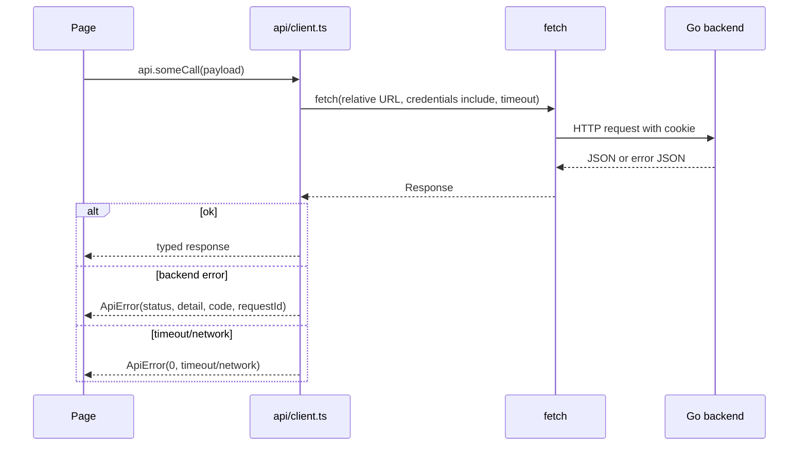

Key decisions:

- `credentials: 'include'` is used everywhere so the backend session cookie is sent through the dev proxy and in production.
- Requests have per-call timeouts. Normal calls default to 10s; model calls, eval calls, and CSV calls use longer timeouts.
- `ApiError` carries `status`, backend `code`, and `requestId`.
- `errorMessage` appends `request_id` so an error shown in the UI can be matched to backend logs.
- Uploads and CSV downloads have custom fetch helpers because they do not fit the normal JSON request/response shape.

Special cases:

- `predict` treats some failed model runs as a valid outcome if the backend returns a full `TPredictResult`. This lets the UI show raw output, schema validation failure, and gateway trace instead of hiding it behind a generic error.
- Eval dataset upload returns validation errors as a structured response when `code === eval_dataset_validation_failed`, even if HTTP is non-2xx.
- `429` from prediction may encode `Retry-After` into the `ApiError.code` so the client portal can show a budget reset hint.

## 7. Authentication And RBAC

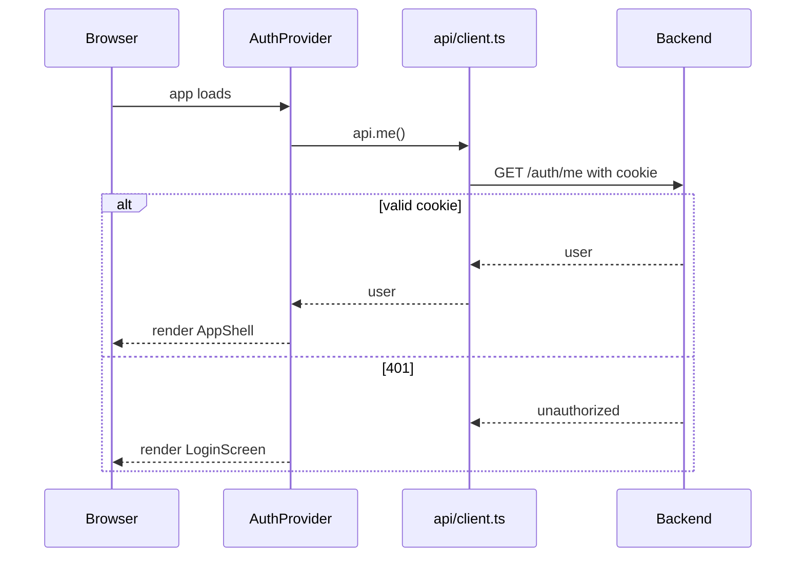

The frontend has a small RBAC mirror in [src/auth/permissions.ts](../src/auth/permissions.ts). It only hides or disables controls. It is not security.

Backend source of truth:

- Authenticated user comes from `/auth/me`.
- Login/logout are backend endpoints.
- Every protected API action is still checked by the Go backend.

Current frontend permission model:

- `admin` has all task permissions in the frontend table.
- `DEFAULT_ROLE` is currently `admin`.
- Non-admin tab visibility is filtered in `AppShell`.

Production note:

- The deployment guide already expects demo login to become real SSO. The frontend seam is small: replace demo-user login with a button that redirects to backend `/auth/login`; `AuthProvider` can keep using `/auth/me`.

## 8. State Ownership

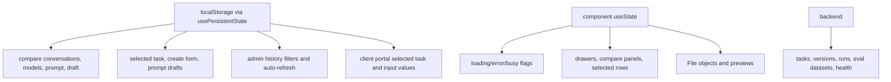

Decision: persist workspace state locally, but not correctness state.

Why:

- Users often type long prompts and schema configs.
- A reload should not destroy a half-finished prompt or task creation form.
- File objects cannot be serialized, so uploads and image attachments stay in memory only.

The persistence helper is [src/hooks/usePersistentState.ts](../src/hooks/usePersistentState.ts):

- Reads from localStorage at mount.
- Writes on state changes.
- Swallows storage errors because persistence is a convenience, not a requirement.
- Provides `clearPersisted(prefix)` to discard committed drafts.

## 9. Compare Page

The Compare page is the multi-model playground.

Files:

- [src/pages/ComparePage.tsx](../src/pages/ComparePage.tsx)
- [src/hooks/useChat.ts](../src/hooks/useChat.ts)
- [src/hooks/useSessions.ts](../src/hooks/useSessions.ts)
- [src/components/Sidebar.tsx](../src/components/Sidebar.tsx)
- [src/components/ChatArea.tsx](../src/components/ChatArea.tsx)
- [src/components/ChatInput.tsx](../src/components/ChatInput.tsx)
- [src/components/ModelColumn.tsx](../src/components/ModelColumn.tsx)
- [src/components/MessageBubble.tsx](../src/components/MessageBubble.tsx)

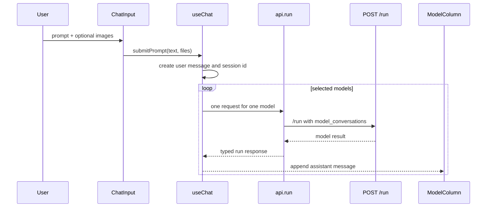

Important behavior:

- Conversations are stored per model, not as one shared transcript.
- A new `session_id` is generated client-side with `crypto.randomUUID()` if needed.
- Images are converted to data URLs.
- Images are attached only to the latest user turn for non-Groq models. This prevents old images from being resent on every turn, which would inflate token usage and confuse vision models.
- Groq is skipped for image content because `llama-groq` is treated as text-only.
- Each selected model gets its own `/run` call. This makes the UI responsive: fast models render first and failed models can be removed without failing the whole compare turn.
- Session history is loaded from `/sessions` and reconstructed back into per-model UI messages.
- Users can rate model answers; leaderboard data is session-scoped.

What `/run` is for:

- Free-form playground comparison.
- Multi-model exploration.
- Session history and ratings.

What `/run` is not for:

- Production task prediction.
- Prompt versioning.
- Schema-bound task contracts.

Production-like task calls use `/v1/tasks/{id}/predict`, which is exposed in the client portal.

## 10. Prompt Studio / Tasks Page

The Tasks page is the builder workspace for platform tasks.

File: [src/pages/TasksPage.tsx](../src/pages/TasksPage.tsx)

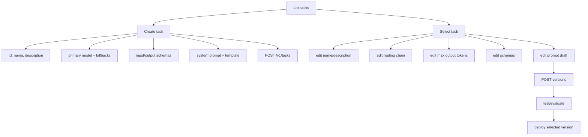

Task creation exists because YAML seeding is no longer the main authoring path. A task is created through the UI with:

- immutable slug id
- name and description
- input schema
- output schema
- system prompt
- prompt template
- primary model
- ordered fallback models
- max output tokens
- temperature
- daily budget
- cache settings

Key decisions:

| Area | Decision | Why |
|---|---|---|
| Task id | Immutable | It keys runs, cache entries, prompt versions, and integration URLs. Changing it is equivalent to creating a new task. |
| PUT updates | Merge semantics | Each section can save only the field it owns without rebuilding the full task payload. |
| Prompt edits | Save as draft version | Prompts are treated as releasable artifacts, not mutable text blobs. |
| Deploy | Explicit confirmation | Production traffic changes immediately. |
| Routing | Drag ordered list | The model chain is an ordered fallback path, so order must be visible and editable. |
| Defaults | Generate prompt from config | The description and schemas are enough to produce a useful first draft. |
| Cost estimate | Inline estimate | Authors see approximate token/cost impact before saving or testing. |

## 11. Schema Editors

Input and output schemas are deliberately handled differently.

Input schema:

- Edited with [src/components/SchemaEditor.tsx](../src/components/SchemaEditor.tsx).
- Represents the request inputs accepted by the task.
- Simple object schemas can be edited visually.
- Advanced JSON Schema features fall back to raw JSON mode.

Output schema:

- Edited with [src/components/OutputSchemaEditor.tsx](../src/components/OutputSchemaEditor.tsx).
- Represents the API response contract, not just a prompt hint.
- Supports object responses through the field editor.
- Supports scalar responses such as string, number, integer, boolean, and array.
- Lets the backend coerce and validate model output.

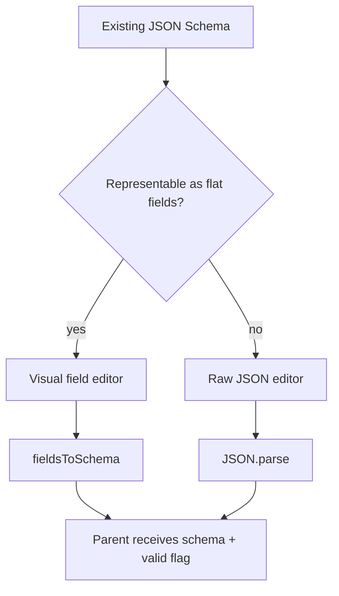

Decision: do not silently simplify advanced schemas.

Why:

- A visual-only editor would either block advanced schemas or drop unsupported keywords.
- This frontend keeps simple authoring simple while preserving complex schemas exactly in JSON mode.

## 12. Prompt Versioning

Prompt versioning is rendered through [src/components/VersionHistory.tsx](../src/components/VersionHistory.tsx).

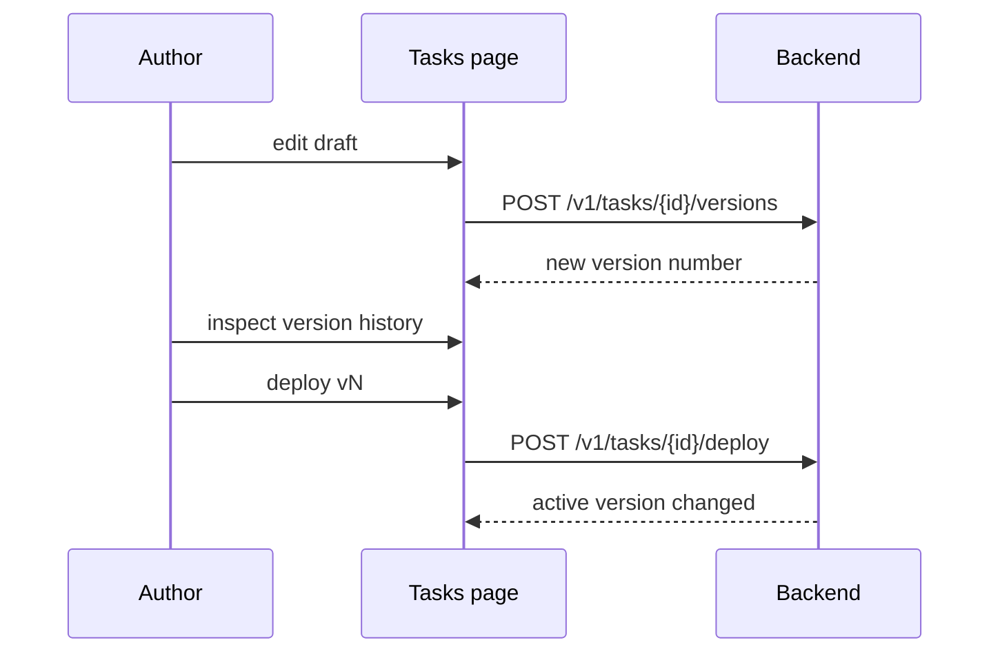

Technical decisions:

- The active prompt shown on the task is immutable until a version is deployed.
- Drafts can have a note for future readers.
- Version history is paginated because prompt histories can become long.
- Viewing a version compares it against the live prompt.
- Deleting versions is gated and the active version cannot be deleted.

Why:

- Prompt changes can break product behavior without obvious runtime errors.
- Version history gives rollback and auditability.
- Deployment makes prompt changes explicit.

## 13. Eval Datasets

Eval datasets live inside the task detail page.

Files:

- [src/components/EvalDatasetSection.tsx](../src/components/EvalDatasetSection.tsx)
- [src/hooks/useEvalDatasetRuns.ts](../src/hooks/useEvalDatasetRuns.ts)
- [src/utils/evalDatasets.ts](../src/utils/evalDatasets.ts)
- Eval row/list/action/check/recent components under `src/components/Eval*.tsx`

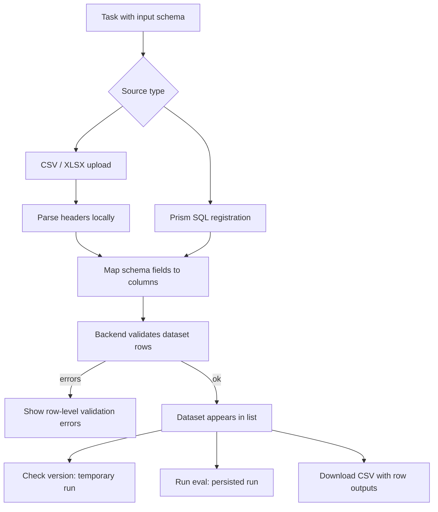

Why evaluation is tied to schemas:

- Input schema fields define which columns must exist or be mapped.
- Output schema fields define expected output columns, defaulting to `expected_<field>`.
- The UI catches missing mapped columns before upload.
- The backend remains the real validator.

Why two run modes:

- `check` gives quick feedback without committing a run to history.
- `runEval` persists an eval result and appears in recent runs.
- `check.csv` is for offline row-level review of actual model outputs.

## 14. Client Portal

The Client Portal is the consumer-facing task catalog and task test page.

File: [src/pages/ClientPortalPage.tsx](../src/pages/ClientPortalPage.tsx)

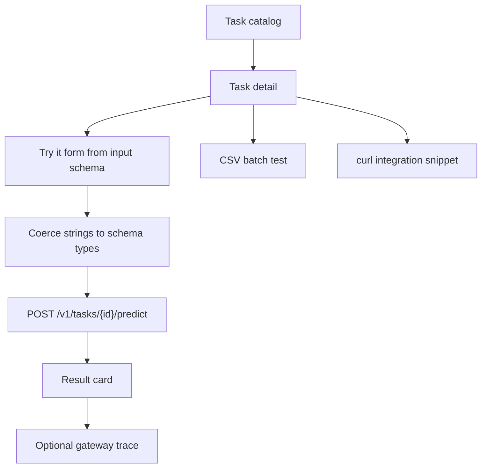

This page answers: "If I am a service team, how do I use this task?"

It shows:

- endpoint path
- active model and fallback chain
- prompt version
- budget/cache status
- 30-day usage stats
- input/output schema
- interactive prediction form
- gateway trace when available
- CSV batch testing
- curl integration snippet

Important behavior:

- Form fields are generated from the input schema.
- Primitive values are coerced before sending:
  - numbers become `number`
  - booleans become `true` or `false`
  - arrays and objects try `JSON.parse`
  - string arrays can be comma-separated as a convenience
- Image-like fields are detected by field name or description and get file pickers.
- Prediction result distinguishes:
  - schema valid vs invalid
  - fallback used
  - degraded backend mode
  - cache hit
  - gateway latency vs winning model latency
  - cost and token usage

The gateway trace is fetched through admin run detail. Because backend writes are async, the UI polls briefly after prediction. If the caller is not allowed to read admin run details, it silently omits the trace.

## 15. CSV Batch Test

CSV batch testing in [src/components/CSVBatchTestPanel.tsx](../src/components/CSVBatchTestPanel.tsx) is separate from persisted eval datasets.

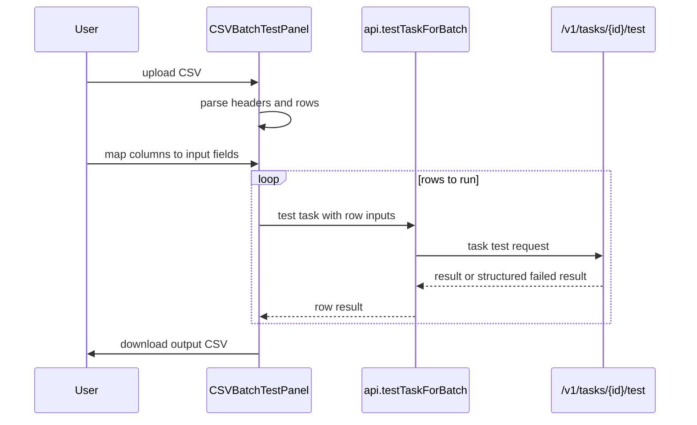

Why this exists in addition to eval datasets:

- CSV batch test is a quick local workflow for trying rows and downloading outputs.
- Eval datasets are registered and can be re-run against versions as a tracked quality artifact.

## 16. Dashboard, History, And Health

Dashboard:

- File: [src/pages/DashboardPage.tsx](../src/pages/DashboardPage.tsx)
- Reads `/dashboard`.
- Shows total runs, total tokens, total cost, per-task stats, and per-model stats.
- Uses backend-calculated cost, not frontend estimates.

Admin history:

- File: [src/pages/AdminRunsPage.tsx](../src/pages/AdminRunsPage.tsx)
- Reads `/v1/admin/runs`.
- Uses lightweight list rows for speed.
- Opens a drawer for full prompt, images, response, and gateway attempt trace.
- Filters persist in localStorage.
- Fetch is debounced by 300ms while typing.
- Auto-refresh skips background work if the browser tab or in-app tab is hidden.

Model health:

- File: [src/pages/ModelHealthPage.tsx](../src/pages/ModelHealthPage.tsx)
- Reads `/v1/admin/model-health`.
- Polls live status every 4s.
- Shows per-task, per-model circuit-breaker state.
- Lets admins reset an unhealthy model to healthy.
- Shows health events and can filter events by clicking a status row.

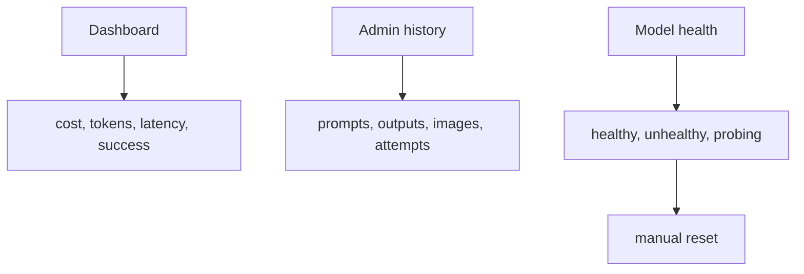

## 17. Types And Contract Drift

The frontend's API types live in [src/types/index.ts](../src/types/index.ts). They mirror Go JSON responses.

Why this file matters:

- It is the shared vocabulary for the UI.
- It keeps pages from guessing response shapes.
- It documents which backend fields are expected by frontend features.

Key groups:

- Chat and session types: `TRunRequest`, `TRunResponse`, `TSessionDetail`.
- Model registry types: `MODEL_GROUPS`, `MODELS`, `DEFAULT_COMPARE_MODELS`.
- Task types: `TTask`, `TPromptVersion`, `TPredictResult`.
- Admin types: `TRunListItem`, `TRunDetail`, `TGatewayAttempt`.
- Eval types: `TEvalDataset`, `TEvalRun`.
- Health types: `TModelHealthStatus`, `THealthEvent`.

Important decision:

- The frontend model list mirrors the backend registry but is not authoritative. If a model exists in the UI but the backend/provider key is missing, the call fails gracefully.

## 18. Cost And Token Estimates

File: [src/utils/tokens.ts](../src/utils/tokens.ts)

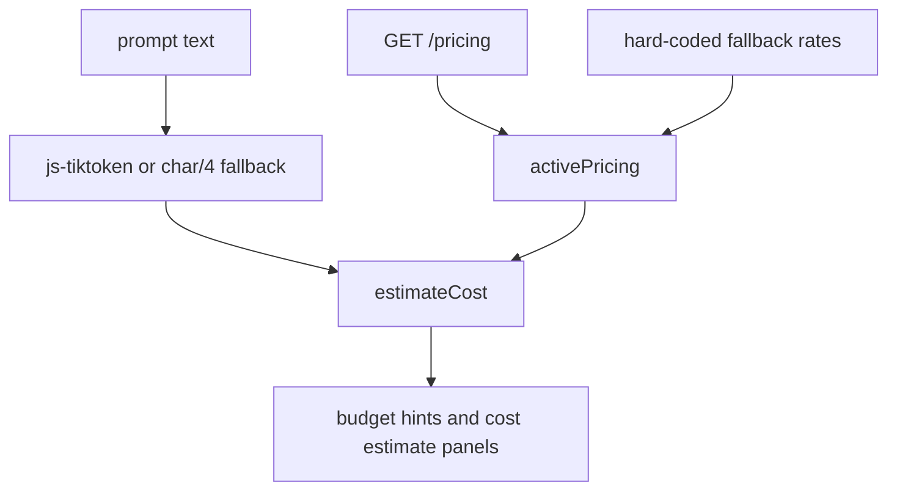

Decisions:

- Use `js-tiktoken` when a known OpenAI encoding exists.
- Use `o200k_base` for `gpt-4o`.
- Use `cl100k_base` for generic GPT models.
- Use `ceil(length / 4)` for Gemini, Claude, and Llama estimates.
- Replace fallback pricing with `/pricing` after login.

Why:

- Users need fast estimates before running a prompt.
- The backend remains the billing source of truth because actual provider token usage is only known after the call.

## 19. Styling And UI System

Files:

- [src/index.css](../src/index.css)
- [vite.config.ts](../vite.config.ts)
- component files using `@meesho/merlin-ui-tailwind`

Stack:

- Tailwind CSS 4
- `@meesho/merlin-ui-tailwind`
- custom CSS variables for background, border, accent, and text colors

Design direction:

- Dense operational UI, not a marketing page.
- Tables, filters, panels, drawers, and compact controls are the default.
- Cards are used for repeated items or bounded tools, not as page-level decoration.
- Markdown output from model responses is restored through `.markdown-body` styles because Tailwind resets defaults.

Current caveat:

- Some controls use literal emoji and inline SVG icons. This works, but a future polish pass should prefer icon components for consistency.

## 20. Development And Deployment

Local development:

```bash
cd llm_platform_frontend
npm install
npm run dev
```

The dev server runs at `http://localhost:5173`. [vite.config.ts](../vite.config.ts) proxies backend paths to `http://localhost:8000`:

- `/run`
- `/sessions`
- `/health`
- `/auth`
- `/pricing`
- `/feedback`
- `/dashboard`
- `/v1`

Production direction:

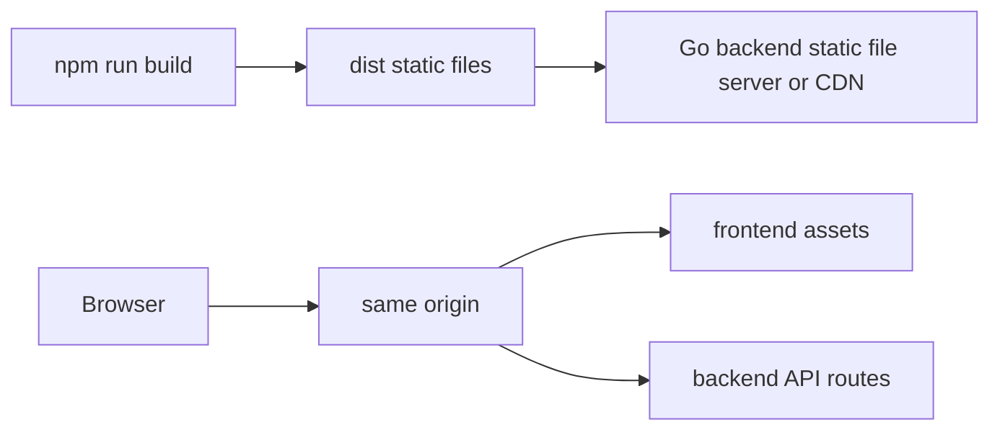

Recommended production choice: same-origin deployment.

Why:

- Avoids CORS complexity.
- Cookies work naturally.
- `BASE = ''` already supports it.
- Vite proxy remains dev-only.

Alternative:

- CDN or separate frontend host. This requires exact CORS origins, `AllowCredentials`, secure cookies, and careful cookie domain/SameSite settings.

## 21. Error Handling Philosophy

The frontend distinguishes several error classes:

| Error | How it is handled |
|---|---|
| 401 during auth bootstrap | Normal signed-out state. |
| 403 admin routes | Shows admin-only message. |
| 404 eval route during development | Tells the user to restart the Go backend so new routes load. |
| 429 prediction | Shows budget/rate-limit message and retry hint when present. |
| Network failure | "Can't reach the server" message. |
| Timeout | Explicit timeout message. |
| Backend validation errors | Shown as structured messages where available. |
| Failed model output with full predict body | Rendered as a result, not thrown away. |

Decision: show actionable errors, not just HTTP status.

Why:

- This app is a platform console. Operators need enough detail to debug bad prompts, provider failures, schema mismatches, and backend logs.
- The `request_id` is included whenever possible so frontend reports can be tied to server logs.

## 22. Important Flows To Explain To A Developer

### Flow A: User compares models

1. User selects models in `Sidebar`.
2. User types a prompt in `ChatInput`.
3. `useChat.submitPrompt` creates a user message for every selected model.
4. Images are converted to data URLs.
5. For each selected model, frontend sends one `/run` request.
6. Each model column updates when its response arrives.
7. Session list refreshes so history includes the new turn.

Why this design:

- Side-by-side comparison is the product goal.
- Independent requests improve perceived latency.
- Failed models do not block successful ones.

### Flow B: User creates a task

1. User opens Tasks and clicks New.
2. `CreateTaskForm` collects id, metadata, schemas, prompts, routing, budget, and cache.
3. The form performs lightweight client validation.
4. `api.createTask` sends the payload to `POST /v1/tasks`.
5. Backend validates and persists the task.
6. Local create-form draft is cleared.
7. The task detail opens and scrolls toward eval setup.

Why this design:

- Task configuration used to live in YAML-like config. The UI now owns the authoring workflow.
- Backend validation still protects correctness.

### Flow C: User deploys a prompt

1. User edits prompt draft.
2. User saves draft to create a new version.
3. User tests or evaluates the version.
4. User deploys a chosen version from `VersionHistory`.
5. Backend changes active version.
6. Future predictions use the new prompt version.

Why this design:

- Prompt edits are treated like releases.
- The deployed version is explicit and auditable.

### Flow D: User tests production task behavior

1. User opens Client Portal.
2. User selects a task.
3. Form fields are generated from the task input schema.
4. Values are coerced to schema-compatible JS values.
5. `api.predict` calls `/v1/tasks/{id}/predict`.
6. Result shows output, validation status, cache/fallback/degraded flags, usage, cost, and latency.
7. Admin users may see gateway attempts after async run writes land.

Why this design:

- It makes integration behavior visible before a backend service adopts the task.
- It exposes platform behavior such as fallback and cache, not just the final output.

## 23. Technical Choices That Matter Most

1. Frontend state is optimized for long-lived workspaces.
   The app preserves tab state and local drafts because users are authoring and evaluating prompts, not just browsing pages.

2. Backend remains authoritative.
   Frontend validation exists for ergonomics. The backend validates permissions, schemas, prompts, task ids, output contracts, budgets, and provider behavior.

3. Relative API URLs are intentional.
   `BASE = ''` makes local proxy and same-origin production use the same client code.

4. Errors are first-class objects.
   `ApiError` carries status, code, and request id so users and developers can diagnose issues.

5. The compare path and task-predict path are separate.
   `/run` is exploratory. `/v1/tasks/{id}/predict` is contract-bound and production-like.

6. Schema editing avoids data loss.
   Visual mode is only used when the schema shape is safely representable. Advanced schemas stay in JSON mode.

7. Eval datasets are schema-driven.
   Mappings derive from input/output schema fields so quality checks remain tied to task contracts.

8. Cost estimates are advisory.
   Frontend estimates help users think before spending. Backend usage is the truth after execution.

## 24. Known Risks And Future Improvements

| Area | Current state | Improvement |
|---|---|---|
| Routing | In-app tabs only | Add URL synchronization if deep links become important. |
| RBAC mirror | Mostly admin-focused | Expand frontend permission map when non-admin roles are fully used. |
| Model registry | Duplicated in frontend and backend | Generate the frontend model list from backend metadata. |
| Polling | Several pages poll manually | Centralize visibility-aware polling helper if more live pages are added. |
| Icons | Mixed emoji, inline SVG, Merlin components | Standardize on an icon library for professional consistency. |
| API types | Manually mirrored | Generate TypeScript types from OpenAPI or backend schema if contract churn grows. |
| E2E tests | Not evident in this package | Add Playwright flows for login, compare, create task, predict, and eval upload. |
| Error taxonomy | Good but local | Share backend error codes in generated constants. |

## 25. How To Read The Code

Read in this order:

1. Start with [src/main.tsx](../src/main.tsx) and [src/App.tsx](../src/App.tsx) to understand boot and auth gating.
2. Read [src/components/AppShell.tsx](../src/components/AppShell.tsx) to understand navigation, tab persistence, and admin-only tabs.
3. Read [src/api/client.ts](../src/api/client.ts) because every feature depends on its API wrappers and error handling.
4. Read [src/types/index.ts](../src/types/index.ts) as the frontend's API dictionary.
5. Read [src/pages/ComparePage.tsx](../src/pages/ComparePage.tsx) and [src/hooks/useChat.ts](../src/hooks/useChat.ts) for the playground model.
6. Read [src/pages/TasksPage.tsx](../src/pages/TasksPage.tsx) for task authoring and prompt version workflow.
7. Read [src/components/SchemaEditor.tsx](../src/components/SchemaEditor.tsx), [src/components/OutputSchemaEditor.tsx](../src/components/OutputSchemaEditor.tsx), and [src/utils/defaultPrompts.ts](../src/utils/defaultPrompts.ts) to understand schema-driven authoring.
8. Read eval components if you are working on quality workflows.
9. Read admin pages if you are working on operations and observability.

If you will not have code access, read the appendix below as the implementation companion to the architecture sections. It includes the key snippets and explains why each one matters.

## 26. Code Snippet Appendix

This section makes the document usable even when the source files are unavailable. Each snippet is intentionally short and points to the original file path for traceability.

### 26.1 App boot and provider stack

Reference: `llm_platform_frontend/src/main.tsx`

USP: every page gets crash isolation, shared toast notifications, and authenticated user context before the app shell renders.

```tsx
createRoot(document.getElementById('root')!).render(
  <StrictMode>
    <ErrorBoundary>
      <ToastProvider>
        <AuthProvider>
          <App />
        </AuthProvider>
      </ToastProvider>
    </ErrorBoundary>
  </StrictMode>,
)
```

Why this matters:

- `ErrorBoundary` catches unexpected component failures.
- `ToastProvider` gives every feature a common notification API.
- `AuthProvider` ensures every page can ask "who is logged in?"

### 26.2 Auth gate

Reference: `llm_platform_frontend/src/App.tsx`

USP: the app has only three startup states: checking auth, signed out, signed in.

```tsx
const App = () => {
  const { user, loading } = useAuth();

  if (loading) {
    return (
      <div className="flex h-screen items-center justify-center bg-secondary-bg">
        <Spinner />
      </div>
    );
  }

  if (!user) return <LoginScreen />;

  return <AppShell />;
};
```

Why this matters:

- No feature page renders before auth bootstrap finishes.
- Signed-out users never see the internal shell.
- The login flow can later change to SSO without changing page code.

### 26.3 Session bootstrap through HttpOnly cookies

Reference: `llm_platform_frontend/src/auth/AuthContext.tsx`

USP: the frontend never stores JWTs. It asks the backend who the current cookie belongs to.

```tsx
useEffect(() => {
  let cancelled = false;
  (async () => {
    try {
      const { user } = await api.me();
      if (!cancelled) setUser(user);
    } catch (err) {
      if (!cancelled && !(err instanceof ApiError && err.status === 401)) {
        console.error('auth bootstrap failed:', errorMessage(err));
      }
    } finally {
      if (!cancelled) setLoading(false);
    }
  })();
  return () => {
    cancelled = true;
  };
}, []);
```

Why this matters:

- A `401` is treated as a normal signed-out state.
- Other auth bootstrap errors are logged for diagnosis.
- The cancellation guard avoids setting state after unmount.

### 26.4 In-app tabs stay mounted

Reference: `llm_platform_frontend/src/components/AppShell.tsx`

USP: tabs are lazy-mounted once, then hidden instead of destroyed. This preserves drafts, scroll, filters, and in-progress work.

```tsx
const [visited, setVisited] = useState<Set<TView>>(
  () => new Set<TView>(['compare', activeView]),
);

const goTo = (key: TView) => {
  setView(key);
  setVisited((prev) => (prev.has(key) ? prev : new Set(prev).add(key)));
};

// ...

if (!visited.has(key)) return null;
return (
  <div key={key} className={cn('flex-1 min-h-0 flex flex-col', activeView !== key && 'hidden')}>
    {node}
  </div>
);
```

Why this matters:

- Switching from Tasks to Dashboard and back does not erase prompt drafts.
- Heavy pages do not all fetch immediately at login.
- Admin pages can remain mounted but hidden, so polling pages must be visibility-aware.

### 26.5 Relative API base and structured errors

Reference: `llm_platform_frontend/src/api/client.ts`

USP: the same client works in local dev through Vite proxy and in production through same-origin hosting.

```ts
const BASE = '';

export class ApiError extends Error {
  status: number;
  code?: string;
  requestId?: string;

  constructor(status: number, message: string, code?: string, requestId?: string) {
    super(message);
    this.status = status;
    this.code = code;
    this.requestId = requestId;
    this.name = 'ApiError';
  }
}
```

Error display keeps the backend request id:

```ts
export function errorMessage(err: unknown): string {
  if (err instanceof ApiError) {
    return err.requestId ? `${err.message} (ref: ${err.requestId})` : err.message;
  }
  if (err instanceof Error) return err.message;
  return String(err);
}
```

Why this matters:

- `BASE = ''` avoids environment-specific API URL logic.
- `requestId` lets a UI error be traced to backend logs.
- `status === 0` is reserved for client-side timeout or network failure.

### 26.6 Fetch wrapper with cookies and timeout

Reference: `llm_platform_frontend/src/api/client.ts`

USP: every normal JSON request gets consistent credentials, timeout, network error handling, and backend error parsing.

```ts
async function fetchJSON<T>(
  url: string,
  options?: RequestInit,
  timeoutMs = 10_000,
): Promise<T> {
  const controller = new AbortController();
  const timer = setTimeout(() => controller.abort(), timeoutMs);
  let res: Response;
  try {
    res = await fetch(url, {
      ...options,
      credentials: 'include',
      signal: controller.signal,
    });
  } catch (e) {
    if (e instanceof DOMException && e.name === 'AbortError') {
      throw new ApiError(0, `Request timed out after ${Math.round(timeoutMs / 1000)}s`, 'timeout');
    }
    throw new ApiError(0, "Can't reach the server — is it running?", 'network');
  } finally {
    clearTimeout(timer);
  }

  if (!res.ok) {
    const data = (await res.json().catch(() => ({}))) as {
      detail?: string;
      code?: string;
      request_id?: string;
    };
    throw new ApiError(
      res.status,
      data.detail ?? `HTTP ${res.status}`,
      data.code,
      data.request_id ?? res.headers.get('X-Request-ID') ?? undefined,
    );
  }
  return res.json() as Promise<T>;
}
```

Why this matters:

- Cookies are sent automatically for auth.
- Timeout errors say timeout, not generic network failure.
- Backend `detail`, `code`, and `request_id` are preserved.

### 26.7 Production predict special-case

Reference: `llm_platform_frontend/src/api/client.ts`

USP: some failed predictions are still useful platform results. The frontend renders them instead of throwing them away.

```ts
if (!res.ok) {
  const data = (await res.json().catch(() => ({}))) as Partial<TPredictResult> & {
    detail?: string;
  };

  if (typeof data.task_run_id === 'string') {
    return {
      result: data as TPredictResult,
      degraded: res.headers.get('X-Platform-Degraded') === 'true',
    };
  }

  const retryAfter = res.status === 429 ? res.headers.get('Retry-After') : null;
  throw new ApiError(
    res.status,
    data.detail ?? `HTTP ${res.status}`,
    res.status === 429 && retryAfter ? `retry_after:${retryAfter}` : undefined,
  );
}
```

Why this matters:

- A schema-invalid output may still include raw response, cost, model, and trace.
- The UI can explain "model answered but failed validation."
- `429` can show a retry/budget reset hint.

### 26.8 Persistent local workspace state

Reference: `llm_platform_frontend/src/hooks/usePersistentState.ts`

USP: long authoring workflows survive reloads without making localStorage a correctness dependency.

```ts
export function usePersistentState<T>(
  key: string,
  initial: T | (() => T),
): [T, Dispatch<SetStateAction<T>>] {
  const [state, setState] = useState<T>(() =>
    read(key, typeof initial === 'function' ? (initial as () => T)() : initial),
  );

  useEffect(() => {
    try {
      localStorage.setItem(key, JSON.stringify(state));
    } catch {
      // persistence is a convenience, never a correctness requirement
    }
  }, [key, state]);

  return [state, setState];
}
```

Clearing committed drafts:

```ts
export function clearPersisted(prefix: string): void {
  try {
    for (let i = localStorage.length - 1; i >= 0; i--) {
      const k = localStorage.key(i);
      if (k && k.startsWith(prefix)) localStorage.removeItem(k);
    }
  } catch {
    // ignore
  }
}
```

Why this matters:

- Prompt drafts, create-task forms, filters, and test inputs survive reloads.
- Storage failures do not crash the app.
- Saved task creation drafts are removed after successful creation.

### 26.9 Compare sends one request per model

Reference: `llm_platform_frontend/src/hooks/useChat.ts`

USP: selected models resolve independently, so a fast model can render while a slow or failed model is still pending.

```ts
const perModelPromises = selectedModels.map(async (model) => {
  const result = await api.run({
    prompt: text,
    models: [model],
    model_conversations: { [model]: modelConvs[model] ?? [] },
    temperature,
    max_tokens: maxOutputTokens,
    session_id: sid,
    system_prompt: systemPrompt || undefined,
  });

  const r = result.results?.[0];
  if (r) {
    const assistantMsg: TAssistantUIMessage = {
      role: 'assistant',
      content: r.success ? (r.response ?? '') : `⚠️ ${r.error}`,
      latency_ms: r.latency_ms,
      total_tokens: r.total_tokens,
      cost_usd: r.cost_usd,
      success: r.success,
      run_id: result.run_id,
      model: r.model,
    };
    setConversations((prev) => ({
      ...prev,
      [model]: [...(prev[model] ?? []), assistantMsg],
    }));
  }
});

const outcomes = await Promise.allSettled(perModelPromises);
```

Why this matters:

- The UI is responsive even with mixed provider latency.
- One model failure does not destroy every successful response.
- Each model column has an independent conversation timeline.

### 26.10 Images are attached only to the newest turn

Reference: `llm_platform_frontend/src/hooks/useChat.ts`

USP: avoids re-sending historical images on every turn, which would multiply token cost and confuse vision models.

```ts
const buildApiContent = (
  msg: TUIMessage,
  modelName: string,
  includeImages = true,
): string | TContentPart[] => {
  if (
    includeImages &&
    msg.role === 'user' &&
    msg.images.length > 0 &&
    !modelName.startsWith('llama-groq')
  ) {
    return [
      { type: 'text', text: msg.content },
      ...msg.images.map((url) => ({
        type: 'image_url' as const,
        image_url: { url },
      })),
    ];
  }
  return msg.content;
};
```

Usage inside prompt submission:

```ts
content: buildApiContent(msg, model, idx === msgs.length - 1),
```

Why this matters:

- Vision inputs go only where they are needed.
- Text-only Groq calls do not receive image parts.
- Historical context remains text-only after the image turn.

### 26.11 Task creation payload replaces YAML seeding

Reference: `llm_platform_frontend/src/pages/TasksPage.tsx`

USP: new tasks are authored from the UI with every production-relevant field, not by editing seed files.

```tsx
const payload: Partial<TTask> = {
  id,
  name,
  description: description.trim() || undefined,
  prompt_template: promptTemplate,
  system_prompt: systemPrompt.trim() || undefined,
  model,
  fallback_models: fallbacks.length ? fallbacks : undefined,
  temperature: tempNum,
  max_tokens: tokNum,
  daily_budget_usd: dailyBudget.trim() ? Number(dailyBudget) : undefined,
  cache_enabled: cacheEnabled,
  cache_ttl_seconds: cacheEnabled && cacheTtlHours.trim()
    ? Math.round(Number(cacheTtlHours) * 3600)
    : undefined,
  input_schema: inputEnabled ? (input.schema as Record<string, unknown>) : undefined,
  output_schema: outputEnabled ? (output.schema as Record<string, unknown>) : undefined,
};

await api.createTask(payload);
clearPersisted('tasks.create.');
```

Why this matters:

- The UI is the task authoring surface.
- Backend validation is still the authority.
- Draft form state is cleared only after successful creation.

### 26.12 Model routing as an ordered fallback chain

Reference: `llm_platform_frontend/src/pages/TasksPage.tsx`

USP: the visual order is the runtime fallback order. Position `0` is primary; later positions are fallbacks.

```tsx
const savedChain = [task.model, ...(task.fallback_models ?? [])];
const [chain, setChain] = useState<string[]>(savedChain);

const save = async () => {
  if (!window.confirm(
    `Route ${task.id} as ${chain.join(' → ')}? Production traffic switches immediately.`,
  )) return;

  await api.updateTask(task.id, {
    model: chain[0],
    fallback_models: chain.slice(1),
  });
};
```

Why this matters:

- Model order is not decorative; it changes production routing.
- The confirmation makes immediate traffic impact explicit.
- Cache keys include model parameters backend-side, so routing changes do not reuse stale model answers.

### 26.13 Prompt drafts become versions

Reference: `llm_platform_frontend/src/pages/TasksPage.tsx`

USP: prompts are treated like deployable releases, not mutable text.

```tsx
const saveDraft = async () => {
  setBusy('save');
  try {
    const { version } = await api.saveDraft(task.id, draft, draftSystem, note);
    setFlash(`Saved as draft v${version} — test it, then deploy.`);
    toast.success(`Saved as draft v${version} — test it, then deploy.`);
    setNote('');
    await loadVersions();
  } catch (e) {
    toast.error(errorMessage(e));
  } finally {
    setBusy(null);
  }
};
```

Why this matters:

- A draft does not affect production until deployed.
- Version history gives rollback and review context.
- Notes explain why a prompt changed.

### 26.14 Version deploy confirms production switch

Reference: `llm_platform_frontend/src/components/VersionHistory.tsx`

USP: deployment is explicit, gated, and refreshes both version history and active task state.

```tsx
const deploy = async (version: number) => {
  if (!window.confirm(`Deploy v${version}? Production traffic switches immediately.`)) return;
  setBusy(`deploy-${version}`);
  try {
    await api.deployVersion(taskId, version);
    setFlash(`v${version} is now live.`);
    toast.success(`v${version} is now live.`);
    await onReload();
    await onActiveChanged?.();
  } catch (e) {
    toast.error(errorMessage(e));
  } finally {
    setBusy(null);
  }
};
```

Why this matters:

- Prompt deployment changes future production predictions.
- UI refresh keeps the displayed active version accurate.
- The backend still enforces deploy permission.

### 26.15 Visual schema editor never drops advanced schema features

Reference: `llm_platform_frontend/src/utils/schema.ts`

USP: schemas that are too advanced for the visual editor fall back to raw JSON instead of being simplified or corrupted.

```ts
const TOP_KEYS = new Set(['type', 'properties', 'required', 'title', 'description', 'additionalProperties']);
const PROP_KEYS = new Set(['type', 'description', 'enum', 'items', 'title']);

export function schemaToFields(schema: JsonSchema | undefined | null): SchemaField[] | null {
  if (!schema || Object.keys(schema).length === 0) return [];
  if (schema.type !== 'object') return null;
  if (Object.keys(schema).some((k) => !TOP_KEYS.has(k))) return null;

  const props = schema.properties;
  if (props !== undefined && (typeof props !== 'object' || props === null)) return null;

  // Each property must be representable by the flat field editor.
  // Otherwise return null and keep the schema in JSON mode.
}
```

Why this matters:

- Simple object schemas get a friendly editor.
- Complex JSON Schema remains editable as raw JSON.
- The UI does not lose `$ref`, `oneOf`, bounds, or other advanced constructs by accident.

### 26.16 Output schema is the response contract

Reference: `llm_platform_frontend/src/components/OutputSchemaEditor.tsx`

USP: output schema can be a JSON object or a scalar type. This defines what the caller receives from the predict API.

```tsx
type ResponseType = 'object' | 'string' | 'number' | 'integer' | 'boolean' | 'array';

const RESPONSE_TYPES: ResponseType[] = [
  'object',
  'string',
  'number',
  'integer',
  'boolean',
  'array',
];
```

Scalar schema build:

```ts
if (type === 'boolean') return { schema: { type: 'boolean' }, valid: true };

if (type === 'string') {
  const schema: JsonSchema = { type: 'string' };
  if (enums.length) schema.enum = enums;
  if (c.pattern.trim()) schema.pattern = c.pattern.trim();
  if (min !== null) schema.minLength = min;
  if (max !== null) schema.maxLength = max;
  return { schema, valid: !patternBad && !rangeBad && !lenBad };
}
```

Why this matters:

- A task can return a plain boolean, number, string, array, or object.
- The schema is enforced by backend output validation.
- Authors can choose a tight API contract instead of always forcing object JSON.

### 26.17 Default prompt generator from task config

Reference: `llm_platform_frontend/src/utils/defaultPrompts.ts`

USP: authors can generate a task-specific first draft from description and schemas.

```ts
export function canBuildDefaultPrompts(
  taskDescription: string | null | undefined,
  inputSchema: JsonSchema | null | undefined,
  outputSchema: JsonSchema | null | undefined,
): boolean {
  return (
    !!taskDescription?.trim() ||
    hasFields(inputSchema) ||
    !!(outputSchema && Object.keys(outputSchema).length > 0)
  );
}
```

The generated user prompt uses backend Go template syntax:

```ts
for (const f of inFields) {
  const label = titleCase(f.name);
  const line = `- ${label}: {{.${f.name}}}`;
  tpl.push(f.required ? line : `{{if .${f.name}}}- ${label}: {{.${f.name}}}{{end}}`);
}
```

Why this matters:

- The prompt starts from the task's real input/output contract.
- Optional fields are guarded with `{{if .field}}`.
- It matches the backend renderer's Go template syntax.

### 26.18 Eval dataset upload maps columns to schema fields

Reference: `llm_platform_frontend/src/components/EvalDatasetSection.tsx`

USP: eval upload is schema-driven. CSV/XLSX columns are mapped to task input/output fields before backend validation.

```tsx
const inputFields = useMemo(() => schemaFieldNames(task.input_schema), [task.input_schema]);
const outputFields = useMemo(() => schemaFieldNames(task.output_schema), [task.output_schema]);
const requiredInputFields = useMemo(
  () => schemaRequiredFieldNames(task.input_schema),
  [task.input_schema],
);
```

Upload payload:

```tsx
const form = new FormData();
form.set('name', name.trim());
form.set('file', file);
form.set(
  'input_mapping',
  JSON.stringify(mappingWithExistingColumns(inputMapping, csvHeaders, requiredInputFields)),
);
form.set('output_mapping', JSON.stringify(outputMapping));

const result = await api.uploadEvalDataset(task.id, form);
```

Why this matters:

- Required input fields must be mapped.
- Expected outputs can default to `expected_<field>`.
- Row-level backend validation errors are shown instead of failing mysteriously.

### 26.19 Eval run modes

Reference: `llm_platform_frontend/src/hooks/useEvalDatasetRuns.ts`

USP: the same dataset supports quick checks, persisted eval runs, and downloadable row-level CSV.

```ts
const checkEval = async (dataset: TEvalDataset) => {
  setBusy(`check-${dataset.id}`);
  try {
    const run = await api.checkEvalDataset(taskId, Number(evalVersion), payloadForDataset(dataset));
    setCheckRun(run);
    setSelectedRunId(null);
    toast.success(`Check complete: ${formatPct(run.match_rate)} match rate.`);
  } finally {
    setBusy(null);
  }
};
```

```ts
const saveEvalRun = async (dataset: TEvalDataset) => {
  setBusy(`run-${dataset.id}`);
  try {
    const run = await api.runEval(taskId, Number(evalVersion), payloadForDataset(dataset));
    toast.success(`Eval complete: ${formatPct(run.match_rate)} match rate.`);
    setCheckRun(null);
    setSelectedRunId(run.id);
    await load();
  } finally {
    setBusy(null);
  }
};
```

Why this matters:

- `check` is fast feedback.
- `runEval` records the result.
- CSV download supports offline row-by-row inspection.

### 26.20 Client Portal generates predict inputs from schema

Reference: `llm_platform_frontend/src/pages/ClientPortalPage.tsx`

USP: the production-like test form is generated from the task input schema.

```tsx
const fields = useMemo<Field[]>(() => {
  const props = (task.input_schema as { properties?: Record<string, Record<string, unknown>> })?.properties ?? {};
  const required = new Set<string>((task.input_schema as { required?: string[] })?.required ?? []);
  return Object.entries(props).map(([name, schema]) => ({
    name,
    required: required.has(name),
    schema,
  }));
}, [task.input_schema]);
```

Prediction call:

```tsx
const inputs: Record<string, unknown> = {};
for (const f of fields) {
  const raw = values[f.name] ?? '';
  if (raw === '') continue;
  inputs[f.name] = coerce(raw, f.schema);
}

const res = await api.predict(task.id, inputs);
setOutcome(res);
void fetchTrace(res.result.task_run_id).then(setAttempts);
```

Why this matters:

- The form changes automatically when task schema changes.
- Raw text values become typed JSON payload values.
- Gateway trace is fetched best-effort for admin visibility.

### 26.21 Client Portal type coercion

Reference: `llm_platform_frontend/src/pages/ClientPortalPage.tsx`

USP: user-entered form strings become schema-compatible JSON before prediction.

```ts
function coerce(raw: string, schema: Record<string, unknown>): unknown {
  switch (schema.type) {
    case 'number':
    case 'integer': {
      const n = Number(raw);
      return Number.isNaN(n) ? raw : n;
    }
    case 'boolean':
      return raw === 'true' ? true : raw === 'false' ? false : raw;
    case 'object':
    case 'array':
      try {
        return JSON.parse(raw);
      } catch {
        if (schema.type === 'array') {
          const itemType = (schema.items as Record<string, unknown> | undefined)?.type;
          if (!itemType || itemType === 'string') {
            const items = raw.split(',').map((s) => s.trim()).filter((s) => s.length > 0);
            if (items.length > 0) return items;
          }
        }
        return raw;
      }
    default:
      return raw;
  }
}
```

Why this matters:

- Users can test number, boolean, object, and array inputs without manually building JSON every time.
- Backend still validates the final payload.

### 26.22 Gateway trace polling after prediction

Reference: `llm_platform_frontend/src/pages/ClientPortalPage.tsx`

USP: the UI explains the fallback walk behind a prediction, but tolerates async DB writes and non-admin users.

```ts
async function fetchTrace(runId: string): Promise<TGatewayAttempt[]> {
  for (let i = 0; i < 6; i++) {
    try {
      const detail = await api.adminRun(runId);
      if (detail.attempts && detail.attempts.length > 0) return detail.attempts;
    } catch {
      // run not written yet, or no admin access
    }
    await new Promise((r) => setTimeout(r, 400));
  }
  try {
    return (await api.adminRun(runId)).attempts ?? [];
  } catch {
    return [];
  }
}
```

Why this matters:

- Backend run/attempt rows are written asynchronously.
- Admin users get deep trace visibility.
- Non-admin users still get the prediction result without a trace error.

### 26.23 Admin history avoids loading huge prompts in list rows

Reference: `llm_platform_frontend/src/pages/AdminRunsPage.tsx`

USP: the table uses lightweight rows; full prompts, responses, images, and attempts load only when the drawer opens.

```tsx
{data?.runs.map((r) => (
  <RunRow key={r.id} run={r} onOpen={() => setSelected(r.run_id)} />
))}

{selected && (
  <RunDetailDrawer key={selected} runId={selected} onClose={() => setSelected(null)} />
)}
```

Drawer fetch:

```tsx
useEffect(() => {
  api
    .adminRun(runId)
    .then(setDetail)
    .catch((e) => setError(errorMessage(e)));
}, [runId]);
```

Why this matters:

- Prompt history stays fast even when prompts, responses, or base64 images are large.
- Details are fetched only when the user asks for them.

### 26.24 Model health polling and manual reset

Reference: `llm_platform_frontend/src/pages/ModelHealthPage.tsx`

USP: admins can watch and reset the per-task, per-model health tracker.

```tsx
useEffect(() => {
  refresh();
  const id = setInterval(refresh, 4000);
  return () => clearInterval(id);
}, [refresh]);
```

Manual reset:

```tsx
const markHealthy = async (s: TModelHealthStatus) => {
  setBusy(`${s.task_id}:${s.model}`);
  try {
    await api.resetModelHealth(s.task_id, s.model);
    refresh();
    refreshEvents();
  } catch (e) {
    toast.error(errorMessage(e));
  } finally {
    setBusy(null);
  }
};
```

Why this matters:

- Operators can see unhealthy/probing models without reading logs.
- Manual reset gives an emergency escape hatch after transient provider failures.

### 26.25 Token and cost estimates sync from backend pricing

Reference: `llm_platform_frontend/src/utils/tokens.ts`

USP: the frontend gives instant estimates, then syncs to backend pricing after login.

```ts
let activePricing: Record<string, Rate> = { ...FALLBACK_PRICING };

export function setPricing(
  table: Record<string, { input_per_1m: number; output_per_1m: number }>,
): void {
  const next: Record<string, Rate> = {};
  for (const [model, r] of Object.entries(table)) {
    next[model] = { inputPer1M: r.input_per_1m, outputPer1M: r.output_per_1m };
  }
  activePricing = next;
}
```

Estimate:

```ts
export function estimateCost(model: string, inputTokens: number, outputTokens: number): number {
  const rate = activePricing[model];
  if (!rate) return 0;
  const raw =
    (inputTokens / 1_000_000) * rate.inputPer1M +
    (outputTokens / 1_000_000) * rate.outputPer1M;
  return Math.round(raw * 1_000_000) / 1_000_000;
}
```

Why this matters:

- Users see cost before sending prompts.
- Backend pricing remains the billing source of truth.
- Offline/local fallback rates keep the UI usable if `/pricing` fails.

### 26.26 Vite proxy and same-origin production compatibility

Reference: `llm_platform_frontend/vite.config.ts`

USP: development and production can use the same relative frontend API calls.

```ts
export default defineConfig({
  plugins: [react(), tailwindcss()],
  devtools: false,
  server: {
    proxy: {
      '/run': 'http://localhost:8000',
      '/sessions': 'http://localhost:8000',
      '/health': 'http://localhost:8000',
      '/auth': 'http://localhost:8000',
      '/pricing': 'http://localhost:8000',
      '/feedback': 'http://localhost:8000',
      '/dashboard': 'http://localhost:8000',
      '/v1': 'http://localhost:8000',
    },
  },
})
```

Why this matters:

- In dev, browser talks to Vite on `:5173`; Vite forwards API calls to Go on `:8000`.
- In production, `BASE = ''` lets the same calls hit same-origin backend routes.
- Cookie auth works cleanly in both modes.

## 27. One-Sentence Mental Model

`llm_platform_frontend` is a React control plane for an LLM gateway: it lets humans author task contracts, compare and evaluate model behavior, deploy prompt versions, and inspect operational traces, while the Go backend remains the authority for security, validation, routing, persistence, and provider execution.
