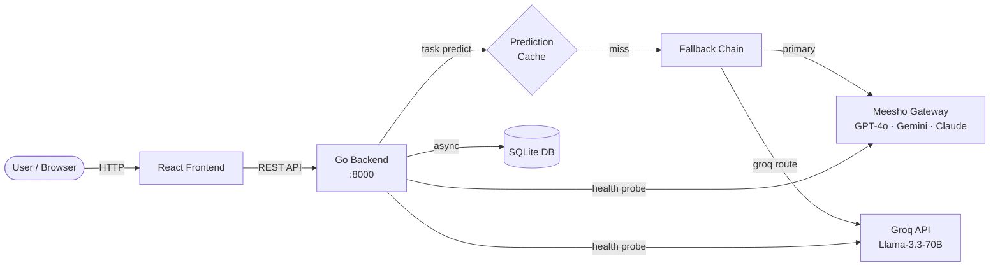

# LLM Platform — Go Backend

A production-ready backend that lets you call multiple LLM models — GPT-4o, Gemini 2.5, and Claude served through **Meesho's bifrost gateway**, plus Llama-3.3 served **directly by Groq** — compare their outputs, track costs down to the cent, and build reliable product features on top of them — with automatic failover, circuit breakers, prompt versioning, and caching.

All models except Groq's Llama reach us through the one Meesho gateway (an OpenAI-compatible endpoint); the vendor names below — OpenAI, Google, Anthropic — are cost-attribution labels, not separate direct integrations.

---

## How it fits together



The Go backend sits between the frontend and every LLM provider. It validates inputs, renders prompts, walks the fallback chain, caches results, logs every call, and enforces budgets — all so product features are reliable even when individual providers have outages.

### Available models

These are the models wired up today. Five of the six reach us through the single Meesho gateway over its OpenAI-compatible wire; only Groq's Llama is a direct vendor API. The vendor column is the attribution recorded on each run, not a separate integration.

| Model key | Served via | Provider attribution |
|-----------|-----------|----------------------|
| `gpt-4o`, `gpt-4o-mini` | Meesho gateway | `openai` |
| `gemini-2.5-pro`, `gemini-2.5-flash` | Meesho gateway | `gemini` |
| `claude-sonnet-4-6` | Meesho gateway | `anthropic` |
| `llama-groq` (Llama-3.3-70B) | Groq API (direct) | `groq` |

The routing registry in [internal/llm/runner.go](internal/llm/runner.go) is the single source of truth. It also carries several more vendor models (other GPT, Gemini, and Claude variants) commented out — because they share the gateway's OpenAI-compatible wire, enabling one is a one-line uncomment, no new provider code.

---

## Quick start

```bash
# 1. Copy the sample env file and fill in your keys
cp .env.example .env   # set MEESHO_GATEWAY_VK and/or GROQ_API_KEY (at least one)

# 2. Run the server (Go 1.22+ required)
go run ./cmd/server

# 3. Check it's alive
curl http://localhost:8000/health
# → {"status":"ok"}
```

The database (`llm_platform.db`) and task configs (`tasks.d/`) are created automatically on first run.

---

## Key vocabulary

| Term | Plain-English meaning |
|------|----------------------|
| **Task** | A named, versioned prediction configuration — input/output schema + prompt template + model routing. Like a named function that calls an LLM. |
| **Run** | One execution of one model call. If a task calls 3 models, that's 3 runs. |
| **Session** | A group of runs from the same user in the same conversation thread. |
| **Provider** | The backend that actually serves a model call. This platform wires up just two: the **Meesho bifrost gateway** (OpenAI-compatible — serves the GPT-4o, Gemini, and Claude models) and **Groq** (direct API — serves Llama-3.3). Each run also records a vendor *attribution* (`openai` / `gemini` / `anthropic` / `groq`) for cost reporting. |
| **Fallback chain** | An ordered list of models to try. If the first fails, try the second, and so on. |
| **Circuit breaker** | An automatic switch that stops sending requests to a broken provider — like a fuse that blows before the wiring catches fire. |
| **Prompt version** | A numbered snapshot of a task's prompt template. You can draft new versions and deploy them like a software release. |
| **Cache hit** | When an identical request was already answered before, so the stored answer is returned — free of charge, instantly. |

---

## Learning guide

These docs (in the repo-root [`docs/`](../docs) folder) explain the codebase and how to run it:

| File | What you'll learn |
|------|-------------------|
| [../docs/repo-guide.md](../docs/repo-guide.md) | **Start here.** The full walkthrough — boot sequence, config, the model/provider layer, fallback chain, circuit breaker, tasks, database, auth, and caching |
| [../docs/repo_work_doc.md](../docs/repo_work_doc.md) | Implementation work doc — architecture decisions and a component-by-component breakdown |
| [../docs/deployment-guide.md](../docs/deployment-guide.md) | Production deployment — environment config, secrets, CORS, and rollout |
| [../docs/gap-analysis-roadmap.md](../docs/gap-analysis-roadmap.md) | Where the demo is today vs. the target Task-keyed prediction platform, and the roadmap to get there |
| [../docs/phase-workflow.md](../docs/phase-workflow.md) | The phased build plan and development workflow |

**Suggested reading order:** repo-guide → repo_work_doc → the rest as needed.

---

## Directory map

```
llm_platform_go/
├── cmd/
│   ├── server/main.go         ← entry point — wires everything together
│   └── issue-token/main.go    ← CLI tool for minting auth tokens
├── internal/
│   ├── api/                   ← HTTP handlers, router, middleware
│   ├── llm/                   ← provider clients, registry, fallback, circuit breaker
│   ├── tasks/                 ← task config, validation, versioning, store
│   ├── health/                ← per-(task, model) circuit breaker tracker
│   ├── cache/                 ← prediction cache (Redis or memory)
│   ├── db/                    ← SQLite setup, migrations, queries, async writers
│   ├── auth/                  ← JWT, cookies, RBAC
│   ├── users/                 ← user store (demo swap seam)
│   ├── config/                ← environment variable loading
│   └── types/                 ← shared request/response types
├── tasks.d/                   ← YAML task definitions (loaded at startup)
├── pricing.json               ← per-model token pricing (USD per 1M tokens)
├── .env                       ← local secrets (gitignored — never commit this)
└── docs/                      ← this learning guide
```
