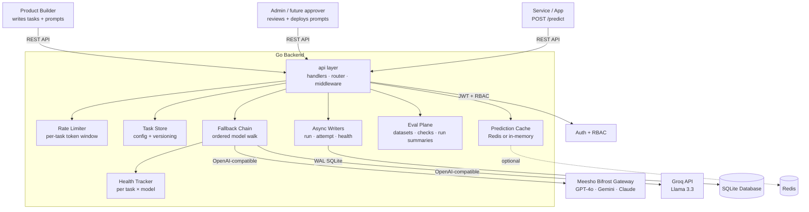
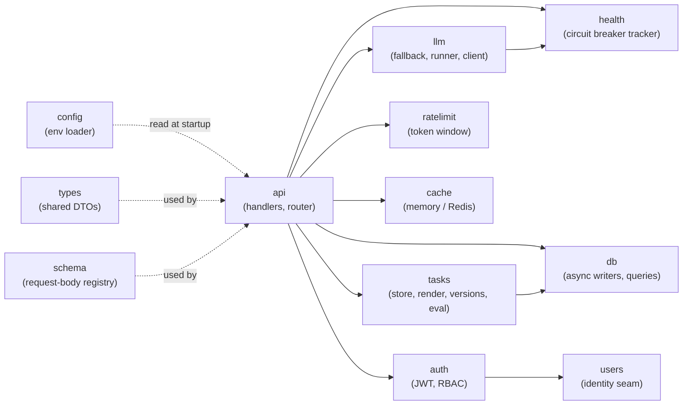
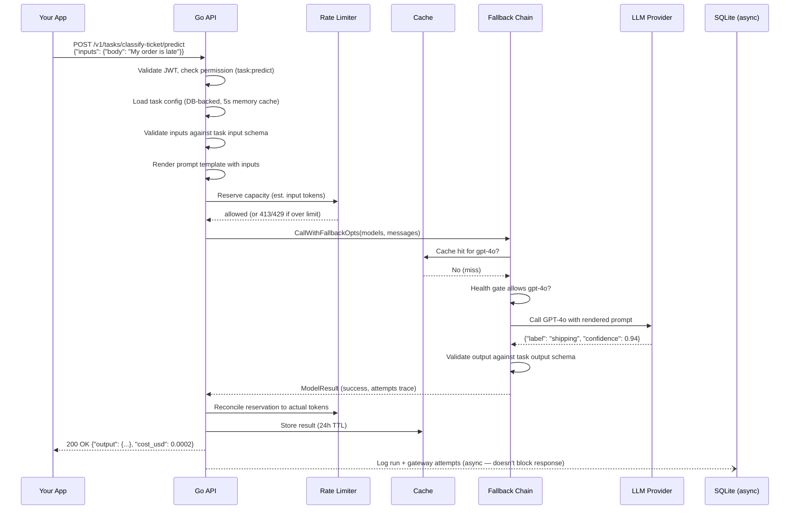

# 00 — The Big Picture

## What problem does this solve?

Imagine you're building a product feature that uses an LLM — say, a "classify this support ticket" function. You run into a bunch of problems immediately:

1. **Which model?** GPT-4o is smart but expensive. Gemini Flash is cheap but sometimes wrong. How do you know which to use?
2. **What if it's down?** OpenAI has outages. If your feature calls only OpenAI and it's down, your feature is down.
3. **How much does it cost?** You want to know your daily LLM spend per product feature, not just total.
4. **How do you update the prompt?** If you change the prompt, how do you roll it back if it breaks something?
5. **Can I reuse results?** If 1,000 users ask the same question, do you really pay for 1,000 LLM calls?

This platform answers all five questions in one place:

| Problem | This platform's answer |
|---------|----------------------|
| Which model? | A **task** defines the model chain. Change it without redeploying your app. |
| What if it's down? | A **fallback chain** + **per-task/model health tracker** automatically routes around failures. |
| How much does it cost? | Every call is logged with token counts × unit prices. Per-task daily budget enforcement. |
| How to update the prompt? | **Prompt versioning** — draft, review, deploy. Full history. Rollback in one click. |
| Can I reuse results? | **Prediction cache** — identical inputs return the stored answer for free. |
| What if a task gets spammed? | A **per-task rate limiter** caps requests, token budget, and individual input sizes per rolling window. |

---

## What this system is NOT

- **Not an agent framework.** It doesn't chain multiple LLM calls together autonomously. It calls one chain of models for one request.
- **Not a fine-tuning platform.** It doesn't train or customize model weights.
- **Not a prompt playground UI.** That's the React frontend. This backend just serves APIs.
- **Not a multi-cloud AI orchestrator.** It routes to the providers you configure, not all possible ones.

---

## The cast of characters



- **Product Builder** — writes prompt templates, defines input/output schemas, iterates on quality.
- **Admin / future approver** — today the implemented role is admin; the permission seam already separates write vs. deploy for a future review workflow.
- **Service / App** — your backend code that calls the `POST /v1/tasks/{id}/predict` endpoint. It never touches prompts directly.
- **Go Backend** — this codebase. The only thing that ever touches LLM provider APIs.

---

## Internal component map

How the backend packages connect to each other:



**Leaves** (depend on nothing else in this repo): `db`, `config`, `types`, `users`, `schema`

**Hub**: `api` — orchestrates everything; receives all dependencies injected at startup from `cmd/server/main.go`

---

## The core abstraction: a Task

Everything in this platform revolves around the concept of a **Task**. A task is:

> A named configuration for calling an LLM. It bundles: what to ask (prompt template), what format to expect back (output schema), which models to try (model chain), how creative to be (temperature), and how much to spend per day (budget).

Think of it like a named function:
```
function classifyTicket(category: string, body: string) → { label: string, confidence: number }
```

The task defines the signature (inputs/outputs) and the implementation (which model, what prompt). Your service code only calls the function — it never has to construct prompts or understand provider routing.

---

## Big architectural decisions

### Why Go?

> **Alternatives considered:** Python (FastAPI/Django), Node.js (Express), Java (Spring Boot)

Go was chosen for three reasons:

1. **Single binary deployment.** A Go program compiles to a single executable file. No Python virtualenv, no npm, no JVM. Copy one file to a server, run it.
2. **Built-in concurrency.** Go has goroutines — lightweight threads — baked into the language. Running 5 model calls in parallel and waiting for all of them is 10 lines of Go. In Python, you'd need asyncio or threading with careful synchronization.
3. **Performance at low memory.** Go uses ~20MB of RAM at idle vs. ~150MB for a Java Spring Boot app doing the same thing.

> ⚠️ **Tradeoff:** Go is more verbose than Python for some things (no list comprehensions, no one-liner lambdas). And the Go ecosystem has fewer ML-specific libraries than Python. If this were a training pipeline, Python would win. For an always-on HTTP API, Go wins.

---

### Why SQLite?

> **Alternatives considered:** PostgreSQL, MySQL, DynamoDB

SQLite is an embedded database — it lives inside the same process as the Go server and writes to a single file (`llm_platform.db`). There's no separate database server to run.

This was chosen because:
1. **Zero infrastructure.** To run this system locally, you need Go and a terminal. Not Go + Docker + Postgres + config.
2. **Fast enough for the load.** One platform instance serving ~100 concurrent users generates maybe 50 writes/second. SQLite with WAL mode handles thousands per second.
3. **Simple backups.** Backing up the database is `cp llm_platform.db backup.db`. That's it.

> ⚠️ **Tradeoff:** SQLite doesn't work well with multiple server instances (two servers writing to the same file causes conflicts). When you need to run 10 instances behind a load balancer, migrate to PostgreSQL. The code is structured to make that swap straightforward — all DB calls go through `internal/db/queries.go` and the `*sql.DB` interface works the same way with Postgres.

---

### Why OpenAI-compatible wire format for every model?

> **Alternatives considered:** Native SDK per provider (Anthropic SDK, Google AI SDK, etc.)

Every model in this platform — OpenAI, Gemini, Claude — is called using the same HTTP request format: OpenAI's chat completions API. This works because:

- **Meesho's bifrost gateway** translates OpenAI-format requests into whatever each provider needs. You send `POST /chat/completions` in OpenAI format; the gateway forwards it to Gemini/Claude using their native APIs.
- **Groq** already uses OpenAI-format natively (they designed their API to be OpenAI-compatible).

The result: the Go code has **one HTTP client** (`openAICompatProvider`) that talks to every provider. Adding a new model is one line in the registry. No new SDK import, no new HTTP client.

> ⚠️ **Tradeoff:** You lose access to provider-specific features that aren't in the OpenAI format. **Gemini's thinking mode** is now handled: the provider returns a multi-part `content` array (text parts + thought tokens); `UnmarshalJSON` in `internal/llm/client.go` concatenates all text parts and discards thought tokens, so the rest of the platform sees a plain string. Features that are genuinely outside the OpenAI format (e.g., Anthropic's native document API) would require a separate native client with its own registry entry.

---

### Why prompt versioning instead of just editing the prompt?

Prompts in LLM products are code. A prompt change can silently degrade quality — the model still returns *something*, but the output is worse. Without versioning:

- You can't roll back a bad prompt change.
- You can't test a new version before making it live.
- You can't see the history of what changed and when.

With versioning, the workflow is: write a draft → test it in the Studio panel → get approval → deploy. The deployed version is immutable. New changes create new versions.

---

## How requests flow (the 60-second version)



Every step shown above has a dedicated section in the learning docs. Start with [04-prediction-flow.md](04-prediction-flow.md) once you understand the basics.
