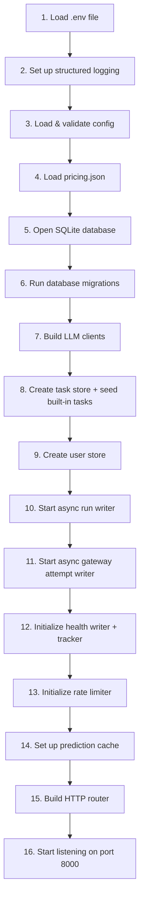

# 01 — Server Startup

## The entry point

Every Go program starts at a function called `main()`. Think of it as the "on" button for the whole application. The server's `main()` lives in [`cmd/server/main.go`](../cmd/server/main.go).

> **🔤 Go concept: `main()` and packages**
> In Go, every runnable program has exactly one `main()` function in a `package main`. The file can import other packages (from the `internal/` folder or from external libraries), and when you run `go run ./cmd/server`, Go compiles everything that `main.go` directly or indirectly imports and starts there.

---

## The boot sequence

The server initializes components **in a specific order**, because each step depends on the previous one. Here's the complete sequence:



---

## Step by step

### Step 1 — Load the `.env` file

```go
_ = godotenv.Load()
```

> **🔤 Go concept: `_` (blank identifier)**
> In Go, you can't declare a variable and never use it — the compiler gives an error. But sometimes a function returns a value you genuinely don't care about. The `_` (underscore) is a special "throw-away" name: it discards the value. Here, `godotenv.Load()` returns an error if the `.env` file doesn't exist, but we ignore it because the server should still work if you're using real environment variables without a `.env` file.

The `.env` file is just a text file with `KEY=VALUE` lines. It's gitignored (never committed) so developers can put real API keys in it without accidentally pushing them to GitHub.

**Why load it first?** All subsequent steps read configuration from environment variables. The `.env` file *sets* those environment variables. So it must go first.

---

### Step 2 — Set up structured logging

```go
logLevel := slog.LevelInfo
if strings.EqualFold(os.Getenv("LOG_LEVEL"), "debug") {
    logLevel = slog.LevelDebug
}
slog.SetDefault(slog.New(slog.NewJSONHandler(os.Stdout, &slog.HandlerOptions{Level: logLevel})))
```

The server uses Go's built-in `slog` package for structured, JSON-formatted logging. Every log line is a JSON object — easy for log aggregators (Grafana Loki, Datadog, etc.) to parse and index.

Set `LOG_LEVEL=debug` in your `.env` to see verbose output during development.

**Why JSON logs?** In production, log lines are ingested by log aggregation systems. A structured format like JSON lets you filter on fields (`"task": "classify-ticket"`, `"code": "rate_limited"`) instead of grepping text.

---

### Step 3 — Load and validate config

```go
cfg, err := config.Load()
if err != nil {
    log.Fatalf("config error: %v", err)
}
if missing := cfg.MissingProviderKeys(); len(missing) > 0 {
    log.Printf("warning: provider keys not set %v — those models will fail at call time", missing)
}
```

> **🔤 Go concept: `:=` and multiple return values**
> `:=` is Go's shorthand for "declare a new variable and assign to it". Many Go functions return two values: the result *and* an error. It's a convention: if `err != nil` (not nil = there was an error), something went wrong. `log.Fatalf` prints the error and **exits the program immediately** — if config is broken, there's no point starting.

`config.Load()` reads all env vars, applies defaults, and validates that at least one LLM provider key is set. If *neither* key is configured, the server refuses to start. If only one is missing, it logs a warning and continues — models that use the missing provider will fail at call time (not at boot).

**Why crash on bad config instead of using defaults?** Failing fast at startup is better than running for hours before anyone notices a misconfiguration. This is called "fail-fast" design.

---

### Step 4 — Load pricing

```go
if err := llm.LoadPricing(cfg.PricingPath); err != nil {
    log.Fatalf("pricing error: %v", err)
}
```

`pricing.json` contains the dollar cost per 1 million tokens for each model. It's loaded into memory once and referenced on every call to calculate `cost_usd`.

**Why must pricing load before LLM clients?** If pricing fails, every call would silently report `$0.00` — misleading data is worse than no data. Fail fast.

---

### Step 5 — Open the database

```go
database, err := db.Open(cfg.DBPath)
defer database.Close()
```

> **🔤 Go concept: `defer`**
> `defer` schedules a function call to run *when the surrounding function returns* — like a cleanup action. Here, `database.Close()` will be called automatically when `main()` exits (e.g., when you press Ctrl+C). This ensures the database file is properly flushed and closed, even if the server crashes.

`db.Open` opens the SQLite file, sets it to WAL (Write-Ahead Logging) mode for concurrency, and returns a `*sql.DB` handle that all other components will share.

---

### Step 6 — Run migrations

```go
if err := db.Migrate(database); err != nil {
    log.Fatalf("migration error: %v", err)
}
```

`db.Migrate` runs all `CREATE TABLE IF NOT EXISTS` statements. On first launch, it creates every table. On subsequent launches, the `IF NOT EXISTS` clause means it skips tables that already exist — safe to run every time.

The migration also runs guarded `ALTER TABLE` statements to add new columns to existing tables, so older databases upgrade automatically. See [08-database.md](08-database.md) for the full schema.

---

### Step 7 — Build LLM clients

```go
clients := llm.BuildClients(cfg)
```

Creates one HTTP client per provider (Groq and Meesho gateway). Each client knows its base URL and API key. See [03-models-and-routing.md](03-models-and-routing.md) for details.

---

### Step 8 — Load tasks + seed built-ins

```go
taskStore := tasks.NewStore(database)
if err := tasks.SeedPlayground(taskStore); err != nil {
    log.Fatalf("seed playground task: %v", err)
}
if err := tasks.SeedAttributeExtraction(taskStore); err != nil {
    log.Fatalf("seed attribute-extraction task: %v", err)
}
```

The task store combines the database (for persistence) with an in-memory cache (for speed). At startup, two built-in tasks are seeded if they don't already exist:

- **`playground`** — the free-form task backing the Studio's `/run` endpoint.
- **`attribute-extraction`** — a demo product task for extracting structured attributes from text.

All other tasks are authored at runtime through the API (`POST /v1/tasks`) and persist in the database.

---

### Step 9 — Create the user store

```go
userStore := users.NewDemoStore()
```

The demo store is a swap seam — a single hardcoded admin user for development. Replace `NewDemoStore` with a real Store implementation (LDAP, OAuth2, internal SSO) and nothing else in the platform changes. See [09-auth-and-rbac.md](09-auth-and-rbac.md).

---

### Step 10 — Async run writer

```go
runWriter := db.NewRunWriter(database, 0)
defer runWriter.Close()
```

A background goroutine that writes prediction run rows to the database **off the hot path**. When a prediction completes, the handler drops the record into a channel and returns immediately. The writer drains the channel in the background.

**Why async?** A SQLite write can take 1–5ms. Under high concurrency, the single-writer lock creates a bottleneck. Async writing removes this bottleneck entirely.

See [08-database.md](08-database.md) for details on the async writer design.

---

### Step 11 — Async gateway attempt writer

```go
attemptWriter := db.NewGatewayAttemptWriter(database, 0)
defer attemptWriter.Close()
```

A second async writer, specifically for the gateway trace — one row per model the fallback walk touched in a prediction. While the run writer captures the final answer, the attempt writer captures **everything that happened getting there**: every fallback, why it happened, the error and its classification, retry counts, and per-call latency.

The attempt writer uses a larger default buffer (4096 vs. 2048 for the run writer) because a single run can produce several attempt rows (one per model in the chain).

**Why a separate writer?** Attempt rows are higher volume (one per model call, not per prediction) and not needed for the response. Keeping them on a separate async path prevents noisy trace writes from interfering with run writes.

---

### Step 12 — Health writer and tracker

```go
healthWriter := db.NewHealthEventWriter(database, 0)
defer healthWriter.Close()
healthTracker := health.NewTracker(health.Config{
    Enabled:      cfg.HealthBreakerEnabled,
    Threshold:    cfg.HealthThreshold,
    BaseCooldown: cfg.HealthBaseCooldown,
    MaxCooldown:  cfg.HealthMaxCooldown,
    Factor:       2,
}, healthWriter.Write)
```

The health tracker is the per-(task, model) circuit breaker. Every state transition (failure, tripped, recovered, manual reset) is written to `model_health_events` via the health writer. See [06-circuit-breaker.md](06-circuit-breaker.md) for the full explanation.

---

### Step 13 — Rate limiter

```go
limiter := ratelimit.New(ratelimit.Config{
    Enabled:        cfg.RateLimitEnabled,
    Window:         cfg.RateWindow,
    MaxRequests:    cfg.RateMaxRequests,
    MaxTokens:      cfg.RateMaxTokens,
    MaxInputTokens: cfg.RateMaxInputTokens,
    CharsPerToken:  cfg.RateCharsPerToken,
    TokensPerImage: cfg.RateTokensPerImage,
})
```

A per-task rolling-window rate limiter with three gates:

1. **Per-request input cap** — rejects a single request whose estimated input tokens are too large (returns 413).
2. **Request-rate cap** — at most N requests per task per window (returns 429).
3. **Token budget** — at most N tokens consumed per task per window, enforced "reserve upfront" (returns 429).

Each task has its own independent window — different tasks never serialize against each other. Defaults: enabled, 1-minute window, 600 requests, 200,000 tokens, 16,000 tokens per request.

See [02-config.md](02-config.md) for all the tuning knobs.

---

### Step 14 — Prediction cache

```go
var predictionCache cache.Cache
switch cfg.CacheBackend {
case "redis": predictionCache = cache.NewRedis(...)
case "memory": predictionCache = cache.NewMemory()
default: // off
}
```

The prediction cache stores responses so identical requests return the stored answer instantly. Redis in production, in-memory for local dev, off by default. See [10-caching-and-cost.md](10-caching-and-cost.md).

---

### Step 15 — Build the router

```go
router := api.NewRouter(api.RouterDeps{
    DB: database, Clients: clients, Users: userStore,
    Tasks: taskStore, Runs: runWriter, Attempts: attemptWriter,
    Cache: predictionCache, Health: healthTracker, Limiter: limiter,
    Auth: ..., AllowedOrigins: ...,
})
```

> **🔤 Go concept: structs as function parameters**
> Instead of passing 10+ separate arguments to `NewRouter(db, clients, users, tasks, ...)`, Go code groups them into a struct (`RouterDeps`). This is a common pattern — it's easier to read and adding a new dependency doesn't break existing call sites.

`NewRouter` registers every HTTP route and binds each handler to all its dependencies. The router now receives both the `Attempts` writer (for gateway traces) and the `Limiter` (for rate limiting) alongside the other deps.

---

### Step 16 — Listen for connections

```go
addr := ":" + cfg.Port  // e.g. ":8000"
http.ListenAndServe(addr, router)
```

The server is now ready. The current implementation uses plain `http.ListenAndServe`, not a graceful-shutdown `http.Server`, so a hard process kill will stop immediately. When `main()` returns after `ListenAndServe` errors, deferred cleanup runs in reverse order for components that have `Close` methods, such as async writers and the database handle.

---

## What happens when a step fails?

| Step | Failure behavior | Why |
|------|-----------------|-----|
| Config | `log.Fatalf` — server exits | No point starting with broken config |
| Pricing | `log.Fatalf` — server exits | Every call would show $0.00 cost |
| DB open | `log.Fatalf` — server exits | Can't run without persistence |
| Migrations | `log.Fatalf` — server exits | Schema could be inconsistent |
| LLM clients | No error — clients are built even if keys are empty | A missing key just fails at call time (per-model) |
| Task seeding | `log.Fatalf` — server exits if seeding fails | Missing built-in tasks would cause 404s |
| Async writers | No error possible — goroutine launches always succeed | Background loops, not critical path |
| Cache | `log.Fatalf` only for Redis config errors; "off" if unconfigured | Cache is an optimization, not a hard requirement |
| Router | No error possible | Pure in-memory setup |
| Listen | `log.Fatalf` if port is already in use | Can't start without a port |
