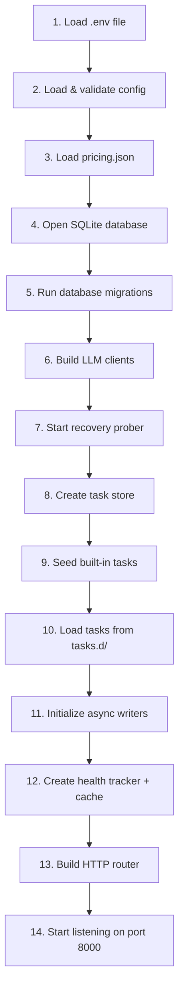

# 01 — Server Startup

## The entry point

Every Go program starts at a function called `main()`. Think of it as the "on" button for the whole application. The server's `main()` lives in [`cmd/server/main.go`](../cmd/server/main.go).

> **🔤 Go concept: `main()` and packages**
> In Go, every runnable program has exactly one `main()` function in a `package main`. The file can import other packages (from the `internal/` folder or from external libraries), and when you run `go run ./cmd/server`, Go compiles everything that `main.go` directly or indirectly imports and starts there.

---

## The 12-step boot sequence

The server initializes components **in a specific order**, because each step depends on the previous one. Here's the complete sequence:



---

## Step by step

### Step 1 — Load the `.env` file

```go
_ = godotenv.Load()
```

> **🔤 Go concept: `_` (blank identifier)**
> In Go, you can't declare a variable and never use it — the compiler gives an error. But sometimes a function returns a value you genuinely don't care about. The `_` (underscore) is a special "throw-away" name: it discards the value. Here, `godotenv.Load()` returns an error if the `.env` file doesn't exist, but we ignore it because the server should still work if you're using real environment variables without a `.env` file.

The `.env` file is just a text file with `KEY=VALUE` lines. It's gitignored (never committed) so developers can put real API keys in it without accidentally pushing them to GitHub.

**Why load it first?** All subsequent steps read configuration from environment variables. The `.env` file *sets* those environment variables. So it must go first.

---

### Step 2 — Load and validate config

```go
cfg, err := config.Load()
if err != nil {
    log.Fatalf("config error: %v", err)
}
```

> **🔤 Go concept: `:=` and multiple return values**
> `:=` is Go's shorthand for "declare a new variable and assign to it". You don't need to write a type — Go figures it out.
> Many Go functions return two values: the result *and* an error. It's a convention: if `err != nil` (not nil = there was an error), something went wrong. `log.Fatalf` prints the error and **exits the program immediately** — if config is broken, there's no point starting.

`config.Load()` reads all env vars, applies defaults, and validates that at least one LLM provider key is set. If you forgot to set `MEESHO_GATEWAY_VK` *and* `GROQ_API_KEY`, the server refuses to start with a clear error rather than starting and failing mysteriously on the first real call.

**Why crash on bad config instead of using defaults?** Failing fast at startup is better than running for hours before anyone notices a misconfiguration. This is called "fail-fast" design.

---

### Step 3 — Load pricing

```go
if err := llm.LoadPricing(cfg.PricingPath); err != nil {
    log.Fatalf("pricing error: %v", err)
}
```

`pricing.json` contains the dollar cost per 1 million tokens for each model. It's loaded into memory once and referenced on every call to calculate `cost_usd`.

**Why must pricing load before LLM clients?** The LLM clients don't need pricing, but this step comes before call handling. If pricing fails, every call would silently report `$0.00` — misleading data is worse than no data. Fail fast.

---

### Step 4 — Open the database

```go
database, err := db.Open(cfg.DBPath)
defer database.Close()
```

> **🔤 Go concept: `defer`**
> `defer` schedules a function call to run *when the surrounding function returns* — like a cleanup action. Here, `database.Close()` will be called automatically when `main()` exits (e.g., when you press Ctrl+C). This ensures the database file is properly flushed and closed, even if the server crashes.

`db.Open` opens the SQLite file, sets it to WAL (Write-Ahead Logging) mode for concurrency, and returns a `*sql.DB` handle that all other components will share.

---

### Step 5 — Run migrations

```go
if err := db.Migrate(database); err != nil {
    log.Fatalf("migration error: %v", err)
}
```

`db.Migrate` runs all `CREATE TABLE IF NOT EXISTS` statements. On first launch, it creates every table. On subsequent launches, the `IF NOT EXISTS` clause means it skips tables that already exist — safe to run every time.

**Why migrations on every startup?** No separate migration script to remember to run. The database schema is always up-to-date.

---

### Step 6 — Build LLM clients

```go
clients := llm.BuildClients(cfg)
```

Creates one HTTP client per provider (currently Groq and Meesho gateway). Each client knows its base URL and API key. See [03-models-and-routing.md](03-models-and-routing.md) for details.

---

### Step 7 — Start the recovery prober

```go
proberCtx, stopProber := context.WithCancel(context.Background())
defer stopProber()
llm.StartRecoveryProber(proberCtx, clients, 15*time.Second)
```

> **🔤 Go concept: goroutines and `context`**
> `StartRecoveryProber` starts a **goroutine** — a lightweight background thread that runs concurrently with the main server. It pings unhealthy providers every 15 seconds to check if they've recovered.
>
> `context.WithCancel` creates a "cancellation token". When the server shuts down and `stopProber()` is called (via `defer`), the prober goroutine receives the cancellation signal and stops cleanly. Without this, the goroutine would run forever even after the server exits — a "goroutine leak".

**Why start the prober before accepting HTTP traffic?** If a provider was unhealthy during the last server run (and state was lost at restart), the prober will discover it's healthy again before the first user request arrives.

---

### Steps 8–10 — Load tasks

```go
taskStore := tasks.NewStore(database)
tasks.SeedPlayground(taskStore)
tasks.LoadYAMLDir(taskStore, "./tasks.d")
```

The task store is a combination of the database (for persistence) and an in-memory cache (for speed). At startup:
1. The built-in "playground" task is seeded if it doesn't exist.
2. YAML files from `tasks.d/` are loaded — this is how you add product tasks without touching code.

---

### Step 11 — Async writers

```go
runWriter := db.NewRunWriter(database, 0)
defer runWriter.Close()
healthWriter := db.NewHealthEventWriter(database, 0)
defer healthWriter.Close()
```

Two background goroutines that write to the database **off the hot path**. When a prediction completes, instead of waiting for the DB INSERT to finish before returning the response, the handler drops the record into a channel and returns immediately. The writer goroutine drains the channel in the background.

**Why async?** A SQLite write can take 1–5ms. For a prediction that took 500ms to get an LLM response, adding 5ms of DB latency sounds small — but under high concurrency, the single-writer lock on SQLite creates a bottleneck. Async writing removes this bottleneck entirely.

See [08-database.md](08-database.md) for details on the async writer design.

---

### Step 12 — Health tracker and prediction cache

```go
healthTracker := health.NewTracker(health.Config{...}, healthWriter.Write)

switch cfg.CacheBackend {
case "redis": predictionCache = cache.NewRedis(...)
case "memory": predictionCache = cache.NewMemory()
default: // off
}
```

The health tracker is the per-(task, model) circuit breaker. The prediction cache is either Redis (production) or in-memory (dev). Both are explained in their dedicated docs.

---

### Step 13 — Build the router

```go
router := api.NewRouter(api.RouterDeps{
    DB: database, Clients: clients, Users: userStore,
    Tasks: taskStore, Runs: runWriter, Cache: predictionCache,
    Health: healthTracker, Auth: ..., AllowedOrigins: ...,
})
```

> **🔤 Go concept: structs as function parameters**
> Instead of passing 10 separate arguments to `NewRouter(db, clients, users, tasks, ...)`, Go code groups them into a struct (`RouterDeps`). This is a common pattern — it's easier to read and adding a new dependency doesn't break existing call sites.

`NewRouter` registers every HTTP route and binds each handler to all its dependencies. See [04-prediction-flow.md](04-prediction-flow.md) and [09-auth-and-rbac.md](09-auth-and-rbac.md) for the routing details.

---

### Step 14 — Listen for connections

```go
addr := ":" + cfg.Port  // e.g. ":8000"
http.ListenAndServe(addr, router)
```

The server is now ready. It will run until the process is killed (Ctrl+C or SIGTERM), at which point all the `defer` calls run in reverse order (close writers, close DB, stop prober).

---

## What happens when a step fails?

| Step | Failure behavior | Why |
|------|-----------------|-----|
| Config | `log.Fatalf` — server exits | No point starting with broken config |
| Pricing | `log.Fatalf` — server exits | Every call would show $0.00 cost |
| DB open | `log.Fatalf` — server exits | Can't run without persistence |
| Migrations | `log.Fatalf` — server exits | Schema could be inconsistent |
| LLM clients | No error — clients are built even if keys are empty | A missing key just fails at call time (per-model) |
| Recovery prober | Goroutine launch can't fail | Background loop, not critical path |
| Task loading | `log.Fatalf` — server exits if YAML is malformed | Bad task config would silently cause 500s |
| Cache | `log.Fatalf` only for Redis config errors; "off" if unconfigured | Cache is an optimization, not a hard requirement |
| Router | No error possible | Pure in-memory setup |
| Listen | `log.Fatalf` if port is already in use | Can't start without a port |
