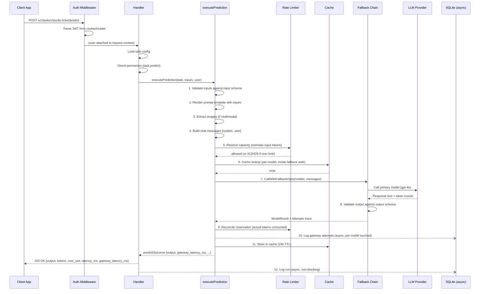

# 04 — The Prediction Flow (End-to-End)

This is the most important doc. Every time someone calls `POST /v1/tasks/{task_id}/predict`, this is what happens — from the moment the HTTP request hits the server to the moment the response goes back.

---

## The full sequence



---

## Step 1: Auth middleware

Before the handler even sees the request, two middleware functions run:

**`RequireAuth`** — validates the JWT token:
- Looks for it in the `Authorization: Bearer <token>` header or the `llm_platform_token` cookie.
- Parses and verifies the JWT signature using `JWT_SECRET`.
- If valid, attaches the user (email, role) to the request context.
- If invalid or missing, returns `401 Unauthorized` immediately.

**`RequirePermission("task:predict")`** — checks the role:
- Gets the user from the context.
- Looks up whether the user's role has the `task:predict` permission.
- If not, returns `403 Forbidden`.

> **🔤 Go concept: `context.Context`**
> HTTP middleware in Go passes data to downstream handlers via a "context" — an immutable bag of values attached to the request. Middleware adds the authenticated user to the context with `context.WithValue(ctx, userKey, user)`. The handler retrieves it with `auth.UserFromContext(ctx)`. This avoids global state — each request has its own context with its own user.

---

## Step 2: Load task config

```go
task, err := h.Tasks.Get(taskID)
```

The task store's `Get` method checks an in-memory cache first (5-second TTL) before hitting the database. For a task that's called 1,000 times per minute, this means ~200 DB reads per minute instead of 1,000.

If the task doesn't exist → `404 Not Found`.
If the task is inactive → `404 Not Found` (inactive tasks are effectively deleted from the API surface).

---

## Step 3: Input validation

```go
if err := validateInputs(task.InputSchema, inputs); err != nil {
    return nil, &httpError{Status: 400, Detail: err.Error()}
}
```

If the task has an `input_schema`, the submitted JSON inputs are validated against it using the [JSON Schema](https://json-schema.org/) standard. For example, if the schema says `"category"` is required and must be a string, and the caller sends `{"category": 42}`, the call fails with a 400 error *before* any LLM API is called.

**Why validate before calling the LLM?** LLM API calls cost money. A malformed request that fails schema validation should be caught instantly, not after spending $0.002 on tokens.

---

## Step 4: Prompt rendering

```go
rendered, err := renderTemplate(task.PromptTemplate, inputs)
```

The task's `prompt_template` is a Go template. Think of it like a fill-in-the-blank form:

```
Prompt template:
"Classify the following support ticket as one of: {{.category}}.
Ticket body: {{.body}}
Respond with only the label."

Inputs: {"category": "shipping, billing, returns", "body": "My order hasn't arrived"}

Rendered prompt:
"Classify the following support ticket as one of: shipping, billing, returns.
Ticket body: My order hasn't arrived
Respond with only the label."
```

> **🔤 Go concept: `text/template`**
> Go's standard library has a template engine where `{{.fieldName}}` is replaced by the value of that field from your data. It also supports logic: `{{if .x}}...{{end}}`, loops: `{{range .items}}...{{end}}`, etc. Think of it as a very simple, safe version of Python's Jinja2 or JavaScript's Handlebars.

**Why not string concatenation?** Templates make the prompt structure explicit and version-controlled. You can see exactly where inputs are inserted. Concatenation hides the structure in code.

---

## Step 5: Build chat messages

```go
messages := buildMessages(task, renderedPrompt, images)
// → [{Role: "system", Content: "You are a ticket classifier..."},
//    {Role: "user",   Content: "Classify the following...", Images: [...]}]
```

All LLM providers expect messages in a "conversation" format, even for single-turn requests:
- The **system message** carries the task's `system_prompt` (e.g., "You are a helpful assistant that classifies support tickets. Always respond in valid JSON.").
- The **user message** carries the rendered prompt, plus any images for vision tasks.

---

## Step 5: Rate limiting

Before any cache lookup or LLM call, the rate limiter runs three gates in sequence:

```go
if opts.enforceLimits && h.Limiter.Enabled() {
    est := h.Limiter.Estimate(systemPrompt+"\n"+prompt, len(images))
    res, dec := h.Limiter.Reserve(task.ID, est)
    if !dec.Allowed {
        return nil, limiterError(dec)  // 413 or 429
    }
    reservation = res
}
```

1. **Input size check** — if the estimated input tokens exceed `RATE_MAX_INPUT_TOKENS`, the request is rejected with `413 Payload Too Large`. This is a *deterministic* rejection: retrying the same oversized input will always fail.
2. **Request-rate check** — if the task already received `RATE_MAX_REQUESTS` in the current window, the request is rejected with `429 Too Many Requests` and a `Retry-After` header.
3. **Token budget check** — if the estimated tokens would push the task over `RATE_MAX_TOKENS` for the window, the request is rejected with `429`.

The token estimate is computed as `ceil(len(text) / CharsPerToken) + images × TokensPerImage`. This is a cheap over-estimate — the real count isn't known until the provider responds.

If the request is allowed, a **reservation** is created. After the fallback walk finishes, the reservation is reconciled to the tokens actually consumed (see Step 9 below).

**Rate limiting only applies to production predicts.** Studio test panel runs (`is_test=true`) and shadow comparisons bypass the limiter.

---

## Step 6: Cache lookup

Before making any LLM API call, the platform checks the prediction cache:

```go
cacheLookup := func(model string) (ModelResult, bool) {
    entry, ok := cache.Get(ctx, cacheKey(task, model, renderedPrompt, ...))
    if !ok {
        return ModelResult{}, false
    }
    return entryToResult(entry), true
}
```

The cache key is computed from:

| Component | Why it's in the key |
|-----------|---------------------|
| `task_id` | Different tasks have different prompts |
| `prompt_version` | Deploying a new prompt invalidates old cached answers |
| Rendered prompt text | Different inputs → different expected outputs |
| System prompt | Part of what determines the output |
| Model routing key | gpt-4o and gemini give different answers to the same question |
| Temperature, max_tokens | Same prompt with different params = different output |
| Output schema | Different schema expectations → different validation |
| Images (hashed) | Multimodal inputs must be part of the key |

This lookup is passed as a **function** into the fallback chain. The chain calls it *as it reaches each model* — so if the primary model is unhealthy and the fallback is used, the cache is only consulted for models actually reached in the walk.

**Why per-model cache instead of caching the whole chain result?** The chain configuration (which model is primary, which is fallback) is live config that can change at any time. If you cache the whole chain result under "this chain", updating the chain doesn't invalidate old cache entries. Per-model caching means a cache entry is always from a specific model — the chain is just a way to select which model to try.

---

## Step 7: The fallback chain call

```go
result := llm.CallWithFallbackOpts(ctx, clients, models, messages, temperature, maxTokens, opts)
```

This is where the actual LLM API calls happen. See [05-fallback-chain.md](05-fallback-chain.md) for the full walkthrough. In brief:
- Try the primary model.
- If it fails for an infra reason (5xx, 429, timeout), try the first fallback model.
- And so on, until a model succeeds or all models are exhausted.
- The circuit breaker skips models it knows are currently unhealthy.

The walk returns a `ModelResult` that now carries an `Attempts` slice — the full gateway trace, one entry per model the walk touched. Each entry records the outcome, fallback reason, HTTP status, whether it was an infra failure, retry count, latency, and token costs.

---

## Step 8: Output validation

If the task has an `output_schema`:

```go
if task.OutputSchema != nil {
    valid := validateOutput(task.OutputSchema, result.Response)
    result.OutputValid = &valid
}
```

The model's response is validated against the schema. A response that doesn't match (e.g., the model returned prose when JSON was expected) is treated as a **failure** and the fallback chain advances to the next model.

This is a key insight: **output schema validation is part of the fallback logic**, not just a reporting field. If gpt-4o returns non-JSON when you expect JSON, the platform automatically retries with gemini-flash. You get the right format or a clear degraded signal.

---

## Step 9: Reconcile rate-limit reservation

```go
if reservation.Active() {
    actualTokens := 0
    for _, a := range result.Attempts {
        actualTokens += a.TotalTokens
    }
    h.Limiter.Reconcile(reservation, actualTokens)
}
```

After the walk, the rate-limit reservation is settled to the **tokens actually consumed** — the sum across every attempt (winner + failed/fallback + schema-invalid + retries). This is the true spend even when the request ultimately failed or fell back.

If the actual consumption is less than the estimate (common — the estimate is a cheap over-count), the window's token counter is adjusted down. If more (rare), it's adjusted up. This ensures the budget gate reflects real usage, not rough estimates.

A cache hit consumed nothing upstream, so its attempts total is effectively zero — the reservation is reconciled to 0 and the window is freed.

## Step 10: Gateway attempt tracing

```go
h.recordAttempts(runID, &task.ID, result.Attempts, opts.isTest)
```

Before the cache fill or run insert, every model the walk touched is persisted to the `gateway_attempts` table. One row per model, in walk order:

| Field | What it records |
|-------|----------------|
| `seq` | Walk order (0 = configured primary, 1 = first fallback, …) |
| `outcome` | `success`, `error`, `schema_invalid`, `skipped_unhealthy`, `cache_hit` |
| `fallback_used` | Was this attempt a fallback (seq > 0)? |
| `fallback_reason` | Why the walk moved past this model (empty on success) |
| `response` | The model's raw output — set even on schema_invalid, so the bad output is preserved |
| `http_status` | Last upstream HTTP status (0 if no response reached) |
| `infra_failure` | Whether it was a provider-infrastructure problem (5xx/429/network) |
| `retry_count` | How many upstream HTTP attempts were made |
| `latency_ms` | This model call's duration |
| `input_tokens` / `output_tokens` / `cost_usd` | Per-attempt costs |

This trace is written via the async `GatewayAttemptWriter`, so it never delays the response.

**Why this matters:** the `runs` table shows *what the caller received*. The `gateway_attempts` table shows *everything that happened behind it*. When a request fell back three times before succeeding, you see exactly why each model was skipped and what it returned.

---

## Step 11: Cache fill

```go
cache.Set(ctx, key, entry, ttl)
```

If the result was a success and schema-valid, it's stored in the cache with the task's configured TTL (default 24 hours). The next identical request within that window gets a free answer.

**Test panel calls bypass caching.** Studio test runs (where a product builder is testing a draft prompt) are marked `is_test=true` and never read from or write to the cache. You always see the live model response.

---

## Step 12: Return the response

```go
return &predictOutcome{
    RunID:            runID,
    PromptVersion:    promptVersion,
    Result:           result,
    Output:           output,
    OutputValid:      outputValid,
    GatewayLatencyMs: int(time.Since(gatewayStart).Milliseconds()),
}, nil
```

The handler serializes this to JSON and sends it back. The response reaches the caller while the DB writes are still in progress (next step).

**`GatewayLatencyMs`** is the end-to-end wall-clock time the platform spent on this prediction — from the moment `executePrediction` started to the moment it returned. It covers input validation, prompt rendering, the complete fallback walk (including any failed/skipped models and retries), output validation, and cache operations. `Result.LatencyMs`, by contrast, is only the winning model's HTTP call duration. The difference between the two is the platform's own overhead plus the time spent on losing models.

---

## Step 13: Async run logging

```go
h.Runs.Write(types.RunRow{
    RunID: taskRunID, TaskID: task.ID, Model: result.Model,
    Response: result.Response, CostUSD: result.CostUSD,
    // ... 20+ fields
})
```

> **🔤 Go concept: channels and goroutines**
> `h.Runs.Write(...)` doesn't write to the database directly. It puts the `RunRow` into a **channel** — a queue that connects two goroutines. A background goroutine (the RunWriter) reads from this channel and batches the writes to SQLite.
>
> Why not write synchronously? Because the HTTP handler would have to wait for the SQLite INSERT to complete before sending the response. The async approach means the user gets the prediction result immediately, and the logging happens in the background.
>
> **What if the channel is full?** If predictions come in faster than the writer can drain them, rows are dropped (counted in a metric, not blocked). Losing observability data is acceptable; blocking a prediction is not.

---

## Budget check (pre-prediction)

Before the cache lookup and model calls, there's a budget check:

```go
if task.DailyBudgetUSD > 0 {
    spent := h.currentSpend(ctx, task.ID)
    if spent >= task.DailyBudgetUSD {
        return nil, &httpError{Status: 429, Detail: "daily budget exceeded"}
    }
}
```

`currentSpend` uses an in-memory spend cache that's refreshed every 5 seconds from the database. It accumulates local costs on top of the refreshed DB value. This means:
- No DB query on every prediction (would bottleneck at scale).
- The spend value is slightly stale (up to 5s + the async writer lag), so enforcement is conservative — it might allow a few calls over budget by a small margin, but never allows unbounded overspend.

**Why not just query the DB?** A `SUM(cost_usd) WHERE task_id=? AND date=today` query would need to run on every prediction. At 1,000 predictions/minute, that's 1,000 SUM queries per minute — each one a full table scan or index scan on an ever-growing table.
