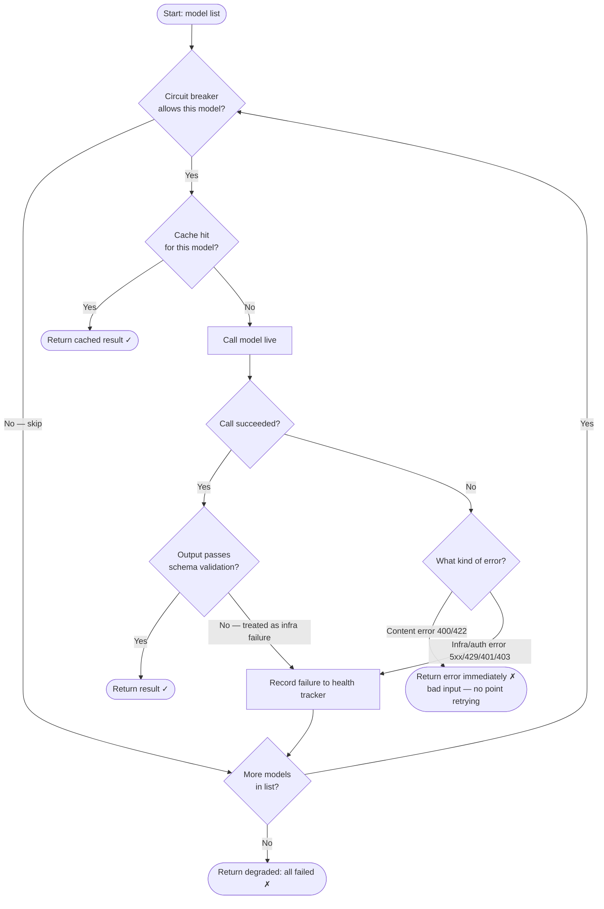

# 05 — The Fallback Chain

## Why do you need a fallback?

LLM APIs go down. GPT-4o returns a 503. Gemini rate-limits you. Your Groq key expires. Without a fallback, every one of these events means a failed user request.

With a fallback chain, you say: "try GPT-4o first; if it fails, try Gemini Flash; if that fails too, try Llama on Groq." The user gets an answer — maybe from a different model than usual — but gets one.

---

## The walk algorithm

The fallback chain walks a list of models in priority order. For each model, it makes a decision:



---

## The three kinds of failures

The algorithm treats errors very differently depending on their type:

### Infra failures → advance the chain

These are failures that are specific to *this provider right now*, not to your request:

| Status code | Meaning | Action |
|-------------|---------|--------|
| 5xx | Provider-side error (server crash, timeout) | Advance chain |
| 429 | Rate limit hit | Advance chain |
| Network error | No TCP connection, DNS failure | Advance chain |
| Timeout | Provider took > 2 minutes | Advance chain |
| Open circuit | Health tracker has already marked this model unhealthy | Skip entirely |

These are called `fallbackEligible` in the code. The logic: if GPT-4o is overloaded right now, Gemini might not be. It's worth trying.

### Config/auth failures → also advance the chain

| Status code | Meaning | Action |
|-------------|---------|--------|
| 401 | Wrong API key | Advance chain (another provider has a different key) |
| 403 | Permission denied | Advance chain |
| 404 | Model not found at this endpoint | Advance chain |

These are also fallback-eligible. The reasoning: a missing API key is a configuration problem for *this specific provider*. Another provider in the chain has a different key and may work.

### Content failures → STOP immediately

| Status code | Meaning | Action |
|-------------|---------|--------|
| 400 | Bad request — the request itself is malformed | Stop — no point retrying |
| 422 | Unprocessable — content violates the model's policies | Stop — no point retrying |

> ⚠️ **Why stop on 400/422?** If your prompt is structured incorrectly, or if the content violates a model's safety policy, sending the same prompt to 5 other models will just give you 5 more 400/422 errors. You'd waste money and time. Stop immediately and surface the real problem.

---

## Schema validation failures → treated like infra failures

If a model returns a 200 OK but its response doesn't match the task's output schema, it's treated as a failure and the chain advances:

```go
if opts.Validate != nil && !opts.Validate(*last.Response) {
    // Record failure to health tracker — this model misbehaved
    last.Degraded = true
    continue  // try next model
}
```

**Why?** You specified an output schema because your application needs structured data. A model that returns prose when you expected JSON is effectively broken *for this task* — it produced output that your code can't use. The right response is to try a different model that might give valid JSON.

This is one of the most powerful features: **output schema enforcement as a fallback trigger**. You get reliable structured output because the chain keeps trying until something works.

---

## The FallbackOptions struct

The fallback walk is controlled by an options struct:

```go
type FallbackOptions struct {
    Lookup   ModelCacheLookup  // function: is this model cached? → return cached result
    Gate     HealthGate        // interface: is this model healthy? → record outcomes
    Validate OutputValidator   // function: is this output valid for the task?
}
```

> **🔤 Go concept: function types as struct fields**
> In Go, a struct field can hold a function. `ModelCacheLookup` is defined as `func(model string) (ModelResult, bool)` — a type that represents "any function that takes a string and returns a ModelResult plus a bool". When you set `opts.Lookup = myCacheFunc`, you're storing a function in the struct. The fallback code calls `opts.Lookup(model)` without knowing *which* cache implementation it's talking to.

All three hooks are optional:
- `nil` Lookup → always "not cached" (no caching, always call live)
- `nil` Gate → no health gating (always call regardless of health)
- `nil` Validate → accept all responses (no schema validation)

The playground (`/run`) uses bare `CallWithFallback` which passes `nil` for all three. Product tasks use `CallWithFallbackOpts` with all three populated.

---

## The result flags

Every `ModelResult` carries two public flags:

```go
type ModelResult struct {
    // ...
    FallbackUsed bool      // true if this was served by model[1], [2], etc. (not [0])
    Degraded     bool      // true if FallbackUsed=true, OR if the whole chain failed
    Attempts     []Attempt // full gateway trace — one entry per model the walk touched
}
```

These are surfaced in the API response so callers can observe degradation:

```json
{
  "model": "gemini-2.5-flash",
  "fallback_used": true,
  "degraded": false,
  "output": {...}
}
```

This tells the caller: "you got an answer, but from a fallback model — the primary is currently unhealthy."

There's also an `X-Platform-Degraded: true` response header for callers who check headers rather than JSON.

---

## The gateway trace: `Attempt`

Every model the walk touches — whether it succeeded, failed, was skipped, or was a cache hit — is recorded as an `Attempt`:

```go
type Attempt struct {
    Seq            int     // 0-based walk order (0 = configured primary)
    Model          string
    Provider       string
    Outcome        string  // "success" | "error" | "schema_invalid" | "skipped_unhealthy" | "cache_hit"
    FallbackUsed   bool    // seq > 0
    FallbackReason string  // why the walk advanced past this model (empty on success/cache_hit)
    Response       *string // the model's output, when any (set even for schema_invalid)
    Error          string  // classified error message
    HTTPStatus     int     // last upstream HTTP status (0 if no response reached)
    InfraFailure   bool    // provider-infra trouble: 5xx, 429, network, timeout
    RetryCount     int     // upstream HTTP attempts made (1 = no retry)
    LatencyMs      int
    InputTokens    int
    OutputTokens   int
    TotalTokens    int
    CostUSD        float64
}
```

The `Attempts` slice is attached to the `ModelResult` by a `defer` at the top of `CallWithFallbackOpts`:

```go
var attempts []Attempt
defer func() { result.Attempts = attempts }()
```

> **🔤 Go concept: `defer` with closure**
> The `defer` here runs when the function returns — at that point `attempts` has been fully populated by the walk loop. The closure captures the slice *by reference*, so whatever is in `attempts` at return time is what gets attached to `result`. This is a clean way to ensure the trace is always attached, even when the function returns early (cache hit, content error).

The caller (`executePrediction`) persists the full `Attempts` slice to the `gateway_attempts` table via the async `GatewayAttemptWriter`. The `runs` table records what the caller received; `gateway_attempts` records everything that happened behind it.

### Outcome values

| Outcome | When it happens |
|---------|----------------|
| `success` | Model returned content and passed schema validation (or no schema) |
| `error` | Provider returned an error or timed out |
| `schema_invalid` | Model returned 200 OK but output failed schema validation — treated as a failure |
| `skipped_unhealthy` | Circuit breaker blocked this model — no call was made |
| `cache_hit` | A cached answer was found for this model — no provider call |

---

## An example walkthrough

**Task config:** primary=`gpt-4o`, fallbacks=[`gemini-2.5-flash`, `llama-groq`]

**Scenario:** GPT-4o's circuit is open (it was unhealthy 20 minutes ago); Gemini returns a 503; Llama succeeds.

```
1. model = "gpt-4o"
   → Gate.Allow("gpt-4o") = false  (circuit is open)
   → Skip. last = skippedResult("gpt-4o")

2. model = "gemini-2.5-flash"
   → Gate.Allow("gemini-2.5-flash") = true
   → Cache.Lookup("gemini-2.5-flash") = miss
   → Call gemini live → 503 Server Error
   → isInfraFailure(503) = true → fallbackEligible = true
   → Gate.RecordFailure("gemini-2.5-flash", "503 server error")
   → Advance to next model

3. model = "llama-groq"
   → Gate.Allow("llama-groq") = true
   → Cache.Lookup("llama-groq") = miss
   → Call llama live → 200 OK, response = "{\"label\": \"shipping\"}"
   → Validate("{\"label\": \"shipping\"}") = true (matches output schema)
   → Gate.RecordSuccess("llama-groq")
   → Return result: Model="llama-groq", FallbackUsed=true, Degraded=true
```

The user gets an answer from Llama, `fallback_used=true`, `degraded=true`. The system degraded gracefully.

---

## What "probe-only mode" means for the chain

When the recovery prober is running, all circuit breakers operate in "probe-only mode". This means:
- Open circuits **never** transition to half-open for live production requests.
- The only way a circuit closes is a successful *probe* from the background prober.

Without this, the standard circuit breaker behavior would be: after the cooldown expires, allow one live production request through as a "test". If it fails, re-trip. This means a real user's request is used as the probe, potentially failing for them while the circuit was recovering.

With probe-only mode: the background prober sends a tiny 1-token request to the unhealthy provider every 15 seconds. Real users never see the "testing if it's recovered" failure. When the prober confirms recovery, the circuit closes and all production traffic resumes.
