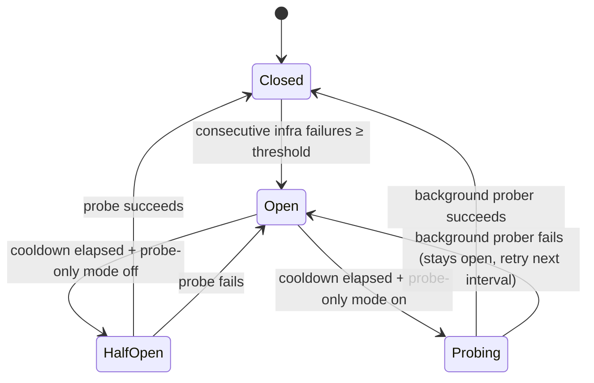

# 06 — The Circuit Breaker

## What's a circuit breaker?

Imagine a house electrical circuit. When too much current flows (a fault), the circuit breaker "trips" — it opens the circuit and stops current from flowing. You fix the fault, then reset the breaker. Until you reset it, the circuit is safely open.

In software, a circuit breaker does the same thing for network calls:
- **Closed** = normal operation, requests flow through.
- **Open** = too many failures detected, stop sending requests (fail fast).
- **Half-open / Probing** = the cooldown expired, try one request to see if the service recovered.

**Why fail fast instead of retrying?** If GPT-4o is down, sending 1,000 requests that all time out at 2 minutes each means users wait 2 minutes before getting an error. With a circuit breaker, after the first few failures, subsequent requests fail *immediately* (in microseconds) and route to the next fallback. Users get an answer faster — just from a different model.

---

## This platform has TWO circuit breakers

Most systems have one circuit breaker per external service. This platform has two, at different granularities:

### Layer 1: Provider-level circuit breaker

Lives in `internal/llm/breaker.go`. One circuit **per provider** (openai, gemini, groq, anthropic).

If GPT-4o returns 5 consecutive 503s, the circuit for "openai" opens. **Every task** that uses GPT-4o is now routing around it.

Use case: A provider has a full outage. All its models are broken. The circuit trips once and blocks all of them.

### Layer 2: Per-(task, model) health tracker

Lives in `internal/health/tracker.go`. One circuit **per (task_id, model)** combination.

If `classify-ticket` using `gpt-4o` returns 3 consecutive schema-invalid responses, the circuit for (classify-ticket, gpt-4o) opens. **Only this task** routes around gpt-4o; other tasks keep using it.

Use case: Your prompt template is malformed in a way that makes one specific model return wrong output. Other models are fine. Other tasks using the same model are fine. Only this specific (task, model) pair needs to be blocked.

---

## Layer 1: Provider-level circuit breaker

### The state machine



> **🔤 Go concept: `sync.Mutex`**
> The circuit breaker's state (closed/open/half-open, failure count, timer) is read and written by multiple goroutines simultaneously — the main handler goroutines and the background prober goroutine. Without synchronization, two goroutines could modify the state at the same time and corrupt it.
>
> A `sync.Mutex` is a lock. Before modifying the state, you call `mu.Lock()` — any other goroutine that tries to `Lock()` at the same time will block until the first one calls `mu.Unlock()`. Think of it as a "one at a time" sign on a door.

### What counts as an "infra failure"?

Only these trip the provider-level circuit:
- HTTP 5xx (500, 502, 503, 504) — server-side errors
- HTTP 429 — rate limit
- Network errors (connection refused, DNS failure)
- Response timeout (no response within 2 minutes)
- Malformed response (unparseable JSON)

These do NOT trip the circuit:
- HTTP 400, 422 — bad request (your input is wrong, not the provider)
- HTTP 401, 403 — auth/permission (a key problem, not an outage)
- `context.Canceled` — the user cancelled the request

### How the threshold and cooldown work

Defaults: threshold = 3, cooldown = 30 seconds.

| Event | State | What happened |
|-------|-------|---------------|
| Start | Closed, failures=0 | Normal |
| 1st 503 | Closed, failures=1 | Recorded |
| 2nd 503 | Closed, failures=2 | Recorded |
| 3rd 503 | **Open**, openedAt=now | Circuit tripped |
| Next request (< 30s later) | Open | Fail fast — no API call |
| Next request (≥ 30s later, probe-only off) | Half-open | Allow one probe |
| Probe returns 200 | **Closed**, failures=0 | Circuit reset |
| Probe returns 503 | **Open**, openedAt=now | Re-tripped, cooldown resets |

### Probe-only mode

When the recovery prober is running (always in production), the circuit uses a different state: **Probing** instead of **Half-open**. 

The difference: in Half-open mode, a live *production request* is used as the probe. In Probing mode, only the background prober can close the circuit — production requests always fail fast while the circuit is open.

```go
llm.StartRecoveryProber(proberCtx, clients, 15*time.Second)
// ↑ this call enables probe-only mode on all circuits
```

---

## Layer 2: Per-(task, model) health tracker

### Why a second circuit breaker?

The provider-level breaker only trips on infra failures (5xx, network, timeout). But there's another class of failure: **a model returns a 200 OK response that doesn't match the task's output schema**.

Example: Task "sentiment-analysis" expects `{"label": "positive|negative|neutral", "score": 0.0-1.0}`. Sometimes gpt-4o returns a verbose explanation instead of JSON. That's a 200 OK from the provider's perspective, but a failure from the task's perspective.

The per-(task, model) tracker handles this. It trips on *both* infra failures *and* schema-invalid responses for a specific task.

### Exponential backoff

With defaults (base=30s, factor=2, max=30m):

| Trip number | Cooldown |
|-------------|---------|
| 1st trip | 30 seconds |
| 2nd trip | 60 seconds |
| 3rd trip | 2 minutes |
| 4th trip | 4 minutes |
| 5th trip | 8 minutes |
| 6th+ | 16m, 30m, 30m, ... (capped) |

> **Why exponential backoff?** If a model is having a transient issue, 30 seconds is enough. If it's been re-tripping 5 times in a row, something more serious is wrong — don't keep checking every 30 seconds, back off to give it time to recover.

### Admin reset

Admins can manually reset a (task, model) circuit via the API:
```
POST /v1/admin/model-health/{task_id}/{model}/reset
```
This is useful when you've fixed the underlying issue (updated the prompt, fixed the model endpoint) and want to re-enable the model immediately without waiting for the cooldown to expire.

### Health events in the DB

Every state transition is logged to the `model_health_events` table:
- `"failure"` — a failure was recorded
- `"tripped"` — the circuit opened
- `"recovered"` — the circuit closed after a successful probe
- `"manual_reset"` — an admin forced a reset

This gives you a full audit trail: when did this model start failing? How many times has it tripped this week?

---

## Why not just retry forever?

> **Alternative:** Instead of a circuit breaker, just retry every failed call 3 times with a 1-second delay.

**Problems with retry-everywhere:**
1. **It's slow.** 3 retries × 2 minutes timeout each = 6 minutes of waiting before you give up. Users don't wait 6 minutes.
2. **It makes outages worse.** If 100 users hit a failing provider at the same time, each retrying 3 times = 300 requests to an already-struggling provider. This "retry storm" can turn a partial outage into a full outage.
3. **It wastes money.** Every retry call costs money (tokens are charged on 5xx responses by some providers).

The circuit breaker approach:
- First 3 failures: yes, they reach the provider (to confirm it's really failing, not just a one-off).
- All subsequent failures for 30 seconds: fail in microseconds, no API call, no cost, no latency.
- Background prober confirms recovery quietly, then normal traffic resumes.

---

## The interaction between the two layers

```
Request arrives for task "classify-ticket" with models [gpt-4o, gemini-flash]

Layer 2 (per-task-model) check:
  Allow("classify-ticket", "gpt-4o")? → YES (healthy)
  → Proceed to Layer 1 check

Layer 1 (provider) check:
  Allow("openai")? → NO (provider circuit is open)
  → Skip gpt-4o, go to gemini-flash

Layer 2 check:
  Allow("classify-ticket", "gemini-flash")? → YES
  → Proceed to Layer 1 check

Layer 1 check:
  Allow("gemini")? → YES
  → Call gemini live
```

In practice, the two layers are woven into the fallback walk. The `HealthGate` interface the fallback chain uses is a `taskHealthGate` adapter that checks both layers:

```go
func (g *taskHealthGate) Allow(model string) bool {
    // Check per-(task,model) health tracker
    allowed, _ := g.tracker.Allow(g.taskID, model)
    return allowed
}
```

(The provider-level breaker is checked inside `CallModel` itself, before the actual HTTP call.)
