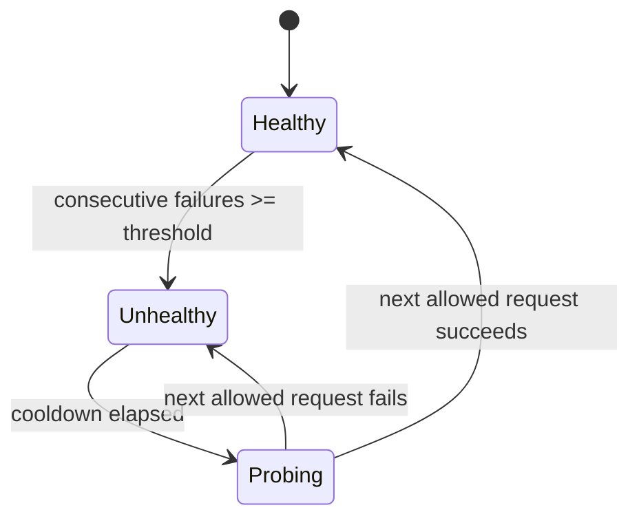

# 06 — Health Tracker and Circuit Breaking

## What problem does this solve?

When a model or provider starts failing, the platform should stop wasting user latency and money on repeated doomed calls. It should also handle a more LLM-specific failure: the provider returns `200 OK`, but the text does not match the task's output schema.

The current implementation has one circuit-breaker layer:

> `internal/health/tracker.go` tracks health per `(task_id, model)`.

There is no provider-wide breaker in the current codebase. A failure on `gpt-4o` for `attribute-extraction` does not automatically disable `gpt-4o` everywhere. That is intentional for now because many failures are prompt/schema specific.

---

## State machine



Defaults from config:

| Env var | Default | Meaning |
|---------|---------|---------|
| `HEALTH_BREAKER_ENABLED` | `true` | Master switch |
| `HEALTH_FAILURE_THRESHOLD` | `3` | Consecutive failures before a pair is skipped |
| `HEALTH_BASE_COOLDOWN` | `30s` | First unhealthy window |
| `HEALTH_MAX_COOLDOWN` | `30m` | Exponential backoff cap |

The backoff factor is `2`, wired in `cmd/server/main.go`.

---

## What counts as a failure?

The fallback walk records failures through the health gate when a model attempt is bad for this task:

| Failure type | Example | Why it matters |
|--------------|---------|----------------|
| Provider/infra failure | 5xx, 429, network error, timeout | The model endpoint did not produce a usable answer |
| Empty/malformed response | no choices, empty content, invalid response payload | The platform cannot serve it |
| Schema-invalid output | model returned prose when the task required JSON | The provider was reachable, but this task/model pair is not currently reliable |

Client/content errors such as bad request shape are not treated as provider recovery signals. They should be fixed by the caller or task author, not hidden by retrying forever.

---

## How the fallback walk uses health

```mermaid
flowchart TD
    A[Try next model in chain] --> B{Health Allow(task, model)?}
    B -->|No| S[Record skipped_unhealthy attempt]
    S --> A
    B -->|Yes| C{Cache hit?}
    C -->|Yes| H[Return cached success]
    C -->|No| D[Call provider]
    D --> E{Output usable?}
    E -->|Yes| OK[Record success and return]
    E -->|No| F[Record failure]
    F --> A
```

The skipped attempt is still written to `gateway_attempts`. That is important: the caller sees one final result, while operators can see that the primary model was skipped because the health tracker marked it unhealthy.

---

## Lazy recovery

There is no background prober. Recovery is lazy and uses real traffic:

1. A model-task pair trips and enters `unhealthy`.
2. Requests skip it until the cooldown expires.
3. The next production request becomes the probe.
4. If that attempt succeeds, the pair becomes healthy again.
5. If it fails, the pair returns to unhealthy and the cooldown grows.

This avoids synthetic LLM calls and keeps the implementation cheap. The tradeoff is that one real request may absorb the probe failure, but the fallback chain continues to later models.

---

## Admin reset

Admins can manually reset a pair:

```http
POST /v1/admin/model-health/reset
Content-Type: application/json

{"task_id":"attribute-extraction","model":"gpt-4o"}
```

Use this after fixing the underlying cause, such as deploying a corrected prompt or restoring a provider route. Resetting clears the local tracker state and records a `manual_reset` event.

---

## Health events in the DB

Every important state change is sent to the async `HealthEventWriter` and stored in `model_health_events`.

| Event | Meaning |
|-------|---------|
| `failure` | A failure was recorded but the pair may still be below threshold |
| `tripped` | The pair crossed threshold and became unhealthy |
| `recovered` | A probe/success closed the circuit |
| `manual_reset` | An admin reset the pair |

Each event includes `task_id`, `model`, `provider`, reason, consecutive failure count, cooldown, state, and timestamp.

---

## Why per-task/model instead of provider-wide?

Provider-wide breakers are useful for full outages, but they are blunt. LLM applications often fail because a particular prompt and a particular model do not cooperate:

- one model returns schema-invalid output for one task;
- another task using the same model is healthy;
- the provider is up, but the product contract is not being met.

Per-task/model health matches the platform abstraction. It protects each product task independently and avoids taking down healthy tasks because one prompt is misbehaving.

A provider-wide breaker could still be added later if outage volume justifies it. The current code does not have `internal/llm/breaker.go`; the live safety net is `internal/health/tracker.go` plus error classification in `internal/llm/failure.go`.
