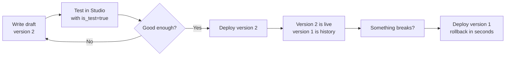

# 07 — Tasks

## What is a task?

A **task** is the central abstraction of this platform. Think of it as a named, versioned, configurable function that calls an LLM:

```
function classifyTicket(
    category: string,   ← input schema
    body: string        ← input schema
) → { label: string, confidence: number }  ← output schema
```

Under the hood, the "function body" is:
- A prompt template that renders the inputs
- A system prompt that sets the model's role
- A model chain (primary + fallbacks)
- Sampling parameters (temperature, max_tokens)
- A daily spending limit

---

## Every field in a Task

```go
type Task struct {
    ID             string          // "classify-ticket" — the URL slug
    Name           string          // "Ticket Classifier" — display name
    Description    string          // "Classifies support tickets into categories"
    InputSchema    json.RawMessage // JSON Schema for input validation
    OutputSchema   json.RawMessage // JSON Schema for output validation
    PromptTemplate string          // Go template: "Classify {{.body}} as {{.category}}"
    SystemPrompt   string          // "You are a JSON-only ticket classifier."
    PromptVersion  int             // Which version is currently live (deployed)
    Model          string          // "gpt-4o" — primary model
    FallbackModels []string        // ["gemini-2.5-flash", "llama-groq"]
    Temperature    float64         // 0.0 – 2.0
    MaxTokens      int             // max output length
    DailyBudgetUSD float64         // 0 = no limit; 5.0 = stop at $5/day
    CacheEnabled   bool            // should identical inputs be cached?
    CacheTTLSeconds int            // 0 = use backend default (24h)
    Active         bool            // false = task is hidden from the API
    CreatedAt      time.Time
    UpdatedAt      time.Time
}
```

> **🔤 Go concept: `json.RawMessage`**
> `json.RawMessage` is Go's way of saying "I want to store raw JSON bytes without parsing them into a specific struct yet." The input and output schemas are JSON Schema objects — complex JSON that varies per task. Storing them as `json.RawMessage` means the platform stores whatever JSON you provide and validates against it dynamically, without having to know the schema structure at compile time.

---

## The ID (slug)

The task ID is a slug: lowercase letters, digits, and hyphens. Examples: `classify-ticket`, `email-summarizer`, `sentiment-v2`.

It becomes the URL: `POST /v1/tasks/classify-ticket/predict`.

Rules (enforced by validation):
- 2–64 characters
- Only `a-z`, `0-9`, `-`
- Cannot start or end with `-`
- Must be globally unique

---

## Input and output schemas

Schemas use [JSON Schema](https://json-schema.org/) — an industry-standard format for describing the shape of JSON data. Example:

```json
{
  "type": "object",
  "required": ["category", "body"],
  "properties": {
    "category": {
      "type": "string",
      "description": "Comma-separated list of valid categories"
    },
    "body": {
      "type": "string",
      "minLength": 1,
      "maxLength": 5000
    }
  },
  "additionalProperties": false
}
```

When a caller sends inputs, they're validated against this schema before the prompt is rendered. A missing required field, a wrong type, or an extra unexpected field → 400 error, no LLM call.

**Why validate inputs?** 1. Costs money to call an LLM with bad data. 2. Clear error messages help callers fix their integration. 3. The platform is a contract — schema defines the contract.

**Output schema** works the same way. After the model responds, the response text is validated as JSON against the output schema. If it doesn't match, the fallback chain advances. This makes structured output reliable.

---

## Prompt templates

The `prompt_template` is a [Go template](https://pkg.go.dev/text/template). It's rendered with the validated inputs to produce the actual prompt text sent to the model.

### Basic syntax

| Syntax | Meaning |
|--------|---------|
| `{{.fieldName}}` | Insert the value of `fieldName` from inputs |
| `{{if .x}}...{{end}}` | Include text only if `x` is truthy (not empty/zero) |
| `{{range .items}}{{.}}{{end}}` | Repeat for each item in a list |
| `{{- .x -}}` | Trim whitespace around the insertion |

### Example

Template:
```
Classify the following support ticket.
Valid categories: {{.categories}}

Ticket body:
---
{{.body}}
---

{{if .priority}}Priority level: {{.priority}}{{end}}

Respond ONLY with a JSON object like: {"label": "shipping", "confidence": 0.95}
```

With inputs:
```json
{
  "categories": "shipping, billing, returns, account",
  "body": "My order #123 hasn't arrived after 2 weeks",
  "priority": "high"
}
```

Rendered prompt:
```
Classify the following support ticket.
Valid categories: shipping, billing, returns, account

Ticket body:
---
My order #123 hasn't arrived after 2 weeks
---

Priority level: high

Respond ONLY with a JSON object like: {"label": "shipping", "confidence": 0.95}
```

---

## Temperature: 0.2 vs 0.7

Task defaults use `temperature = 0.2`. The playground uses `temperature = 0.7`. Why?

**Temperature** controls how random the model's output is:
- `0.0` = always pick the most likely next token → very deterministic, repetitive
- `0.5` = balanced
- `1.0` = more creative, varied
- `2.0` = maximum randomness, often incoherent

For product features (like ticket classification), you want **determinism**: the same input should give the same output every time, and you want the model to pick the most confident answer, not a creative variation. → `temperature = 0.2`

For the playground (exploring what models can do), you want **variety**: show the model's range, let it be creative. → `temperature = 0.7`

---

## Prompt versioning

Prompt templates in LLM products are code. A bad prompt change can silently degrade quality. Versioning solves this.

### The workflow



### Version numbering

Version numbers are **monotonically increasing integers**. Every new version always has a higher number than all existing versions (including drafts). This is enforced by the database:

```sql
SELECT COALESCE(MAX(version), 0) + 1 FROM prompt_versions WHERE task_id = ?
```

This prevents collisions — even if you save 3 drafts before deploying, they get version numbers 2, 3, 4.

### Active vs. draft vs. deployed

| State | Meaning | `active` flag in DB |
|-------|---------|---------------------|
| Draft | Saved but not live | `false` |
| Deployed | Currently live — the prompt used for all predictions | `true` (only one at a time) |
| Historical | Was live once, no longer | `false` |

`task.PromptVersion` holds the number of the currently active version. When the task store renders a prompt, it fetches the version whose `version` number matches `task.PromptVersion`.

---

## RBAC on tasks: why callers can't see the prompt

When a service with the `caller` role calls `GET /v1/tasks/classify-ticket`, the response has the input/output schemas and task metadata — but `prompt_template` and `system_prompt` are **blanked out** (`""`).

```go
func redactedTask(t *tasks.Task) *TaskResponse {
    resp := TaskResponse{...all fields...}
    if !user.Can(auth.PermTaskViewPrompt) {
        resp.PromptTemplate = ""
        resp.SystemPrompt   = ""
    }
    return resp
}
```

**Why?** The prompt is intellectual property. The callers' contract is "given these inputs, get this output" — they don't need to know how the sausage is made. This also lets the prompt team iterate on prompts without exposing internal reasoning to external services.

Roles that CAN see prompts (the `task:view_prompt` permission): `admin`.
Roles that CANNOT: `client` (the service principal) — it only gets the input/output contract.

---

## Creating a task

**The database is the single source of truth for tasks — there is no file-based task
config.** Tasks are created and edited at runtime through the API (`POST /v1/tasks`,
backed by the Studio UI) and persist in the `tasks` table. The only tasks seeded at
boot are the two built-ins (`playground` and `attribute-extraction`); every product
task is authored against the running service.

A create request carries the same fields a task row holds — id, name, description,
`model` + `fallback_models`, sampling params, `daily_budget_usd`, cache opt-in, the
`system_prompt`/`prompt_template`, and the input/output JSON Schemas:

```jsonc
POST /v1/tasks
{
  "id": "classify-ticket",
  "name": "Ticket Classifier",
  "model": "gpt-4o",
  "fallback_models": ["gemini-2.5-flash", "llama-groq"],
  "temperature": 0.1,
  "max_tokens": 200,
  "daily_budget_usd": 10.0,
  "cache_enabled": true,
  "cache_ttl_seconds": 86400,
  "system_prompt": "You are a support ticket classifier. Respond with valid JSON only.",
  "prompt_template": "Classify the ticket.\nCategories: {{.categories}}\n\nTicket:\n{{.body}}",
  "input_schema":  { "type": "object", "required": ["categories", "body"], "properties": { "categories": {"type": "string"}, "body": {"type": "string", "maxLength": 5000} } },
  "output_schema": { "type": "object", "required": ["label", "confidence"], "properties": { "label": {"type": "string"}, "confidence": {"type": "number", "minimum": 0, "maximum": 1} } }
}
```

The same schema validation and defaults are applied on create as on every later edit,
and onboarding a task is an API/UI action — never a config rollout or server restart.

---

## The built-in playground task

The playground compare UI (`/run` endpoint) runs under a special built-in task with ID `"playground"`. This means:
- Playground usage is tracked in the `runs` table like any other task.
- You can see per-user playground spend in the dashboard.
- The playground respects the global daily budget (if ever configured).

`tasks.SeedPlayground(taskStore)` creates this task at startup if it doesn't exist. It uses no schemas (free-form input/output) and no prompt template (the raw prompt is sent directly).
