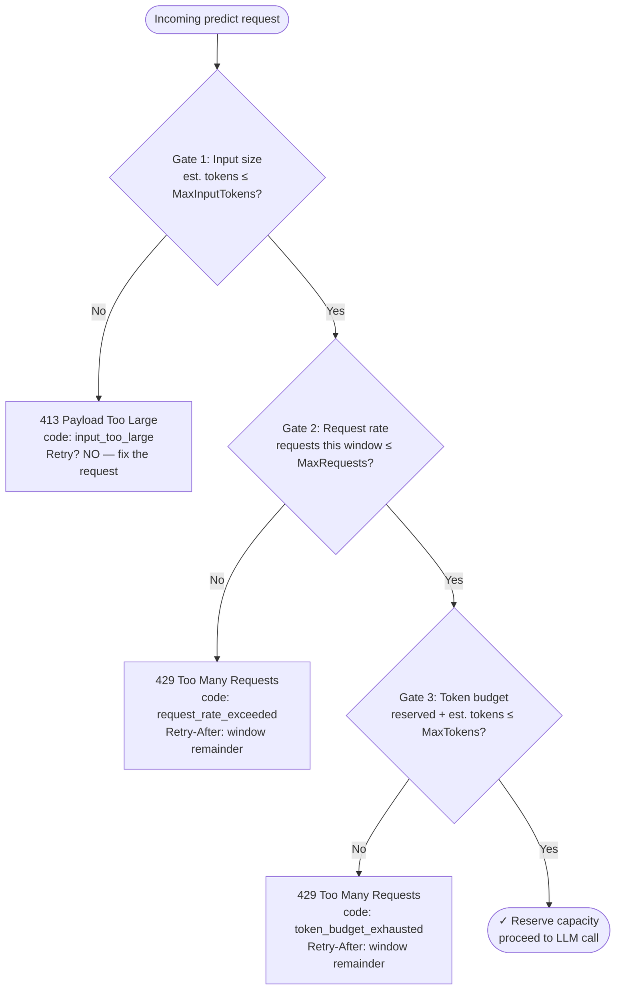
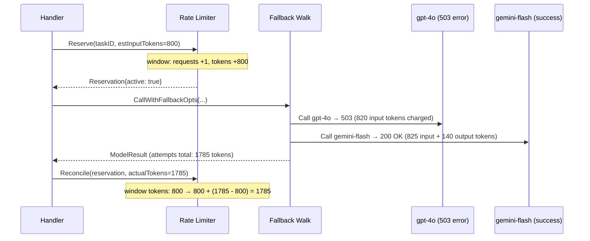

# 11 — The Per-Task Rate Limiter

## What problem does it solve?

Without rate limiting, two bad things can happen:

1. **Cost runaway.** A bug in a caller (or a load-test left running) floods a task with thousands of requests. Each call costs real money — tokens are charged by providers even for failed requests. Before you notice the spike, the daily budget is gone.

2. **Noisy-neighbour starvation.** If one task absorbs all provider capacity (Groq's rate limit, Meesho gateway's concurrency), other tasks get throttled by the upstream, not by you.

The rate limiter is a **per-task, rolling-window gate** that sits in front of every production predict call. It enforces three independent limits and gives callers actionable HTTP responses (`413` or `429` with a `Retry-After` header) so they can back off cleanly.

---

## Three gates in sequence

Every incoming predict request passes three gates in order. A request is only allowed through if it clears all three.



| Gate | HTTP status | Error code | Retryable? |
|------|------------|------------|------------|
| Input size | 413 | `input_too_large` | No — same input will always be rejected |
| Request rate | 429 | `request_rate_exceeded` | Yes — retry after `Retry-After` header |
| Token budget | 429 | `token_budget_exhausted` | Yes — retry after `Retry-After` header |

---

## Gate 1: Input size cap

The first gate checks whether a *single request* is oversized — before any shared window state is touched.

```go
est := h.Limiter.Estimate(systemPrompt+"\n"+renderedPrompt, len(images))
// est ≈ ceil(len(text) / CharsPerToken) + images × TokensPerImage
```

**Why check input size separately?** A 50k-token input is a caller bug, not a traffic spike. It will always be too large — no window adjustment, no Retry-After. The 413 is deterministic: fix the request, not the timing.

---

## Gate 2: Request rate cap

The second gate checks whether this task has received too many requests in the current rolling window.

Each task has its own independent window and lock. Different tasks are never serialized: a high-traffic `attribute-extraction` task doesn't slow down `classify-ticket` at the mutex level.

When the window rolls (`now - windowStart >= Window`), both the request count and the token count reset automatically on the next `Reserve` call.

---

## Gate 3: Token budget (reserve-upfront)

The third gate enforces a rolling-window token budget using a **reserve-upfront, reconcile-after** design.

### Why reserve-upfront instead of charge-after?

The real token count isn't known until the provider responds. If you charged tokens after the response, a request that triggers 3 fallbacks (each consuming tokens before failing) could spend 3× the expected budget before the gate fires.

Reserve-upfront locks in the estimated input tokens *before* any provider call. After all attempts finish — winner, failed models, retries — the reservation is settled to actual total consumption.

### Reserve → walk → reconcile lifecycle



**What Reconcile does:**
- If actual < estimated (common, since the estimate deliberately over-counts): window tokens are adjusted **down** — other tasks or later requests recover that headroom.
- If actual > estimated (rare, heavy fallback path): window tokens are adjusted **up**.
- If the window rolled between Reserve and Reconcile: the old reservation is silently dropped. The new window starts clean.
- **Request count is never rolled back** — a request that ran counts, even if every model failed.

A cache hit has zero token consumption; its Reconcile adjusts the window back down by the full reservation.

---

## When rate limiting is bypassed

Rate limiting only applies to production predict calls. These paths skip the limiter:

| Path | Why bypassed |
|------|-------------|
| Studio test panel (`is_test=true`) | Product builders iterating on prompts should not be gated |
| Shadow comparisons (`/v1/shadow/compare`) | Explicit side-by-side evaluations, not product traffic |
| Playground fan-out (`/run`) | Development and exploration path |

---

## Configuration

All settings are read from environment variables (or `.env`):

| Variable | Default | Effect |
|----------|---------|--------|
| `RATE_LIMIT_ENABLED` | `true` | Master on/off switch |
| `RATE_WINDOW` | `1m` | Rolling window length per task |
| `RATE_MAX_REQUESTS` | `600` | Max accepted requests per task per window (0 = unlimited) |
| `RATE_MAX_TOKENS` | `200000` | Max token budget per task per window (0 = unlimited) |
| `RATE_MAX_INPUT_TOKENS` | `16000` | Max estimated input tokens for one request (0 = unlimited) |
| `RATE_CHARS_PER_TOKEN` | `4` | Text-to-token estimation divisor |
| `RATE_TOKENS_PER_IMAGE` | `1000` | Flat token cost per attached image |

Setting any limit to `0` disables that specific gate while keeping the others active.

---

## Key file

All rate-limiting logic lives in [`internal/ratelimit/limiter.go`](../internal/ratelimit/limiter.go) (~212 lines).

The limiter is constructed in `cmd/server/main.go` and injected into the `Handler` struct. It is invoked in `internal/api/predict_core.go` via `h.Limiter.Reserve(...)` before any LLM call, and `h.Limiter.Reconcile(...)` after.
