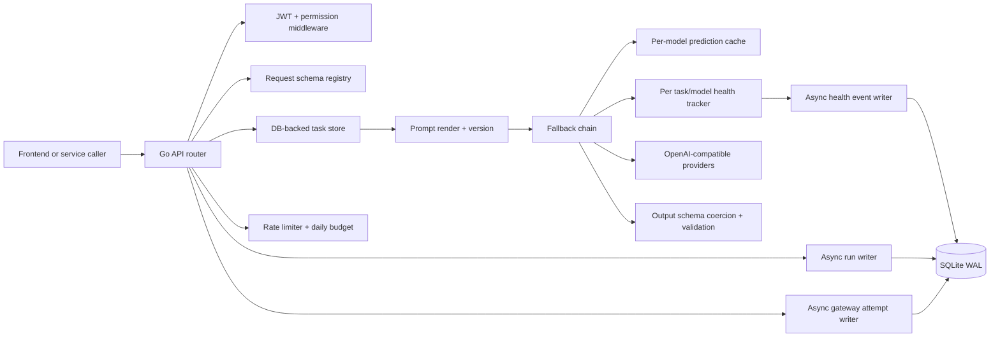
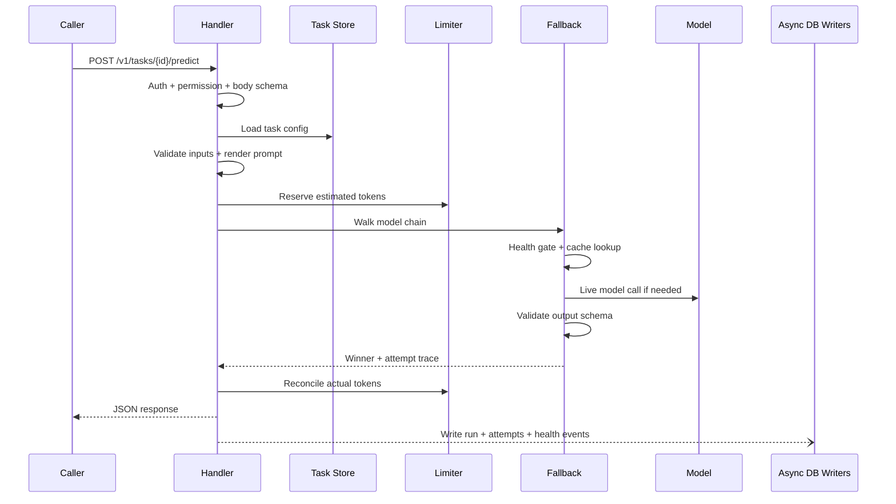

# 12 — Implementation Reference, USPs, and Future Coding Practices

This is the one-file technical reference for the current Go backend. Use it when you need to explain what is implemented, why specific choices were made, what makes the system strong, and how future code should be added without breaking the architecture.

---

## Current architecture at a glance



The backend is a task-based prediction gateway. Product services call one named task; the task owns prompt, schemas, model chain, cache settings, budget, and active prompt version.

---

## What is implemented now

| Area | Implemented behavior | Main files |
|------|----------------------|------------|
| Server boot | Config, pricing, SQLite, clients, tasks, users, async writers, health, limiter, cache, router | `cmd/server/main.go` |
| Tasks | DB-backed CRUD, built-in seeds, validation, 5s config cache, prompt versioning | `internal/tasks/*.go` |
| Prediction | Input validation, prompt render, image handling, rate/budget gates, cache, fallback, output validation, async writes | `internal/api/predict_core.go` |
| Model routing | Friendly model registry, Meesho gateway, Groq direct, retries, cost attribution | `internal/llm/runner.go`, `client.go` |
| Fallback | Ordered model walk, health skip, cache hit, schema-invalid fallback, attempt trace | `internal/llm/fallback.go` |
| Health | Per-`(task_id, model)` circuit breaker with lazy probing and events | `internal/health/tracker.go` |
| Cache | Redis/memory/off, strict SHA-256 key, per-model cache lookup | `internal/cache/cache.go` |
| Rate limit | Per-task rolling request/token/input-size gates with reserve/reconcile | `internal/ratelimit/limiter.go` |
| Cost | `pricing.json` loaded at boot, per-model token-cost calculation | `internal/llm/pricing.go` |
| Eval | CSV/XLSX upload, Prism registration, prompt-version checks, eval run records | `internal/api/eval_handlers.go`, `internal/tasks/eval.go` |
| Auth | Demo users, JWT cookie/Bearer auth, admin permission seam | `internal/auth/*.go`, `internal/users/*.go` |
| DB | SQLite WAL migrations, runs, tasks, versions, attempts, eval, health, shadow, feedback | `internal/db/db.go` |

---

## Core prediction flow



Important behavior: the response does not wait for SQLite trace writes. The async writers are best-effort and non-blocking.

---

## USP 1: Task as the product contract

The platform does not expose "call a model with a prompt" as the product API. It exposes "call a named task with inputs."

```go
type Task struct {
    ID             string
    InputSchema    json.RawMessage
    OutputSchema   json.RawMessage
    PromptTemplate string
    SystemPrompt   string
    PromptVersion  int
    Model          string
    FallbackModels []string
    DailyBudgetUSD float64
    CacheEnabled   bool
}
```

Why this is strong:
- callers integrate against schemas, not prompt internals;
- prompt/model changes do not require caller redeploys;
- cost, quality, cache, health, and eval all attach to the product task.

---

## USP 2: Schema-invalid output drives fallback

Structured output is not just parsed after the fact. It participates in routing.

```go
// internal/llm/fallback.go, conceptually
for _, model := range models {
    if !health.Allow(model) {
        record("skipped_unhealthy")
        continue
    }
    if cached, ok := lookup(model); ok {
        return cached
    }
    result := CallModel(ctx, clients, model, messages, temp, maxTokens)
    if result.Success && validateOutput(result.Response) == nil {
        health.RecordSuccess(model)
        return result
    }
    health.RecordFailure(model, reason)
    record("schema_invalid_or_error")
}
```

Why this is strong:
- a `200 OK` response is not enough;
- the platform serves only task-contract-compatible output;
- schema-invalid attempts are traceable in `gateway_attempts`.

---

## USP 3: Per-model cache inside the fallback walk

The cache key is per model, not per fallback chain.

```go
type KeyInputs struct {
    TaskID         string
    PromptVersion  int
    Model          string
    SystemPrompt   string
    RenderedPrompt string
    Temperature    float64
    MaxTokens      int
    OutputSchema   string
    Images         []string
}
```

Why this is strong:
- deploying a prompt version automatically creates new keys;
- changing the model chain does not accidentally serve an old fallback answer as the new primary answer;
- multimodal inputs and output schema are part of identity.

---

## USP 4: Full gateway attempt trace

The `runs` table stores what the caller received. The `gateway_attempts` table stores what happened behind it.

```sql
SELECT seq, model, outcome, fallback_reason, http_status, latency_ms, cost_usd
FROM gateway_attempts
WHERE run_id = ?
ORDER BY seq;
```

This explains questions like:
- Was the primary unhealthy?
- Did a model fail schema validation?
- Did the response come from cache?
- Which fallback was used and why?
- How much did each attempted model cost?

---

## USP 5: Hot path writes are asynchronous

```go
func (w *GatewayAttemptWriter) Write(a *types.GatewayAttempt) bool {
    select {
    case w.ch <- a:
        return true
    default:
        w.dropped.Add(1)
        return false
    }
}
```

Why this is strong:
- prediction latency is dominated by provider calls, not SQLite;
- a slow DB drops observability rows instead of blocking users;
- run rows, attempt rows, and health events have separate buffers.

---

## Technical decisions taken

| Choice | What was chosen | Why |
|--------|-----------------|-----|
| Runtime | Go single binary | Fast startup, low memory, simple deployment |
| DB | SQLite WAL for now | Zero local infra; good enough for one instance |
| Future DB | Postgres | Needed for multi-instance production |
| Provider protocol | OpenAI-compatible HTTP | One client for Meesho gateway, Groq, Gemini/Claude through gateway |
| Task storage | DB/API, not YAML files | Runtime self-serve task authoring and prompt versioning |
| Health | Per-task/model tracker | LLM failures are often prompt/schema specific |
| Eval gate | Advisory today | Tables/routes exist; hard deploy blocking is future work |
| Auth | Demo JWT admin now | Good local seam; real SSO later |
| Cache | Redis/memory/off strategy | Same interface, different deployment choices |

---

## What is intentionally not implemented yet

| Gap | Why it matters | Suggested future place |
|-----|----------------|------------------------|
| Real SSO | Demo login trusts `user_id` | Replace `users.DemoStore` |
| Multi-role RBAC | Only `admin` exists now | Extend `internal/auth/rbac.go` |
| Graceful shutdown/timeouts | Current server uses `http.ListenAndServe` | Wrap in `http.Server` |
| Postgres | SQLite is single-instance | Add driver and migrate `internal/db` |
| Audit log | Needed for deploy/delete governance | New append-only table + writer |
| Hard eval deploy gate | Prevents unevaluated prompt releases | `tasks.Store.Deploy` |
| Async/callback predict | Needed for long jobs | New run state table + worker |
| Kafka/warehouse sink | Long-term analytics | Add observability exporter |
| RAG | Retrieval-augmented tasks | New retrieval service/contract |

---

## Future coding practices

1. Keep `api` as the orchestration layer. Business-specific sequencing belongs in handlers/core files; provider details stay in `llm`, persistence in `db`, config in `config`.
2. Every new external request body should get a schema under `internal/schema/requests/*.yaml` and be validated before handler decoding.
3. Every new model key must be added to the registry, `pricing.json`, frontend model lists, and registry/pricing tests.
4. Never let observability writes block prediction responses. Use async writers or clearly justify a synchronous write.
5. Do not cache schema-invalid outputs, test runs, override-model runs, or override-version runs.
6. Preserve prompt version immutability. Editing live prompt text should create a new version, then deploy it.
7. Keep rate limiter reserve/reconcile semantics. If a new path consumes tokens, reconcile actual usage after all attempts.
8. Treat cache/backend failures as misses. Cache is an optimization, not correctness.
9. Add docs when changing an architectural decision. Update this file plus the focused guide for that area.
10. Avoid broad refactors while touching hot-path prediction code. The pipeline is intentionally explicit so failures are easy to debug.

---

## Best file references for future readers

| Question | Read this |
|----------|-----------|
| How does the server boot? | `cmd/server/main.go` |
| What are all routes? | `internal/api/router.go` |
| What happens during predict? | `internal/api/predict_core.go` |
| How are task configs stored? | `internal/tasks/store.go` |
| How do prompt versions work? | `internal/tasks/versions.go` |
| How are outputs validated? | `internal/tasks/validate.go` |
| How does fallback work? | `internal/llm/fallback.go` |
| How are models routed? | `internal/llm/runner.go` |
| How is health tracked? | `internal/health/tracker.go` |
| How is rate limiting enforced? | `internal/ratelimit/limiter.go` |
| How is cost calculated? | `internal/llm/pricing.go`, `pricing.json` |
| What tables exist? | `internal/db/db.go` |
| How are evals run? | `internal/api/eval_handlers.go`, `internal/tasks/eval.go` |
