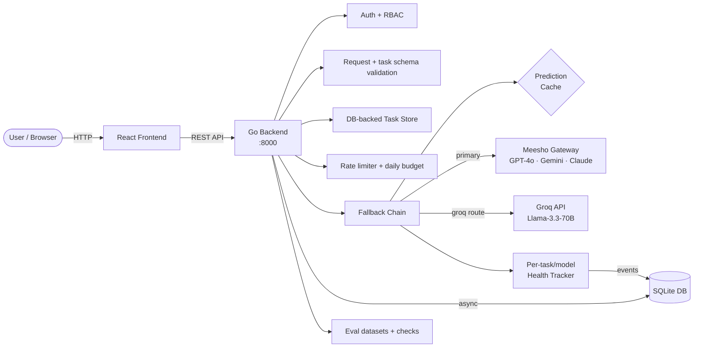

# LLM Platform — Go Backend

A production-ready backend that lets you call multiple LLM providers (OpenAI, Gemini, Groq, Anthropic via Meesho's gateway), compare their outputs, track costs down to the cent, and build reliable product features on top of them — with automatic failover, per-task health gating, prompt versioning, eval datasets, rate limiting, gateway attempt tracing, and caching.

---

## How it fits together



The Go backend sits between the frontend and every LLM provider. It validates request bodies, validates task inputs, renders prompts, walks the fallback chain, caches results, records every model attempt, and enforces budgets/rate limits — all so product features are reliable even when individual providers or individual model-task pairs are unhealthy.

---

## Quick start

```bash
# 1. Copy the sample env file
cp .env.example .env   # or edit .env directly — fill in your provider keys

# 2. Run the server (Go 1.22+ required)
go run ./cmd/server

# 3. Check it's alive
curl http://localhost:8000/health
# → {"status":"ok"}
```

The database (`llm_platform.db`) is created automatically on first run. Two built-in tasks (`playground` and `attribute-extraction`) are seeded if missing; all other product tasks are created through the Studio/API and stored in the database.

---

## Key vocabulary

| Term | Plain-English meaning |
|------|----------------------|
| **Task** | A named, versioned prediction configuration — input/output schema + prompt template + model routing. Like a named function that calls an LLM. |
| **Run** | One execution of one model call. If a task calls 3 models, that's 3 runs. |
| **Session** | A group of runs from the same user in the same conversation thread. |
| **Provider** | A company or gateway that serves LLM APIs (OpenAI, Google Gemini, Groq, Meesho bifrost). |
| **Fallback chain** | An ordered list of models to try. If the first fails, try the second, and so on. |
| **Health tracker** | A per-task/per-model circuit breaker that skips unhealthy model-task pairs and probes recovery after cooldown. |
| **Prompt version** | A numbered snapshot of a task's prompt template. You can draft new versions and deploy them like a software release. |
| **Cache hit** | When an identical request was already answered before, so the stored answer is returned — free of charge, instantly. |
| **Gateway attempt** | One row per model touched during a prediction, including skipped, failed, schema-invalid, cache-hit, and successful attempts. |

---

## Learning guide

These docs explain every part of the codebase from scratch — no Go experience needed:

| File | What you'll learn |
|------|-------------------|
| [docs/00-big-picture.md](docs/00-big-picture.md) | Why this system exists, what problems it solves, and why Go/SQLite were chosen over the alternatives |
| [docs/01-server-startup.md](docs/01-server-startup.md) | How the server boots step-by-step, why order matters, and what happens if something fails |
| [docs/02-config.md](docs/02-config.md) | Every config field, every environment variable, and the 12-factor philosophy behind it |
| [docs/03-models-and-routing.md](docs/03-models-and-routing.md) | How model routing works, the Provider interface, why the registry map is a single source of truth |
| [docs/04-prediction-flow.md](docs/04-prediction-flow.md) | **The full lifecycle** of one prediction — from HTTP request to DB row |
| [docs/05-fallback-chain.md](docs/05-fallback-chain.md) | How the fallback walk decides which model to try next and when to give up |
| [docs/06-circuit-breaker.md](docs/06-circuit-breaker.md) | The per-task/per-model health tracker and lazy recovery probe |
| [docs/07-tasks.md](docs/07-tasks.md) | Task anatomy, JSON Schema validation, Go prompt templates, and versioning |
| [docs/08-database.md](docs/08-database.md) | SQLite, WAL mode, every table, and why DB writes are done asynchronously |
| [docs/09-auth-and-rbac.md](docs/09-auth-and-rbac.md) | JWT authentication, HttpOnly cookies, current admin permissions, and planned role split |
| [docs/10-caching-and-cost.md](docs/10-caching-and-cost.md) | The prediction cache, what makes a cache key unique, and how token costs are calculated |
| [docs/11-rate-limiter.md](docs/11-rate-limiter.md) | Per-task request/token/input-size gates and reserve/reconcile accounting |
| [docs/12-implementation-reference.md](docs/12-implementation-reference.md) | What is implemented now, USPs, technical decisions, and future coding practices |

**Suggested reading order:** 00 → 01 → 03 → 04 → 05 → 06 → 11 → 12 → rest in any order.

---

## Directory map

```
llm_platform_go/
├── cmd/
│   ├── server/main.go         ← entry point — wires everything together
│   └── issue-token/main.go    ← CLI tool for minting auth tokens
├── internal/
│   ├── api/                   ← HTTP handlers, router, middleware
│   ├── llm/                   ← provider clients, registry, fallback, error classification
│   ├── tasks/                 ← task config, validation, versioning, store
│   ├── health/                ← per-(task, model) circuit breaker tracker
│   ├── ratelimit/             ← per-task rolling-window request/token limiter
│   ├── cache/                 ← prediction cache (Redis or memory)
│   ├── db/                    ← SQLite setup, migrations, queries, async writers
│   ├── auth/                  ← JWT, cookies, RBAC
│   ├── users/                 ← user store (demo swap seam)
│   ├── config/                ← environment variable loading
│   ├── schema/                ← embedded request-body JSON Schemas
│   └── types/                 ← shared request/response types
├── pricing.json               ← per-model token pricing (USD per 1M tokens)
├── .env                       ← local secrets (gitignored — never commit this)
└── docs/                      ← this learning guide
```
