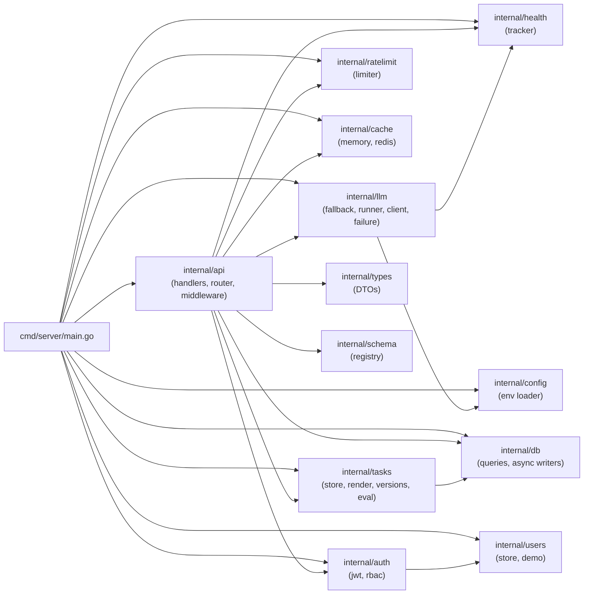

# Reading Order — Navigate the Codebase

This guide is for someone who wants to understand the *source code*, not just the docs. Each pass answers a specific question, tells you what to look for, and flags one insight that clicks things into place.

Estimated total: **3–4 hours** for a first read-through. Skip passes 6–8 if you only need the hot path.

---

## Package dependency map

Read this before anything else. It shows which packages call which so you know the flow before you open any file.

**The rule:** `api` is the top of the call tree. It orchestrates everything. `db`, `config`, and `types` are leaves — they depend on nothing else in the project.

---

## Pass 1 — The entry point (30 min)

**File:** [`cmd/server/main.go`](../cmd/server/main.go)

**Question answered:** What gets wired to what when the server starts?

**What to look for:**
- The construction order: config → db → LLM clients → task store → user store → async writers → health tracker → rate limiter → cache → router → `http.ListenAndServe`
- Every dependency that gets injected into the `Handler` struct — this tells you the full surface area of a prediction call
- The `GatewayAttemptWriter`, `RunWriter`, and `HealthEventWriter` goroutine startup — three background drains that keep observability off the hot path

**Aha insight:** Everything is constructed once at startup and injected downward. There is no global state. Each request's dependencies arrive via the `Handler` struct or the request context. This is why the code is testable without mocking the whole world — you construct a test handler with fake dependencies.

---

## Pass 2 — The data contracts (20 min)

**Files (in order):**
1. [`internal/types/request.go`](../internal/types/request.go) — what callers send
2. [`internal/types/response.go`](../internal/types/response.go) — what callers receive
3. [`internal/tasks/task.go`](../internal/tasks/task.go) — the central Task struct

**Question answered:** What shape does data take as it moves through the system?

**What to look for:**
- In `task.go`: the `Task` struct — notice it holds both the *configuration* (prompt template, output schema, model chain) and the *per-call parameters* (temperature, max_tokens). A task is the full specification for one kind of LLM call.
- In `response.go`: `GatewayAttempt` — each field corresponds to one model the fallback walk touched. This is the shape that lands in the `gateway_attempts` table.
- In `request.go`: `PredictRequest` — the `Inputs` field is a `map[string]any` that gets validated against the task's `input_schema` and then template-rendered. Callers never see the prompt.

**Aha insight:** Tasks are the unit of abstraction. The caller sends `{"inputs": {...}}` — they don't construct prompts, pick models, or know which provider was used. The task configuration owns all of that.

---

## Pass 3 — The hot path (45 min)

This is the most important pass. Follow one predict request end-to-end through four files.

**Files (in order):**
1. [`internal/api/router.go`](../internal/api/router.go) — which URL maps to which handler
2. [`internal/api/predict_core.go`](../internal/api/predict_core.go) — the full prediction pipeline
3. [`internal/llm/fallback.go`](../internal/llm/fallback.go) — the fallback chain walk
4. [`internal/llm/runner.go`](../internal/llm/runner.go) — the model registry

**Question answered:** What happens between `POST /v1/tasks/{id}/predict` arriving and the JSON response leaving?

**What to look for in each file:**

`router.go`: The middleware stack (RequestID → Logger → Recoverer → CORS → RequireAuth → RequirePermission). Every production predict call passes all five before reaching the handler.

`predict_core.go`: Read `executePrediction` top to bottom. The pipeline is:
1. validate inputs against `task.InputSchema`
2. render prompt template with inputs
3. collect multimodal images
4. rate-limit gate (Reserve)
5. cache lookup function (passed as closure into the fallback walk)
6. `CallWithFallbackOpts` — the actual LLM calls
7. output validation
8. Reconcile rate-limit reservation to actual tokens
9. async write gateway attempts
10. cache fill
11. async write run row

`fallback.go`: Read `CallWithFallbackOpts`. The loop walks `models` in order. For each model: check health gate → check cache → call provider → check output validity → record success or failure → advance or return.

`runner.go`: The `registry` map is the routing source of truth. Every friendly model key maps to a `providerConfig` with provider label, actual upstream model ID, provider selector, and special flags such as `reasoning` or `minOutputTokens`. Adding a model is a small code change plus pricing/frontend/test updates.

**Aha insight:** The cache lookup is *inside* the fallback walk, not before it. This means the cache is consulted per-model, in walk order. If the primary model is unhealthy and the fallback is used, the cache for the primary is never checked — only the models actually reached in the walk are cache-eligible.

---

## Pass 4 — The safety systems (30 min)

**Files (in order):**
1. [`internal/health/tracker.go`](../internal/health/tracker.go) — per-(task, model) circuit breaker
2. [`internal/ratelimit/limiter.go`](../internal/ratelimit/limiter.go) — per-task token rate limiter
3. [`internal/llm/failure.go`](../internal/llm/failure.go) — error classification (`isInfraFailure`)

**Question answered:** How does the system protect itself from provider failures and traffic spikes?

**What to look for:**

`tracker.go`: The `Allow` / `RecordSuccess` / `RecordFailure` / `Reset` methods. Track how the state machine transitions: `healthy` → (threshold failures) → `unhealthy` → (cooldown elapsed) → `probing` → (success) → `healthy`. Notice `RecordFailure` also emits a `HealthEvent` to the async sink — every state change is durable.

`limiter.go`: The `Reserve` / `Reconcile` pair. The key invariant: a request reserves estimated tokens before any provider call, then reconciles to actual tokens after all attempts. Read `Reconcile` — notice what happens when the window has rolled between Reserve and Reconcile (the reservation is silently dropped).

`failure.go`: `isInfraFailure(err)` is the single function that decides whether a provider error should advance the fallback chain (5xx, 429, network errors) or stop it immediately (400, 422, context.Canceled). Every fallback and circuit-breaker decision flows through this classification.

**Aha insight:** There is one circuit breaker layer, not two. The per-(task, model) `health.Tracker` tracks both infra failures and schema-invalid responses per task — it is the complete safety net. The `isInfraFailure` classification in `failure.go` determines which errors count as "provider is broken" vs. "your request is broken".

---

## Pass 5 — Persistence (20 min)

**Files (in order):**
1. [`internal/db/db.go`](../internal/db/db.go) — schema and migrations
2. [`internal/db/runwriter.go`](../internal/db/runwriter.go) — async prediction run writer
3. [`internal/db/attemptwriter.go`](../internal/db/attemptwriter.go) — async gateway trace writer
4. [`internal/db/healthwriter.go`](../internal/db/healthwriter.go) — async circuit breaker event writer

**Question answered:** How does the platform write to the database without slowing down predictions?

**What to look for:**

`db.go`: The schema (one `CREATE TABLE IF NOT EXISTS` per table) and the guarded `ALTER TABLE` migrations. Pay attention to the `SetMaxOpenConns(1)` call — SQLite is single-writer. This is the constraint that makes WAL mode necessary and that will force a Postgres migration at scale.

`runwriter.go`: A `chan RunRow` channel plus a drain goroutine. The `Write` method is non-blocking: it sends to the channel and returns immediately. The goroutine on the other end batches and inserts. If the channel is full (buffer overflow), the row is dropped and counted — observability is best-effort, never blocking.

Read `attemptwriter.go` and `healthwriter.go` — they are the same pattern applied to two other tables. Once you understand one writer, you understand all three.

**Aha insight:** Three separate writers, three separate channels, three separate drain goroutines. Each table has its own buffer so a burst of circuit-breaker events doesn't compete with a burst of run rows. The HTTP response goes back to the caller while all three writers are still processing.

---

## Pass 6 — Auth and identity (15 min)

**Files (in order):**
1. [`internal/auth/auth.go`](../internal/auth/auth.go) — JWT parsing and middleware
2. [`internal/auth/rbac.go`](../internal/auth/rbac.go) — role-based access control

**Question answered:** How does the platform know who is calling and what they're allowed to do?

**What to look for:**

`auth.go`: `RequireAuth` middleware extracts the JWT from the `Authorization: Bearer` header or the `llm_platform_token` cookie, parses and verifies it, and attaches the `User` to the request context. Handlers downstream call `auth.UserFromContext(ctx)` — there's no global state.

`rbac.go`: The permission map currently grants all six permissions to `admin`. `task:predict` is the permission needed for the production endpoint. `task:view_prompt` is the permission that gates seeing raw prompt templates in task responses — future non-holders will see the template redacted.

**Aha insight:** The user store (`internal/users/`) is behind a `Store` interface with a single in-memory demo implementation. The entire identity stack (including JWT issuance and RBAC) is built, but the identity *source* is a swap seam — replace `users.NewDemoStore()` in `main.go` with a real SSO/IdP/Postgres implementation without touching any other code.

---

## Pass 7 — Task management (20 min)

**Files (in order):**
1. [`internal/tasks/store.go`](../internal/tasks/store.go) — task CRUD and config cache
2. [`internal/tasks/render.go`](../internal/tasks/render.go) — prompt template rendering
3. [`internal/tasks/versions.go`](../internal/tasks/versions.go) — prompt version history

**Question answered:** How are tasks stored, retrieved, and updated, and how does prompt versioning work?

**What to look for:**

`store.go`: The in-memory `configCache` with a 5-second TTL (a `map[string]cachedTask` protected by a `sync.RWMutex`). Reads acquire a shared lock and serve from cache. Writes acquire an exclusive lock and invalidate immediately. This is why 1,000 predictions per minute don't generate 1,000 DB reads.

`render.go`: `RenderPrompt` uses Go's `text/template` package. The `{{.fieldName}}` syntax fills in caller-supplied inputs. The function returns an error if a required field is missing — templates are validated at render time, not at task creation.

`versions.go`: How prompt versioning works — drafts, deploy semantics, and rollback. The `Deploy` method copies the selected prompt version into the live `tasks` row and updates `tasks.prompt_version`. `ListVersions` computes the `active` flag by comparing each version number to `tasks.prompt_version`; there is no `is_deployed` column.

**Aha insight:** The task config cache means a local prompt deployment invalidates immediately on the instance that performed it, and other instances refresh within the 5-second TTL — no restart needed. A mid-request config change won't corrupt that request because the task config is read once at the start of `executePrediction` and held for the duration.

---

## Pass 8 — Caching (15 min)

**Files (in order):**
1. [`internal/cache/cache.go`](../internal/cache/cache.go) — the Cache interface
2. [`internal/cache/memory.go`](../internal/cache/memory.go) — in-process TTL cache
3. [`internal/cache/redis.go`](../internal/cache/redis.go) — Redis backend

**Question answered:** What gets cached, under what key, and how are backends swapped?

**What to look for:**

`cache.go`: The `Cache` interface (`Get`, `Set`) and `KeyInputs` struct. Read every field in `KeyInputs` — this is the exact definition of "identical request". Notice that `PromptVersion` is in the key: deploying a new prompt version automatically invalidates all old cache entries for that task, with no explicit invalidation code.

`memory.go`: A `sync.Map` of `string → entry`. TTL is enforced on `Get` — entries are not actively evicted, they're lazily expired on access. Fine for development; not suitable for production at scale (memory grows until process restart).

`redis.go`: The production backend. The key is the SHA-256 hex of the serialised `KeyInputs`. Values are JSON-encoded `Entry` structs. TTL is set on `Set` and enforced by Redis itself.

**Aha insight:** Swapping from in-memory to Redis is a one-line change in `main.go` (construct `cache.NewRedis(...)` instead of `cache.NewMemory()`). The rest of the codebase never knows — it only sees the `Cache` interface. This is the **strategy pattern**: the algorithm (cache check → LLM call → cache fill) is fixed; the storage mechanism is pluggable.

---

## Quick-reference: "where is X?"

| Concept | File |
|---------|------|
| Server boot sequence | `cmd/server/main.go` |
| All HTTP routes | `internal/api/router.go` |
| Full prediction pipeline | `internal/api/predict_core.go` |
| Model registry (add a model here) | `internal/llm/runner.go` |
| Fallback chain walk | `internal/llm/fallback.go` |
| OpenAI-compatible HTTP client + Gemini thinking | `internal/llm/client.go` |
| Per-(task, model) circuit breaker | `internal/health/tracker.go` |
| Infra vs. content error classification | `internal/llm/failure.go` |
| Per-task rate limiter | `internal/ratelimit/limiter.go` |
| Prediction cache key definition | `internal/cache/cache.go` |
| Database schema + migrations | `internal/db/db.go` |
| All SQL queries | `internal/db/queries.go` |
| Task struct definition | `internal/tasks/task.go` |
| Prompt template rendering | `internal/tasks/render.go` |
| JWT auth + middleware | `internal/auth/auth.go` |
| RBAC permission matrix | `internal/auth/rbac.go` |
| Configuration env vars | `internal/config/config.go` |
| Request-body schemas | `internal/schema/requests/*.yaml` + `internal/schema/registry.go` |
| Eval datasets and runs | `internal/tasks/eval.go` + `internal/api/eval_handlers.go` |
| Token pricing | `pricing.json` + `internal/llm/pricing.go` |
